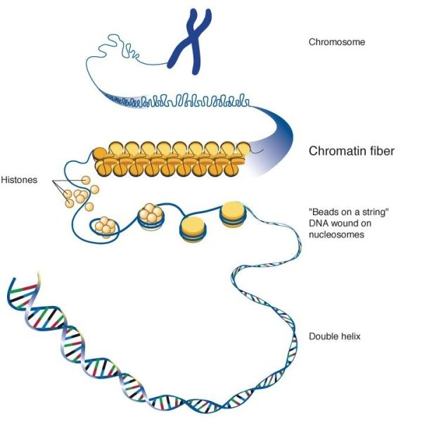

## Assaying open regions in genome 

If we unwind the DNA from the chromosome, we will uncover that a complex of macromolecules exist in an intricately organized manner. The most **basic repeating unit of chromatin is the nucleosome**, consisting of ∼147 bp of DNA wrapped around an octamer of histone proteins.

* There are sections of highly condensed **heterochromatin**, where nucleosomes are packed into chromatin fiber. This is typically regions that are gene-poor and/or transcriptionally silent.

* On the other hand, there is **euchromatin** which is is more loosely wrapped chromatin. These are **regions of chromatin that are more open**, allowing recruitment of RNA polymerase complexes and gene regulatory proteins for active transcription

_Image source: ["Creative Diagnostics Blog"](https://www.creative-diagnostics.com/blog/index.php/the-structure-and-function-of-chromatin/)_

## ATAC-seq

A popular approach used to identify open regions of the genome is the **A**ssay for **T**ransposase-**A**ccessible **C**hromatin (ATAC) followed by high throughput sequencing.  The ATAC-Seq method was first [published in 2013](https://www.ncbi.nlm.nih.gov/pubmed/24097267) in the journal Nature Methods by lead researcher Jason Buenrostro in the labs of Howard Chang and William Greenleaf at Stanford University.

### How does it work?

* Utilizes hyperactive Tn5 transposase to insert sequencing adapters into the open chromatin regions 
* Tn5 tagmentation simultaneously fragments the genome and tags the resulting DNA with sequencing adapters
* Amplify and sequence

_Image source: [Buenrostro et al., 2015](https://www.ncbi.nlm.nih.gov/pubmed/24097267)_

The method relies on the hyperactive Tn5 transposase that was already being used for tagmentation-based NGS library preparation methods. The authors hypothesized that if a similar approach was used in vivo, the **addition of the adapters would mainly take place in open chromatin regions, where no steric hindrance of the transposase would occur**, allowing the enzyme to preferentially access these regions.

### The ATAC-seq profile

In one assay, **ATAC-seq is able to simultaneously assess three different aspects of chromatin architecture** at high resolution:

1. Maps open chromatin
2. Transcription factor occupancy
3. Nucleosome occupancy

The schematic below illustrates the representative DNA fragments and corresponding data signal obtained from current chromatin accessibility assays. You can see how the ATAC-seq profile is an aggregate off all of the other assays.

_Image source: [Tsompana and Buck, 2014](https://pubmed.ncbi.nlm.nih.gov/25473421/)_

### Why ATAC-seq?

* The main advantage over existing methods is the **simplicity** of the library preparation protocol:
	* Tn5 insertion followed by two rounds of PCR.
	* no sonication or phenol-chloroform extraction like FAIRE-seq
	* no antibodies like ChIP-seq
	* no sensitive enzymatic digestion like MNase-seq or DNase-seq
	
* **Short time requirement.** Unlike similar methods, which can take up to four days to complete, ATAC-seq preparation can be completed in under three hours.
* **Low starting cell number** than other open chromatin assays (500 to 50K cells recommended for human).

## Planning your ATAC-seq experiment

* **Replicates**: more is better
* **Controls**: not typically run, but could use genomic DNA fragmented by some other method (i.e. sonication)
* **PCR amplification**: as few cycles as possible
* **Sequencing depth**: varies based on size of reference genome and degree of open chromatin expected
* **Sequencing mode**: paired-end
* **Mitochondria**: discarded from computational analyses; option to remove during prep

## Analysis of ATAC-seq

### Quality control

Multiqc metrics

Ataqv plots
 - fragmet length distribution

### Alignment

### Peak calling

MACS2 use the callpeaks command:

* `-nomodel` `—nolambda`; turn off the model building and shifting and do not compute local bias lambda.
* `—keep-dup-all`; if you have removed PCR duplicates 
* `-f BAMPE`; analyze only properly paired alignments

for NFR can try to do `--nomodel` with `—shift` and `—extsize` using the size of the fragments

Genrich

* Designed to be able to run all of the post-alignment steps through peak-calling with one command.
* Removal of mitochondrial reads
* Removal of PCR duplicates
* Analysis of multi-mapping reads (adding fractional amount to each location)
* Analysis of multiple replicates; collectively calls peaks. No more IDR.
* ATAC-seq mode: intervals are centered on transposase cut sites

Good paper on different resources: https://www.ncbi.nlm.nih.gov/pmc/articles/PMC8191135/
