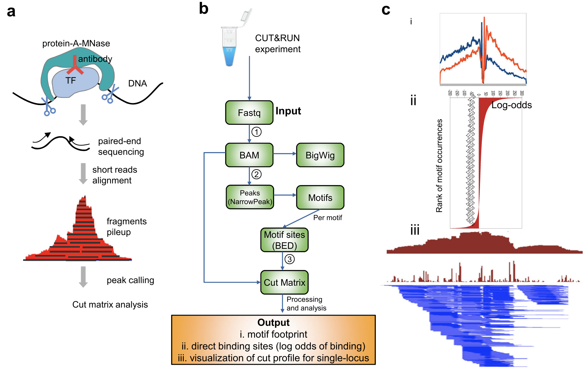

# CUT&RUN

## A simple method for chromatin profiling

**C**leavage **U**nder **T**argets and **R**lease **U**sing **N**uclease (CUT&RUN) is an innovative chromatin mapping strategy that is rapidly gaining traction in the field. The protocol requires less than a day from cells to DNA, and can be done entirely on the benchtop using standard equipment that is already present in most molecular biology laboratories.

### How does it work?

 
1. Cells/nuclei are bound to concanavalin A–coated magnetic beads.
	- Original Henikoff paper in eLife, isolates nuclei. Using purified nuceli allows for maximized binding of antibodies to nuclear factors and will result in cleaner CUT&RUN signal compared to protocol using whole cells. 
	- More recent bioArxiv paper, whole cells are harvested. Introduce the usage of a strong detergent to permeabilize cells rather than to rely on nuclei extraction.
	
2. Cell membranes (or nuclear membrances) are permeabilized with digitonin to allow the antibody to come in and bind its target (1h to overnight)
3. The Protein A fused MNase is then added. Protein A binds the Immunoglobulin G (IgG) on the primary antibody (or mock IgG) thus targeting MNase to antibody bound proteins.
4. The nuclease is briefly activated to digest the DNA around the target protein. This targeted digestion is controlled by the addition of calcium, which MNase requires for its nuclease activity and is chelated from the reaction up until this point. The nuclease reaction is performed on ice, and only for a short period of time, thus precisely controlling the amount of cutting and mitigating noise generated by off target digestion. 
5. At this point mononucleosomal-sized DNA fragments from external organism is added (spike-in DNA).
6. Fragments are released from nuclei by a short incubation at 37 °C. 
7. These short DNA fragments can then be purified for subsequent library preparation and high-throughput sequencing.

_Image source: ["AddGene Blog"](https://blog.addgene.org/cutrun-a-improved-method-for-studying-protein-dna-interactions)_

> #### What about CUT&TAG?
> For the **C**leavage **U**nder **T**argets and **Tag**mentation assay, pAG is fused to a hyperactive Tn5 transposase (pAG-Tn5) pre-loaded with sequencing adaptors, and is activated by magnesium to simultaneously fragment and “tag” antibody-labelled chromatin with adaptors. This bypasses traditional library prep steps and accelerates sample processing. However, it only works well with nuclei.
> 
> Both assays were developed in the laboratories of Dr. Steven Henikoff (Fred Hutchinson Cancer Research Center, Seattle, WA, USA) and Dr. Ulrich Laemmli (University of Geneva, Switzerland).

## CUT&RUN versus ChIP-seq

ChIP-seq is a notoriously challenging approach, in which target fragments are enriched from excess pools of sheared chromatin. Despite rigorous optimization and washing, the method is subject to high background. The resulting low signal to noise ratio makes it difficult to identify true binding sites.

### Advantages of CUT&RUN compared to ChIP-seq:
- **Requires less starting material (smaller number of cells)**. For example, while the protocol calls for 500K cells, it could be used with as low as 5K cells
- **Lower depth of sequencing**. You can produce high-quality CUT&RUN data with only 3–8 million reads per sample, compared to the 30 million or more reads required for ChIP-seq
- **Background is signifincantly reduced**, using targeted release of genomic fragments.
- **Lower costs**, by reducing antibody usage, library prep, and sequencing depth requirements

_Image source: [Epicypher Blog](https://www.epicypher.com/resources/blog/cut-and-run-vs-cut-and-tag-which-one-is-right-for-you/)_

### Any limitations to CUT&RUN?

The primary limitation of CUT&RUN is the **likelihood of over-digestion of DNA** due to inappropriate timing of the Calcium-dependent MNase reaction. A similar limitation exists for contemporary ChIP-seq protocols where enzymatic or sonicated DNA shearing must be optimized.

Also, it is possible that a **chromatin complex could be too large to diffuse out** or that protein–protein interactions retain the cleaved complex. In such cases, total DNA may be extracted after the digestion.

## Controls for CUT&RUN

Typically, with ChIP-Seq it is highly recommended that each peak should be compared with the same region of the genome in a matched control sample because only a fraction of the DNA in corresponds to actual signal amidst background noise. **CUT&RUN is thought to produce a sharper stronger signal, so do we need an input control?**

The recommendation from the Henikoff papers is do not use an input control (i.e. DNA purified from cells, but without adding any antibody for enrichment). Rather they recommend the use of a nonspecific rabbit IgG antibody that will randomly coat the chromatin at low efficiency without sequence bias. With a no-antibody control, the lack of tethering increases the possibility that slight carryover of pA-MN will result in preferential fragmentation of hyperaccessible DNA.

To **assess protocol efficacy**, it is recommended to run, in parallel, a **control CUT&RUN with an antibody against a histone mark**. How does it help? After quantifying purified DNA, run it on the Bioanalyzer system. Transcription factor CUT&RUN DNA are typically around 50–150 bp and may not show up on the bioanalyzer electropherogram if run prior to amplification. This is due to the low concentration of DNA present. However, with the control histone mark CUT&RUN, should see mono-, di-, and tri-nucleosomes in the Bioanalyzer traces.

## Analysis of CUT&RUN

### Quality Control

A number of metrics are used to evaluate the quality of a CUT&RUN dataset, including:

* **Fragment size distribution.** The fragment size is measured by the start and end positions of a pair of reads in paired-end sequencing. Since the experimental protocol enriches short fragments, it is a routine to ensure that the fragment size is within the expected range (e.g., ≤ 120 bp). 
* **Adapter content percentage**. The percentage of reads retained after the read trimming step. For a good-quality dataset, the number
of reads removed by trimming should be less than 10–15%, mostly corresponding to short fragments.
* **Library size/sequence depth**. Ensure appropriate read depth (3-8 million reads per sample) was achieved.
* **Read duplication rate**.  The read duplication rate is defined as the fraction of paired reads that have identical starts for
the first mate and ends for the second mate. Data should typically have a low read duplication rate (10–15%), although the rate may be higher for factors with an affinity for low-complexity regions. Can be filtered out if needed.
* **Alignment percentage**. Majority of reads (> 80%) should align uniquely to the species genome.
* **Number of peaks and FrIP**

### [CUT&RUNTools](https://github.com/fl-yu/CUT-RUNTools-2.0)
An end-to-end computational pipeline specifically tailored to this technology. Latest version now available for single-cell analysis. CUT&RUNTools is implemented using Python, R, and BASH scripts.

**Workflow/features:**
* Takes paired-end sequencing readFASTQ files as the input and performs a set of analytical steps
* Trimming of adapter sequences (Trimmomatic). A two-step read trimming process to improve the quality (K-seq).
* Alignment to the reference genome (Bowtie2). Turning on dovetail alignment, designed to accept alignments for paired-end reads when there is a large degree of overlap between two mates of each pair.
* Size selection: After alignment, fragments are divided into ≤ 120-bp and > 120-bp fractions. The ≤ 120-bp fraction which is likely to contain TF binding sites.
* Peak calling (MACS2, and now SEACR in 2.0)
* Estimation of cut matrix at single-nucleotide resolution (mostly used for footprinting)
* De novo motif searching (MEME) and motif footprinting analysis, using sequences within 100 bp from the summit of each peak
* Direct binding site identification
* Data visualization

_Image source: ["CUT&RUNTools: a flexible pipeline for CUT&RUN processing and footprint analysis"](https://genomebiology.biomedcentral.com/track/pdf/10.1186/s13059-019-1802-4.pdf)_

### [SEACR](https://seacr.fredhutch.org/)
Peak calling by Sparse Enrichment Analysis for CUT&RUN sequencing data. An analysis strategy that uses the global distribution of background signal to calibrate a simple threshold for peak calling. 

* CUT&RUN data features exceedingly low background and low sequence depth, in comparison with ChIP-seq. 
* ChIP-seq experiments are typically sequenced deeply and thus feature high background, thus most peak calling algorithms designed for this type of data. The sparseness of the background can increase false positives, resulting in any spurious background read being called as a peak.
* Thus, rather than requiring highly sensitive methods to distinguish signal from background noise, **peak calling from CUT&RUN data requires high specificity for true positive peaks**.

_Image source: ["Peak calling by Sparse Enrichment Analysis for CUT&RUN chromatin profiling"](https://epigeneticsandchromatin.biomedcentral.com/articles/10.1186/s13072-019-0287-4)_

**Features of SEACR:**

- model free and empirically data driven and therefore does not require arbitrary selection of parameters from a statistical model
- fast, accurate, scalable and simple to use
- peak calling is based on fragment block aggregation

### [CnRAP (Cut & Run Analysis Pipeline)](https://github.com/mbassalbioinformatics/CnRAP)
An analytical pipeline developed to analyze CUT&RUN data. Inspired by both Henikoff (SEACR) and Orkin (Cut&RunTools) lab pipelines.

## Spike-in normalization

There are multiple sources of technical variability that can hamper the direct comparison of binding signal strength between different conditions (in both, ChIP-seq and CUT&RUN data). For example, an increase in genomic occupancy of a chromatin factor could simply be the result of variability in the efficiency of immunoprecipitation between control and treated samples in a ChIP experiment.

The spike-in strategy is based on the use of a fixed amount of exogenous material (i.e cells or chromatin) from another species that is added to sample in an effort to control for technical variation. Since we are adding a known amount (and the same amount) to each sample, we expect the number of mapped reads to the reference (for example E. coli) to also be similar.  

* If the number of **mapped reads to the spike-in reference are roughly the same across samples**, then the observable differences in the reads of the experimental samples across conditions can be exclusively attributed to biological variation. 
* If the number of **mapped reads to the spike-in reference are variable across samples**, this suggests that there is some amount of technical variation. 

### Normalizing data using the spiked-in data

In the case of the latter described above, a normalization factor can be easily calculated ad hoc to equilibrate the spike-in signal among samples. The same correction computed from spike-in reads is then used to normalize the experimental ChIP-seq, thus enabling the fair comparison of the ChIP-seq signal across the samples.

**Different methods for computing the normalization factor:**

No matter which method you implement, the first step is aligning your sample to the spike-in reference. Collect total number of reads and total number of mapped reads for each sample.

1. Active motif
- Take the sample with the lowest number of mapped reads (minMap). Take the minMap and divide by the total number of mapped reads in the sample to compute a normliaztion factor. 
2. Epicypher
- A similar approach, except rather than using the number of mapped reads use the percentage of mapped reads
3. Constant 10K
- 10,000 / (Number of mapped reads/2) 

