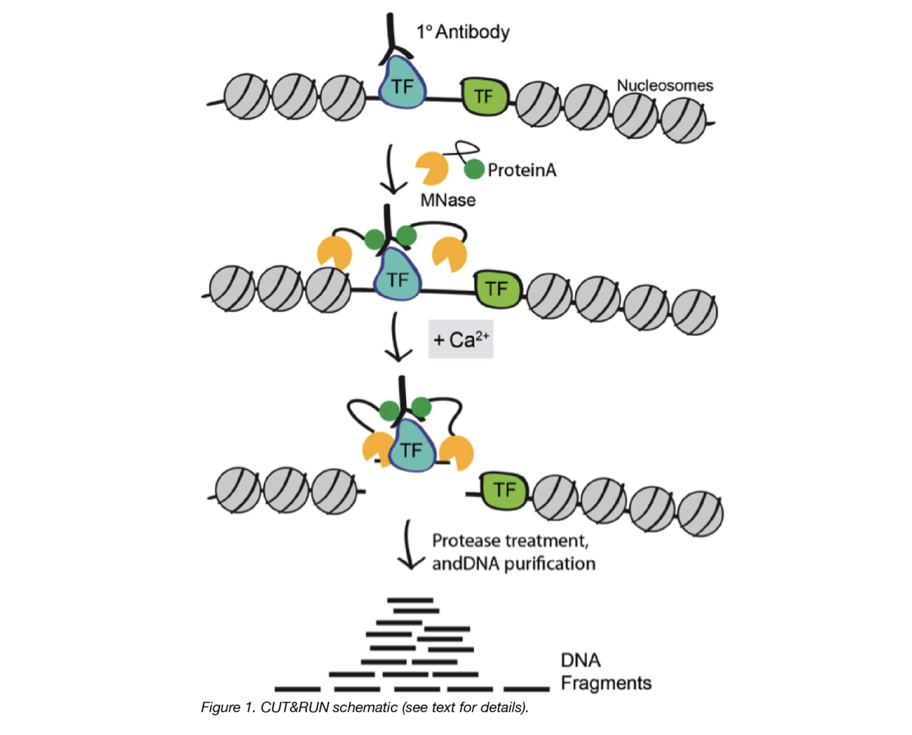
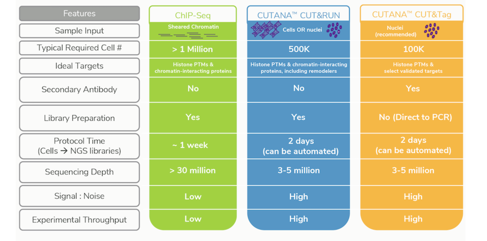
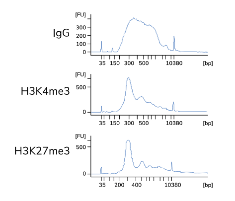
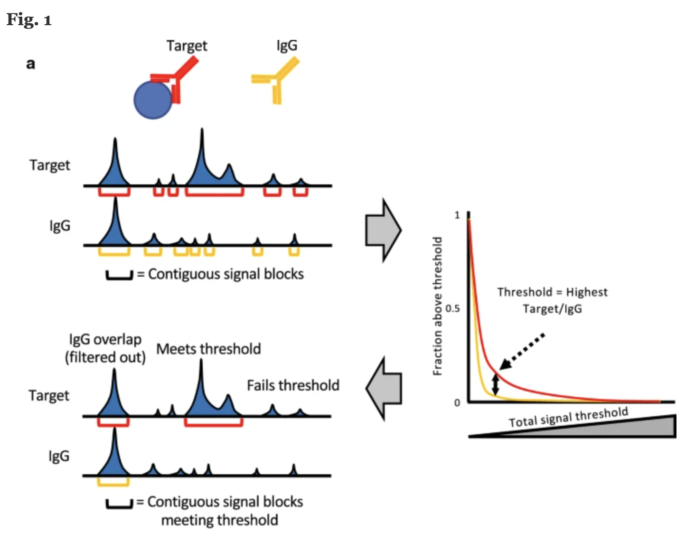

# CUT&RUN

## A simple method for chromatin profiling

**C**leavage **U**nder **T**argets and **R**elease **U**sing **N**uclease (CUT&RUN) is an innovative chromatin mapping strategy that is rapidly gaining traction in the field. The protocol requires less than a day to go from from cells to DNA, and can be done entirely on the benchtop using standard equipment that is already present in most molecular biology laboratories.

### How does it work?

 
1. Cells/nuclei are bound to concanavalin A–coated magnetic beads.
	- Original [Henikoff paper in eLife](), isolates nuclei. Using purified nuclei allows for maximal binding of antibodies to nuclear factors and will result in cleaner CUT&RUN signal compared to protocol using whole cells. 
	- More recent [bioArxiv paper](), whole cells are harvested. Introduce the usage of a strong detergent to permeabilize cells rather than to rely on extraction of nuclei.
	
2. Cell membranes (or nuclear membrances) are permeabilized with digitonin to allow the antibody access to its target (1h to overnight)
3. The Protein A fused MNase is then added. Protein A binds the Immunoglobulin G (IgG) on the primary antibody (or mock IgG) thus targeting the MNase to antibody bound proteins.
4. The nuclease is briefly activated to digest the DNA around the target protein. This targeted digestion is controlled by the release of (previously chelated) calcium, which MNase requires for its nuclease activity. The nuclease reaction is performed on ice, and only for a short period of time, thus precisely controlling the amount of cutting and thereby mitigating noise generated by off target digestion. 
5. At this point mononucleosomal-sized DNA fragments from a different organism is added (spike-in DNA).
6. Fragments are released from nuclei by a short incubation at 37 °C. 
7. These short DNA fragments are then purified for subsequent library preparation and high-throughput sequencing.

_Image source: ["AddGene Blog"](https://blog.addgene.org/cutrun-a-improved-method-for-studying-protein-dna-interactions)_

> #### What about CUT&TAG?
> For the **C**leavage **U**nder **T**argets and **Tag**mentation assay, pAG is fused to a hyperactive Tn5 transposase (pAG-Tn5) pre-loaded with sequencing adaptors, and is activated by magnesium to simultaneously fragment and “tag” antibody-labelled chromatin with adaptors. This bypasses traditional library prep steps and accelerates sample processing. However, it only works well with nuclei.
> 
> Both assays were developed in the laboratories of Dr. Steven Henikoff (Fred Hutchinson Cancer Research Center, Seattle, WA, USA) and Dr. Ulrich Laemmli (University of Geneva, Switzerland).

## CUT&RUN versus ChIP-seq

ChIP-seq is a notoriously challenging approach, in which target fragments are enriched from excess pools of sheared chromatin. Despite rigorous optimization and washing, the method is subject to high background. The resulting low signal to noise ratio makes it difficult to identify true binding sites.

### Advantages of CUT&RUN

- **Requires less starting material (smaller number of cells)**. For example, while the protocol calls for 500K cells, it could be used with as low as 5K cells
- **Lower depth of sequencing**. You can produce high-quality CUT&RUN data with only 3–8 million reads per sample, compared to the 30 million or more reads required for ChIP-seq
- **Background is signifincantly reduced**, using targeted release of genomic fragments.
- **Lower costs**, by reducing antibody usage, library prep, and sequencing depth requirements

### Limitations of CUT&RUN

- **Likelihood of over-digestion of DNA** due to inappropriate timing of the Calcium-dependent MNase reaction. A similar limitation exists for contemporary ChIP-seq protocols where enzymatic or sonicated DNA shearing must be optimized.
- **Not all proteins have been optimized for the protocol.** Depending on your protein of interest, you may need to invest time in pilot experiments to get the protocol working for you.
- It is possible that a **chromatin complex could be too large to diffuse out** or that protein–protein interactions retain the cleaved complex. In such cases, total DNA may be extracted after the digestion.

_Image source: [Epicypher Blog](https://www.epicypher.com/resources/blog/cut-and-run-vs-cut-and-tag-which-one-is-right-for-you/)_

## Controls for CUT&RUN

### Negative (background) control
Similar to ChIP-seq, only a fraction of the DNA in at CUT&RUN sample will correspond to actual signal amidst background noise. However, **CUT&RUN is thought to produce a sharper stronger signal, so do we need an input control?**

Rather than having an input DNA control, **the use of a nonspecific rabbit IgG antibody is recommended by the Henikoff lab**. It will randomly coat the chromatin at low efficiency without sequence bias. While a no-antibody input DNA sample will generate a more diverse DNA library, the lack of tethering increases the possibility that slight carryover of pA-MN will result in preferential fragmentation of hyperaccessible DNA.

### Positive control

To **assess protocol efficacy**, it is recommended to run, in parallel, a **control CUT&RUN with an antibody against a histone mark**. How does it help? After quantifying purified DNA, run it on the Bioanalyzer system. Transcription factor CUT&RUN DNA are typically around 50–150 bp and may not show up on the bioanalyzer electropherogram if run prior to amplification. This is due to the low concentration of DNA present. However, with the control histone mark CUT&RUN, you should see mono-, di-, and tri-nucleosomes in the Bioanalyzer traces. In the figure below, H3K4me3 and H3K27me3 libraries are predominantly enriched for mononucleosomes as indicated by the peak at 275 bp (~150 bp mononucleosomes + 125 bp sequence adapters). Bioanalyzer traces are the best indicator of success prior to sequencing. 

_Typical Bioanalyzer traces for IgG negative control and H3K4me3 / H3K27me3 positive control CUT&RUN sequencing libraries. Image source: [Epicypher CUT&RUN Protocol v1.5.4 ](https://www.stratech.co.uk/wp-content/uploads/2020/07/cutana-cutrun-protocol.pdf)_

## Analysis of CUT&RUN

### Quality Control

A number of metrics are used to evaluate the quality of a CUT&RUN dataset, including:

* **Fragment size distribution -** The fragment size is measured by the start and end positions of a pair of reads in paired-end sequencing. Since the experimental protocol enriches short fragments, it is a routine to ensure that the fragment size is within the expected range (e.g., ≤ 120 bp). 
* **Adapter content percentage -** The percentage of reads retained after the read trimming step. For a good-quality dataset, the number
of reads removed by trimming should be less than 10–15%, mostly corresponding to short fragments.
* **Library size/sequence depth -** Ensure appropriate read depth (3-8 million reads per sample) was achieved.
* **Read duplication rate -** The read duplication rate is defined as the fraction of paired reads that have identical starts for
the first mate and ends for the second mate. Data should typically have a low read duplication rate (10–15%), although the rate may be higher for factors with an affinity for low-complexity regions. Can be filtered out if needed.
* **Alignment percentage -** Majority of reads (> 80%) should align uniquely to the species genome.
* **Number of peaks and FrIP -** The number of peaks will vary depending on the protein of interest. For proteins where we expect limited binding the fraction of reads in peaks will consequeuntly be lower.

### Alignment

CUT&RUN libraries are sequenced using **paired-end reads which are are aligned by Bowtie2**. There are a few additional parameters that are used by various groups, which are not typically used with ChIP-seq data. They are listed and described below:

_CUT&RUN sequencing workflow. Image source: Adapted from [CUT&RUNTools: a flexible pipeline for CUT&RUN processing and footprint analysis]([https://www.stratech.co.uk/wp-content/uploads/2020/07/cutana-cutrun-protocol.pdf](https://genomebiology.biomedcentral.com/articles/10.1186/s13059-019-1802-4/figures/1))_

* `--end-to-end`: Bowtie2 will search for alignments involving all of the read characters. This is also called an "untrimmed" or "unclipped" alignment, and is only used when trimming is done prior to alignment.
* `--very-sensitive`: a preset option which will result in Bowtie2 generally being slower, but more sensitive and more accurate.
* `--no-mixed`: By default, when Bowtie2 cannot find a concordant or discordant alignment for a pair, it then tries to find alignments for the individual mates. This option disables that behavior.
* `--no-discordant`:  A discordant alignment is an alignment where both mates align uniquely, but that does not satisfy the paired-end constraints,  This option disables that behavior.  
* `-I 10 -X 700`: For specifying the size range of inserts. In this example, 10-700 bp in length is used to ignore any remaining adapter sequence at the 3’ ends of reads during mapping.
* `--dovetail`: The term 'dovetailing' describes mates which extend past one another. It is unusual but encountered in CUT&RUN experiments. This flag indicates that dovetailed alignments should be considered as concordant. 

_It is not neccessary to include all or any of these options!_ We just want to bring to your attention that some combination of these options have been used by other groups. We encourage you to read through th literature and decide what is best for your data.

> #### To trim or not to trim?
> Trimming is optional.
> * If reads are 25bp then there is no need to trim, as adapter sequences will not be included in reads of inserts >25 bp. 
> * Trimming can help remove low quality bases and remove any adapter sequence. After trimming, a minimum read length of 25bp should be imposed, as reads smaller than this are hard to align accurately.  
> * Should you choose not trim reads, you will need to use `--local` when runing Bowtie2 as this will perform "soft-clipping" to ignore parts of the reads which may be of low quality.

### Peak calling

For the most part, **MACS2 remains the peak caller of choice for CUT&RUN data**. After alignment, fragments can be divided into ≤ 120-bp and > 120-bp fractions. For transcription factors or proteins with an expected punctate binding profile, you can use the ≤ 120-bp fraction which is likely to contain binding sites. The range can be increased depending on the protein of interest, and alternatively BAM files without filtering can also be used. _The default narrow peak setting will suffice._

Another **recent approach developed by the Henikoff Lab is a tool called [SEACR](https://seacr.fredhutch.org/)**. Peak calling by **S**parse **E**nrichment **A**nalysis for **C**UT&**R**UN sequencing data, provides an analysis strategy that uses the global distribution of background signal to calibrate a simple threshold for peak calling. 

ChIP-seq experiments are typically sequenced deeply and thus feature high background, thus most peak calling algorithms designed for this type of data. By contrast, CUT&RUN data features exceedingly low background and low sequence depth. The sparseness of the background can increase false positives, resulting in any spurious background read being called as a peak. Thus, rather than requiring highly sensitive methods to distinguish signal from background noise, **peak calling from CUT&RUN data requires high specificity for true positive peaks**.

_Image source: ["Peak calling by Sparse Enrichment Analysis for CUT&RUN chromatin profiling"](https://epigeneticsandchromatin.biomedcentral.com/articles/10.1186/s13072-019-0287-4)_

**Features of SEACR include:**

- model free and empirically data driven and therefore does not require arbitrary selection of parameters from a statistical model
- fast, accurate, scalable and simple to use
- peak calling is based on fragment block aggregation

***

*This lesson has been developed by members of the teaching team at the [Harvard Chan Bioinformatics Core (HBC)](http://bioinformatics.sph.harvard.edu/). These are open access materials distributed under the terms of the [Creative Commons Attribution license](https://creativecommons.org/licenses/by/4.0/) (CC BY 4.0), which permits unrestricted use, distribution, and reproduction in any medium, provided the original author and source are credited.*

