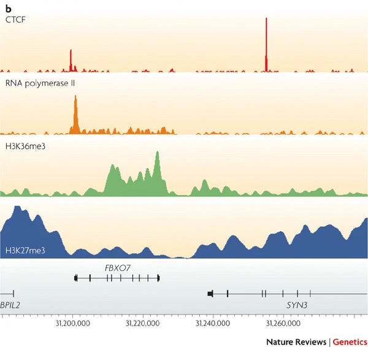

Approximate time: 45 minutes

## Learning Objectives

* Identify public research consortia for gene regulation and the resources they provide
* Review experimental design considerations for a ChIP experiment
* Understand the steps involved in a ChIP-seq analysis workflow

## Unraveling the epigenetic landscape
A precise map of binding sites for transcription factors, core transcriptional machinery and other DNA-binding proteins is critical for gaining a full understanding of transcriptional regulation. To that end, there are various consortia that have formed to collect data across studies and make it publicly available. Ultimately, resources like this enable researchers to piece together the epigenomic landscape contributing to cell identity, development, lineage specification, and disease. 

_Image source: ["From DNA to a human: What the ENCODE and Roadmap Epigenome Projects can teach us about how we are who we are"](https://portlandpress.com/biochemist/article/37/5/24/773/From-DNA-to-a-human-What-the-ENCODE-and-Roadmap)_

### The ENCODE project

The [ENCODE (Encyclopedia of DNA Elements) Project](https://www.encodeproject.org/) was planned as a follow-up to the Human Genome Project. It is a **public research consortium aimed to assign function to all elements in the human and mouse genome**. Coinciding with the completion of the Human Genome Project in 2003, the ENCODE Project began as a worldwide effort involving more than 30 research groups and more than 400 scientists. 

ENCODE has produced vast amounts of data that can be accessed through the project's freely accessible database, the ENCODE Portal. The ENCODE "Encyclopedia" organizes these data into two levels of annotations: 1) integrative-level annotations, including a registry of candidate cis-regulatory elements and 2) ground-level annotations derived directly from experimental data.

> *NOTE:* For those working on other model organisms, there is also the [modENCODE (MODel organism ENCyclopedia Of DNA Elements) project](http://www.modencode.org/), targeting the identification of functional elements in selected model organism genomes, specifically _Drosophila melanogaster_ and _Caenorhabditis elegans_.

### NIH Roadmap Epigenomics Mapping Consortium

The [NIH Roadmap Epigenomics Project](http://www.roadmapepigenomics.org/) has continued this journey, with a focus on human epigenomic data. This project was launched in 2008 with the goal of elucidating how epigenetic regulation contributes to human development and disease. **The Roadmap Epigenome** uses many of the same technologies used by ENCODE, but **almost excusively focused on epigenetic features such as DNA methylation and histone modifications**, while ENCODE emphasized identifying sites of DNA binding factor occupancy.

The data is presented as  **an atlas, where users can explore epigenome maps for stem cells and primary ex vivo tissues** selected to represent the normal counterparts of tissues and organ systems frequently involved in human disease. Data can be viewed in the browser or downloaded locally.

## ChIP-seq: A method for detecting and characterizing protein–DNA interactions

In this workshop we will be focusing on the ChIP-seq technology. <u>Ch</u>romatin <u>I</u>mmuno<u>p</u>recipitation followed by sequencing (ChIP-seq) is a central method in epigenomic research. In ChIP experiments, a transcription factor, cofactor, or other chromatin protein of interest is enriched by immunoprecipitation from cross-linked cells, along with its associated DNA. The immunoprecipitated DNA fragments are then sequenced, followed by identification of enriched regions of DNA or peaks. These peak calls can then be used to make biological inferences by determining the associated genomic features and/or over-represented sequence motifs. 

_Image source: ["From DNA to a human: What the ENCODE and Roadmap Epigenome Projects can teach us about how we are who we are"](https://portlandpress.com/biochemist/article/37/5/24/773/From-DNA-to-a-human-What-the-ENCODE-and-Roadmap)_

ChIP-seq has been widely used for many transcription factors, histone modifications, chromatin modifying complexes, and other chromatin-associated proteins in a wide variety of organisms. As such, **there is much diversity in the way ChIP-seq experiments are designed and the way analyses are executed.**

In this lesson, we describe a few general guidelines for setting up a ChIP-seq experiment and outline the basic analysis workflow.

## Experimental design considerations

When starting out with your experiment, there are many things to think about. We have highlighted some of the important points in the previous lecture and within this lesson, but we also encourage you to peruse the [ENCODE guidelines and practices for ChIP-seq](https://www.ncbi.nlm.nih.gov/pmc/articles/PMC3431496/). Although it was published in 2012, much of the information is still very valid and used in practice today.

Below, is the **decision tree** that was presented earlier in the workshop (lecture). From this, we highlight some important points below:

### Starting material
Ensure that you have a sufficient amount of starting material because the ChIP will only enrich for a small proportion. For a standard protocol, you want approximately 2 x 106 cells per immunoprecipitation. If it is difficult to obtain that many samples from your experiment, consider using low input methods. Ultimately, higher amounts of starting material yield more consistent and reproducible protein-DNA enrichments.

> #### Can I pool samples if I don't have enough cells?
> We generally recommend that you try to steer clear of pooling (for ChIP-seq and other NGS applications). There is variability between samples and mixing them together can increase background noise and dilute signal. In the case where you have small amounts of starting material, we suggest using [CUT&RUN](https://elifesciences.org/articles/21856).

### Quality control of your ChIP

Your ChIP experiment is only as good as your antibody! The more specific the antibody, the more robust and accurate your results will be. Antibody deficiencies are of two main types: poor reactivity against the intended target and/or cross-reactivity with other DNA-associated proteins.  Here, we boil it down to the following key points:

* Test your antibody with the use of a [**Western blot**](https://www.nature.com/scitable/definition/western-blot-288/). These are performed on protein lysates from either whole-cell extracts, nuclear extracts, chromatin preparations, or immunoprecipitated material. Numerous antibodies have been shown to work in ChIP; nevertheless, **it is best to test the antibody with the specific set of cells that you are working with**.

> _Immunoblot analyses of antibodies against SIN3B that (left) pass and (right) fail quality control. Lanes contain nuclear extract from GM12878 cells (G) and K562 cells (K). Arrows indicate band of expected size of 133 kDa. [[Landt et al, 2012](https://www.ncbi.nlm.nih.gov/pmc/articles/PMC3431496/)]_

* Check a few regions by **qPCR to confirm that the pull-down worked**. Create primers for regions of the genome you expect your protein of interest to bind. The PCR is performed on the immunoprecipitated material, before sending it for sequencing. 
    * You can also check a region of DNA that you do not expect to be enriched and thus do not expect to be amplified by qPCR, to show that your ChIP is specific (negative control)

* If you don't have any known targets for your protein, run a **postive control ChIP**. Histone H3 or H3k4me3 usually work very well. Since there is loads of H3K4me3 present at most TSSs you could design primers against the promoter of a housekeeping gene. If you have a good signal present, you will at least know the protocol is working well.

> **NOTE:** The authors of this study also included a positive control sample using an antibody against p300 to test the protocol, although the data is not included here. The p300 protein [has been shown](https://pubmed.ncbi.nlm.nih.gov/19212405/) to have binding sites in the cortex. 

### Input control

A ChIP-Seq peak should be compared with the same region of the genome in a matched control sample because only a fraction of the DNA in our ChIP sample corresponds to actual signal amidst background noise. 

There are a number of **artifacts that tend to generate pileups of reads that could be interpreted as a false positive peaks**. These include:
* Open chromatin regions that are fragmented more easily than closed regions due to the accessibility of the DNA
* The presence of repetitive sequences
* An uneven distribution of sequence reads across the genome due to DNA composition
* ‘hyper-ChIPable’ regions: loci that are commonly enriched in ChIP datasets. Certain genomic regions are more susceptible to immunoprecipitation, therefore show increased ChIP signals for unrelated DNA-binding and chromatin-binding proteins.

There are two kinds of controls that can be used for ChIP-seq: **IgG control** and **input control**. 

*Image source: [Xu J. et al., BioRxiv (2019)](https://www.biorxiv.org/content/10.1101/2019.12.17.880013v1.full).*

**IgG control** is DNA resulting from a immunoprecipitation with an [isotype-matched](https://www.novusbio.com/products/isotype-controls) control immunoglobulin. An isotype control is an antibody that maintains similar properties to the primary antibody but lacks specific target binding. Save 5-10% of your cell lysate, and add the appropriate non-specific IgG instead of protein-specific antibody, but at the same concentration. This will give an indication of the assay background and identify non-specific binding of the beads used for the immunoprecipitation. However, if too little DNA is recovered after immunoprecipitation, the sequencing library will be of low complexity and binding sites identified using this control could be biased. 

**Input control** is DNA purified from cells that are cross-linked, and fragmented, but without adding any antibody for enrichment. Save 5-10% of your cell lysate before addition of antibodies. Input samples can account for variations in the fragmentation step of the ChIP protocol as certain regions of the genome are more likely to shear than others based upon their structure and GC content. Input controls are **more widely used** to normalize signals from ChIP enrichment.

> #### Do I need to have one input sample for each IP sample in my dataset?
> The ENCODE guidelines [[Landt, et al, 2012](https://www.ncbi.nlm.nih.gov/pmc/articles/PMC3431496/)] states _"If cost constraints allow, a control library should be prepared from every chromatin preparation and sonication batch, although some circumstances can justify fewer control libraries. Importantly, a new control is always performed if the culture conditions, treatments, chromatin shearing protocol, or instrumentation is significantly modified."_
> 
> The short answer is, yes having an input sample matched with each IP is ideal. However, studies have shown input replicates to have strong reproducibility in some cases. Thus, if there are constraints with budget or obtaining enough sample, having one input per sample group can suffice. 

### Replicates

As with any high-throughput experiment, a single assay is often subject to a substantial amount of variability. Thus, it is highly recommended to setup your experimental design with a **minimum of 2-3 biological replicates**. Presumably, two replicates measuring the same underlying biology should have high consistency but that is not always the case. Having replicates allow you to evaluate concordance of peaks and identify a set of reproducible enriched regions with greater confidence. If you have multiple sample groups and are planning a differential enrichment analysis, increasing the number of replicates will give you more statistical power to find changes between groups.

*Image source: [Klaus B., EMBO J (2015) **34**: 2727-2730](https://dx.doi.org/10.15252%2Fembj.201592958)*

> #### Do we see batch effects in ChIP-seq data?
> Typically, batch effects are not as big of a concern with ChIP-seq data. However, it is best to run everything in parallel as much as possible. If you only have a single sample group, it should be more feasible to prepare all samples together (since there are fewer). For multiple sample groups, if you are not able to process all samples together, split replicates of the different sample groups across batches. This way you avoid any potential confounding.

### Types of binding profiles

A major factor to consider when choosing your sequencing depth is the type of binding profile you are expecting. There are three types of binding profiles, generally speaking: narrow, broad and mixed. The variations in profiles are depicted in the image below:

*Image source: [Park P., Nature Reviews Genetics (2009) **10**: 669–680](https://www.nature.com/articles/nrg2641).*

* **Narrow peaks** are short degenerate regions of sequence that present as punctate binding sites. This type of profile is generally observed for protein–DNA binding (i.e most transcription factors) or histone modifications at regulatory elements. *E.g. CTCF and RNA polymerase II (red and orange in the image above).*
* **Broad peaks** present as larger regions of enrichment across the gene body. This type of profile is often associated with histone modifications that mark domains — for example, transcribed or repressed regions. *E.g. H3K36me3 and H3K27me3 (green and blue in the image above).*
* **Mixed peaks** are more difficult to discern, as the profile is a mixture of narrow and broad. The example shown is RNA polymerase II (orange), which has a sharp peak followed by a broad region of enrichment.

The table below is adapted from the [ENCODE data standards page](https://www.encodeproject.org/chip-seq/histone-encode4/), which categorizes the different histone marks by their signal profile. Knowing the profile expected for a given histone mark can help you determine the appropriate sequencing depth.

   
|Broad Peaks	| Narrow Peaks |	Exceptions/Mixed Peaks |
|---------------|---------------|---------------|
|H3F3A|H2AFZ|H3K9me3|
|H3K27me3|H3ac||
|H3K36me3|H3K27ac||
|H3K4me1|H3K4me2||
|H3K79me2|H3K4me3||
|H3K79me3|H3K9ac||
|H3K9me1|||
|H3K9me2|||
|H4K20me1|||
|H3K9me3|||

   
### Sequencing considerations

Below we list some general guidelines and things to think about when sending your samples to the sequencing facility:

#### Read length
* Read length should be between 50- to 150-bp
* Single-end reads are sufficient in most cases
    * Longer reads and paired-end reads will improve mappability
    * Paired-end is good (and necessary) for allele-specific chromatin events, and investigations of transposable elements
* Balance cost with value of more informative reads
    * i.e. spending money on replicates is more important than longer reads or paired-end

#### Sequencing depth

* Narrow peak profiles
     * **Mammalian cells**; ENCODE suggests a minimum of 10 million uniquely mapped reads. For standard transcription factors we recommend between **20-40 million total read depth**
     * **Worms and flies**; ENCODE suggests a minimum of **2 million uniquely mapped reads**. We recommend between **4-8 million total read depth**.
     
* Broad peak profiles
     * Generally require a higher sequence depth
     * **Mammalian cells** require a **minimum of 40M total read depth; more is better** for detecting some histone marks
     * **Worms and flies; less is known** and so the numbers vary across studies. We suggest a **minimum of 8M total read depth.**

* Sequence the input controls to equal or higher depth than your ChIP samples

### Resources
* ENCODE Data Standards and Processing Pipeline Information for [Histone](https://www.encodeproject.org/chip-seq/histone/) and [Transcription Factors](https://www.encodeproject.org/chip-seq/transcription_factor/)
* [Thermofisher Step-by-step guide to a successful ChIP experiment](https://www.thermofisher.com/us/en/home/life-science/antibodies/antibodies-learning-center/antibodies-resource-library/antibody-application-notes/step-by-step-guide-successful-chip-assays.html)
* "Chromatin Immunoprecipitation (ChIP) Principles and How to Obtain Quality Results", [BenchSci Blog](https://blog.benchsci.com/chromatin-immunoprecipitation-chip-principles-and-how-to-obtain-quality-results)

## Understanding the ChIP-seq analysis workflow

In the same way that the experimental design setup is a process, the analysis also takes some thought and decision making. Below we have depicted an end-to-end analysis workflow for ChIP-sequencing data. **Our focus for this workshop will be on the top half of this workflow diagram**.

All of the software required to get us from **raw sequence reads to peak calls** are command-line tools and accessible on O2, the HMS-RC high performance cluster. As we encounter each of the tools, we will describe it's purpose and how it functions. Where applicable we can delve a bit deeper to understand the inner workings of the algorithm, such that we can thoroughly understand the output. Each step of the workflow will require a specific file format. You will notice that we have annotated these file formats on the workflow below. We will describe these file formats in more detail in the respective lessons.

> **NOTE:** Boxes in green cover topics that will not be covered here, but will be a focus of the ChIP-seq Part II workshop (_material development in progress_). It is also worth noting that the green boxes also represent analysis steps which require a working knowledge of R. The color fade indicates that there are some parts of "Peak Call QC" which are covered in this workshop with the use of command-line tools, and other methods which are R-based and will be covered in Part II. 

***
*This lesson has been developed by members of the teaching team at the [Harvard Chan Bioinformatics Core (HBC)](http://bioinformatics.sph.harvard.edu/). These are open access materials distributed under the terms of the [Creative Commons Attribution license](https://creativecommons.org/licenses/by/4.0/) (CC BY 4.0), which permits unrestricted use, distribution, and reproduction in any medium, provided the original author and source are credited.*

