Approximate time: 45 minutes

## Learning Objectives

* 

## Unraveling the epigenetic landscape
It is clear that DNA sequence and transcription factor availability alone are not sufficient for effective gene regulation in eukaryotes. Epigenetic factors at various levels also have an essential role. DNA wraps around histones to form nucleosomes, which fold and condense to form chromatin. In the processes of DNA replication and transcription, some regions of chromatin are opened and regulatory machinery can bind to the exposed DNA binding sites. In addition, the chromatin structure can undergo dynamic epigenetic modifications, such as DNA methylation, histone modification and chromatin remodelling.

**All of this together is critical for gaining a full understanding of transcriptional regulation.** 

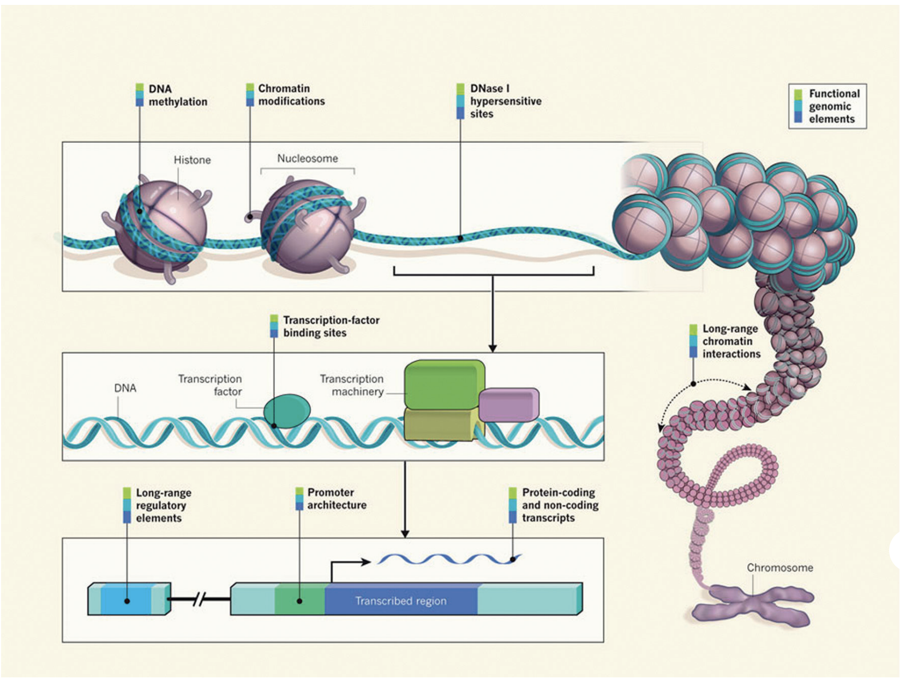

_Image source: ["From DNA to a human: What the ENCODE and Roadmap Epigenome Projects can teach us about how we are who we are"](https://portlandpress.com/biochemist/article/37/5/24/773/From-DNA-to-a-human-What-the-ENCODE-and-Roadmap)_

---

### ChIP-seq: A method for detecting and characterizing protein–DNA interactions

In this workshop we will be focusing on the ChIP-seq technology. <u>Ch</u>romatin <u>I</u>mmuno<u>p</u>recipitation followed by sequencing (ChIP-seq) is a central method in epigenomic research. In ChIP experiments, a transcription factor, cofactor, or other chromatin protein of interest is enriched by immunoprecipitation from cross-linked cells, along with its associated DNA. The immunoprecipitated DNA fragments are then sequenced, followed by identification of enriched regions of DNA or peaks. These peak calls can then be used to make biological inferences by determining the associated genomic features and/or over-represented sequence motifs. 

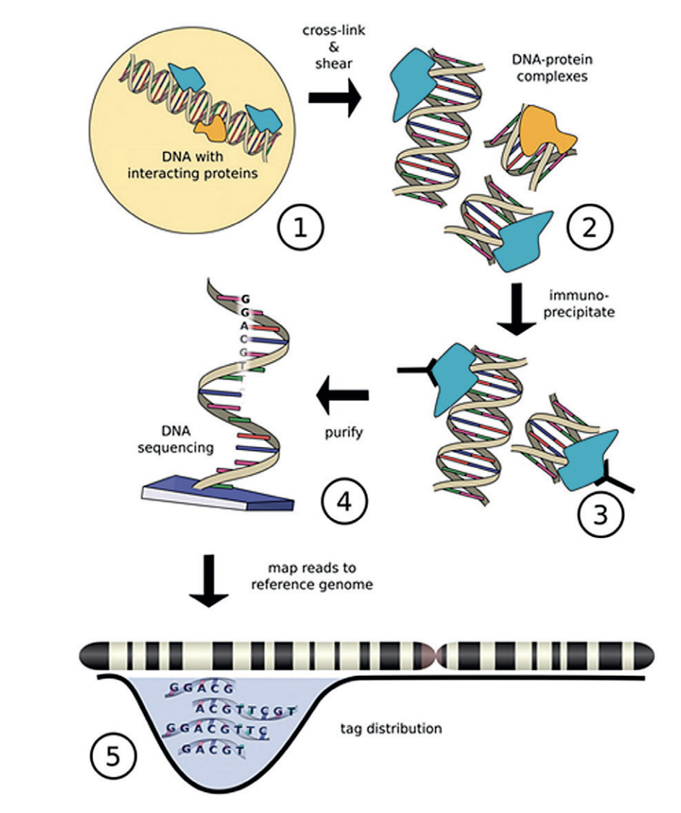

_Image source: ["From DNA to a human: What the ENCODE and Roadmap Epigenome Projects can teach us about how we are who we are"](https://portlandpress.com/biochemist/article/37/5/24/773/From-DNA-to-a-human-What-the-ENCODE-and-Roadmap)_

ChIP-seq has been widely used for many transcription factors, histone modifications, chromatin modifying complexes, and other chromatin-associated proteins in a wide variety of organisms. As such, **there is much diversity in the way ChIP-seq experiments are designed and the way analyses are executed.**

---

### CUT&RUN: An improved alternative to ChIP-seq

ChIP-seq is a notoriously challenging approach. Despite rigorous optimization and washing, the method is subject to high background. The resulting low signal to noise ratio makes it difficult to identify true binding sites.

**C**leavage **U**nder **T**argets and **R**elease **U**sing **N**uclease (CUT&RUN) is an innovative chromatin mapping strategy that is **rapidly gaining traction in the field**. The protocol requires less than a day to go from from cells to DNA, and can be done entirely on the benchtop using standard equipment that is already present in most molecular biology laboratories.

#### How does it work?

CUT&RUN is a native endonuclease-based method based on the binding of an antibody to a chromatin-associated protein in situ and the recruitment of a protein A-micrococcal nuclease fusion (pA-MN) to the antibody to efficiently cleave DNA surrounding binding sites.

	
<b>Click here for more specifics on the CUT&RUN protocol</b>

	 Below we describe each step of the protocol in some detail: 
1. Cells/nuclei are bound to concanavalin A–coated magnetic beads. 
	- In the original <a href="https://elifesciences.org/articles/21856">Henikoff lab paper</a> they isolate nuclei. Using purified nuclei allows for maximal binding of antibodies to nuclear factors and will result in cleaner CUT&RUN signal compared to protocol using whole cells. 
	- In the more <a href="https://elifesciences.org/articles/46314">recent paper, also from the Henikoff lab</a>, whole cells are harvested. They introduce the use of a strong detergent to permeabilize cells rather than relying on the extraction of nuclei. 
2. Cell membranes (or nuclear membrances) are permeabilized with digitonin to allow the antibody access to its target (1h to overnight) 
3. The Protein A fused MNase is then added. Protein A binds the Immunoglobulin G (IgG) on the primary antibody (or mock IgG) thus targeting the MNase to antibody bound proteins. 
4. The nuclease is briefly activated to digest the DNA around the target protein. This targeted digestion is controlled by the release of (previously chelated) calcium, which MNase requires for its nuclease activity. The nuclease reaction is performed on ice, and only for a short period of time, thus precisely controlling the amount of cutting and thereby mitigating noise generated by off target digestion. 
5. At this point mononucleosomal-sized DNA fragments from a different organism is added (spike-in DNA). 
6. Fragments are released from nuclei by a short incubation at 37 °C. 
7. These short DNA fragments are then purified for subsequent library preparation and high-throughput sequencing. 	
 

_Image source: ["AddGene Blog"](https://blog.addgene.org/cutrun-a-improved-method-for-studying-protein-dna-interactions)_

> #### What about CUT&TAG?
> For the **C**leavage **U**nder **T**argets and **Tag**mentation assay, pAG is fused to a hyperactive Tn5 transposase (pAG-Tn5) pre-loaded with sequencing adaptors, and is activated by magnesium to simultaneously fragment and “tag” antibody-labelled chromatin with adaptors. This bypasses traditional library prep steps and accelerates sample processing. However, it only works well with nuclei.
> 
> Both assays were developed in the laboratories of Dr. Steven Henikoff (Fred Hutchinson Cancer Research Center, Seattle, WA, USA) and Dr. Ulrich Laemmli (University of Geneva, Switzerland).

### CUT&RUN versus ChIP-seq

| Advantages of CUT&RUN | Limitations of CUT&RUN |
|:----------------:|:----------:|
| **Requires less starting material** (smaller number of cells).   | **Not all proteins have been optimized for the protocol.** You may need to invest time in pilot experiments to get the protocol working for you. | 
|**Lower depth of sequencing**.  | **Likelihood of over-digestion of DNA** due to inappropriate timing of the Calcium-dependent MNase reaction. | 
| **Background is significantly reduced**, using targeted release of genomic fragments.  | It is possible that a **chromatin complex could be too large to diffuse out** or that protein–protein interactions retain the cleaved complex.| 
| **Lower costs**, by reducing antibody usage, library prep, and sequencing depth requirements | | 

---

### ATAC-seq: Assaying open regions in the genome

A popular approach used to identify open regions of the genome is the **A**ssay for **T**ransposase-**A**ccessible **C**hromatin (ATAC) followed by high throughput sequencing.  The ATAC-Seq method was first [published in 2013](https://www.ncbi.nlm.nih.gov/pubmed/24097267) in the journal Nature Methods by lead researcher Jason Buenrostro in the labs of Howard Chang and William Greenleaf at Stanford University.

#### How does it work?

* Utilizes hyperactive Tn5 transposase to insert sequencing adapters into the open chromatin regions 
* Tn5 tagmentation simultaneously fragments the genome and tags the resulting DNA with sequencing adapters
* Amplify and sequence

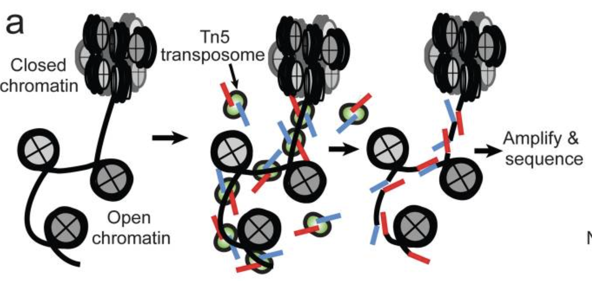

_Image source: [Buenrostro et al., 2015](https://www.ncbi.nlm.nih.gov/pubmed/24097267)_

The method relies on the hyperactive Tn5 transposase that was already being used for tagmentation-based NGS library preparation methods. The authors hypothesized that if a similar approach was used in vivo, the **addition of the adapters would mainly take place in open chromatin regions, where no steric hindrance of the transposase would occur**, allowing the enzyme to preferentially access these regions.

#### Why ATAC-seq?

* The main advantage over existing methods is the **simplicity** of the library preparation protocol:
	* Tn5 insertion followed by two rounds of PCR.
	* no sonication or phenol-chloroform extraction like FAIRE-seq
	* no antibodies like ChIP-seq
	* no sensitive enzymatic digestion like MNase-seq or DNase-seq
	
* **Short time requirement.** Unlike similar methods, which can take up to four days to complete, ATAC-seq preparation can be completed in under three hours.
* **Low starting cell number** than other open chromatin assays (500 to 50K cells recommended for human).

## Profiling chromatin structure

### Protein-DNA binding 
In a typical primary ChIP-seq analysis pipeline, the sequence reads are mapped to a reference genome and areas with the highest coverage (peaks) are determined.  When we visualize the reads in a genome viewer **these regions present with a characteristic signal profile** depending on the protein of interest.

* **Narrow peaks**: a signal profile spanning a small region but with high amplitude (shown in the red track in the image below). The narrow peak profile is generally observed for most transcription factors, but also for some regulatory elements (i.e. CTCF). 
* **Mixed peaks:** are more difficult to discern, as the profile is a mixture of narrow and broad. The example shown below is RNA polymerase II (orange), which has a sharp peak followed by a broader (lower amplitude) region of enrichment.
* **Broad peaks:** present as larger regions of enrichment across the gene body, and are typically observed with speicific histone marks as described below.

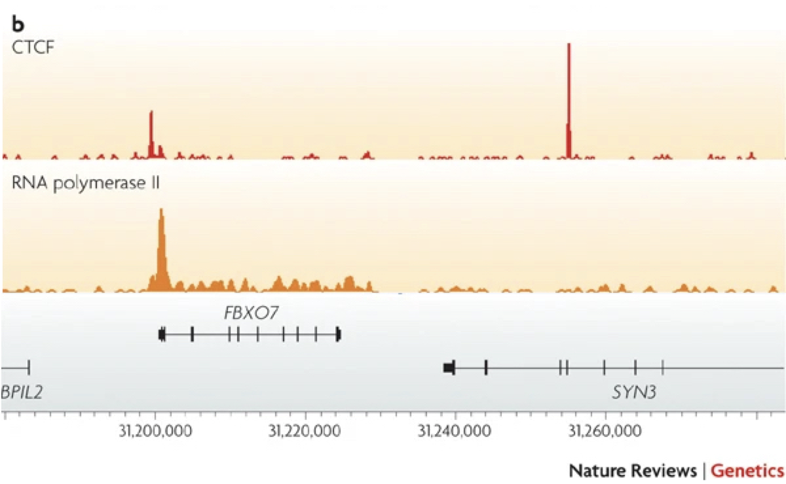

_Image adapted from: [Park P., Nature Reviews Genetics (2009) **10**: 669–680](https://www.nature.com/articles/nrg2641)_

### Histone modifications
When it comes to analyzing histone modifications, the histone code has the potential to be massively complex with each of the four standard histones possibly being modified at multiple sites with different modifications in their N-terminal ends. But in practice, researchers tend to limit themselves to a few modifications on **Histone 3 with well characterized roles in gene regulation**: 

* **Active promoters** (narrow peak): H3K4me3, H3K9Ac 
* **Active enhancers** (narrow peak): H3K27Ac, H3K4me1 
* **Repressor** (broad peak): H3K9me3 and H3K27me3 
* **Actively transcribed gene bodies** (broad peak): H3K36me3 

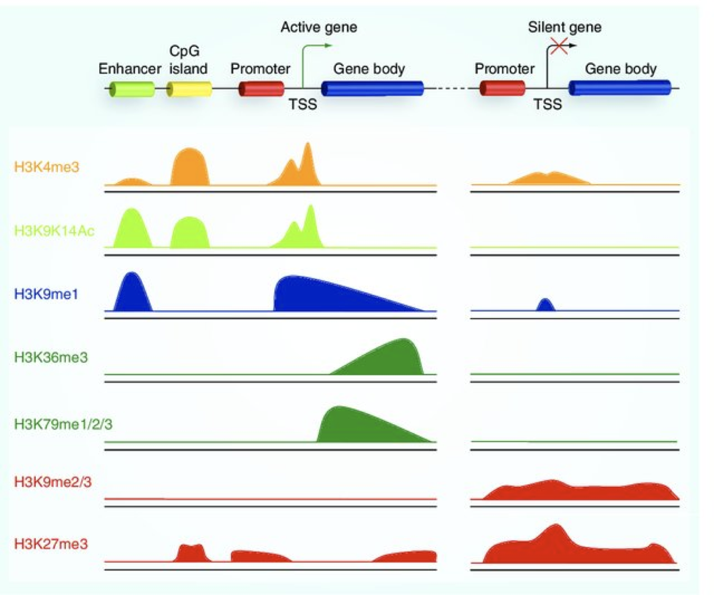

_Image source: Lim et al, 2010, Epigenomics_

### Chromatin accessibility

The schematic below illustrates the representative DNA fragments and the expected signal profile obtained from current chromatin accessibility assays.

* **Open chromatin**: FAIRE-seq, DNAse-seq
* **Transcription factor occupancy**: DNAse-seq
* **Nucleosome occupancy**: MNase-seq

In one assay, **ATAC-seq is able to simultaneously assess three different aspects of chromatin architecture** at high resolution. Therefore, in our data we will tend to see regions corresponding to the nucleosome-free regions (NFR) (< 100 bp) and mono-, di-, and tri-nucleosomes (~ 200, 400, 600 bp) respectively). 

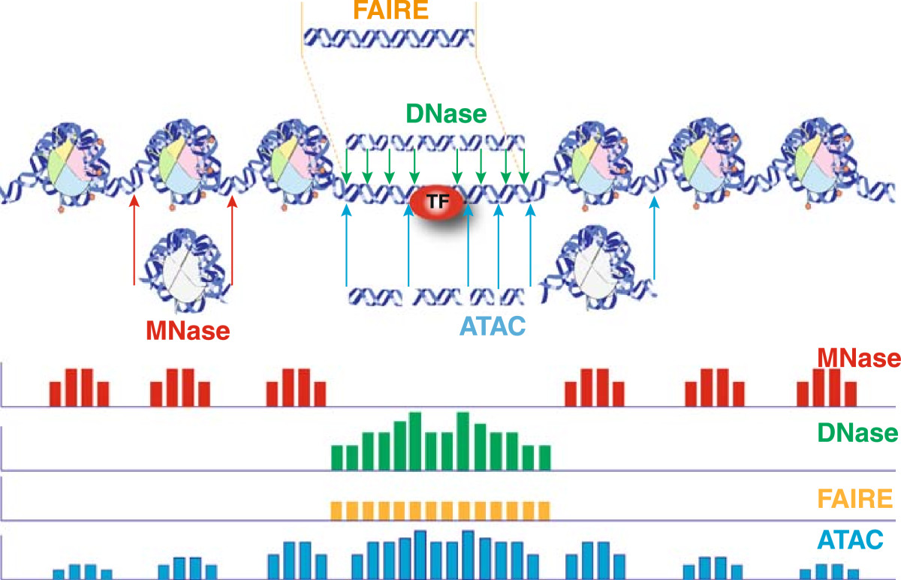

_Image source: [Tsompana and Buck, 2014](https://pubmed.ncbi.nlm.nih.gov/25473421/)_

## Experimental design considerations

When starting out with your experiment, there are many things to think about. We have highlighted some of the important points in the previous lecture and within this lesson, but we also encourage you to peruse the [ENCODE guidelines and practices for ChIP-seq](https://www.ncbi.nlm.nih.gov/pmc/articles/PMC3431496/). Although it was published in 2012, much of the information is still very valid and used in practice today.

> **_NOTE: When relevant, we include comaprisons to CUT&RUN and ATAC-seq to demonstrate how guidelines change for the different assays._**

### Starting material

**ChIP-seq**

Ensure that you have a sufficient amount of starting material because the ChIP will only enrich for a small proportion. For a standard protocol, you want approximately 2 x 106 cells per immunoprecipitation. If it is difficult to obtain that many samples from your experiment, consider using low input methods. Ultimately, higher amounts of starting material yield more consistent and reproducible protein-DNA enrichments.

> #### Can I pool samples if I don't have enough cells?
> We generally recommend that you try to steer clear of pooling (for ChIP-seq and other NGS applications). There is variability between samples and mixing them together can increase background noise and dilute signal. In the case where you have small amounts of starting material, we suggest using [CUT&RUN](https://elifesciences.org/articles/21856).

	
<b><i>Click here for CUT&RUN guidelines</i></b>

	 
	
It is recommended to start with <b>500,000 native (unfixed) cells, particularly when mapping new targets or using new cell types.</b> Following initial validation of workflows using 500,000 cells and control antibodies, cell numbers can be reduced (as low as 5K cells).

	

	
<b><i>Click here for ATAC-seq guidelines</i></b>

	 
	
For ATAC-seq the requirement of cell number <b>ranges from 50K to 500K.</b>

	

### Quality control of your ChIP

Your ChIP experiment is only as good as your antibody! The more specific the antibody, the more robust and accurate your results will be. Antibody deficiencies are of two main types: poor reactivity against the intended target and/or cross-reactivity with other DNA-associated proteins.  Here, we boil it down to the following key points:

* Test your antibody with the use of a [**Western blot**](https://www.nature.com/scitable/definition/western-blot-288/). These are performed on protein lysates from either whole-cell extracts, nuclear extracts, chromatin preparations, or immunoprecipitated material. Numerous antibodies have been shown to work in ChIP; nevertheless, **it is best to test the antibody with the specific set of cells that you are working with**.

> _Immunoblot analyses of antibodies against SIN3B that (left) pass and (right) fail quality control. Lanes contain nuclear extract from GM12878 cells (G) and K562 cells (K). Arrows indicate band of expected size of 133 kDa. [[Landt et al, 2012](https://www.ncbi.nlm.nih.gov/pmc/articles/PMC3431496/)]_

* Check a few regions by **qPCR to confirm that the pull-down worked**. Create primers for regions of the genome you expect your protein of interest to bind. The PCR is performed on the immunoprecipitated material, before sending it for sequencing. 
    * You can also check a region of DNA that you do not expect to be enriched and thus do not expect to be amplified by qPCR, to show that your ChIP is specific (negative control)

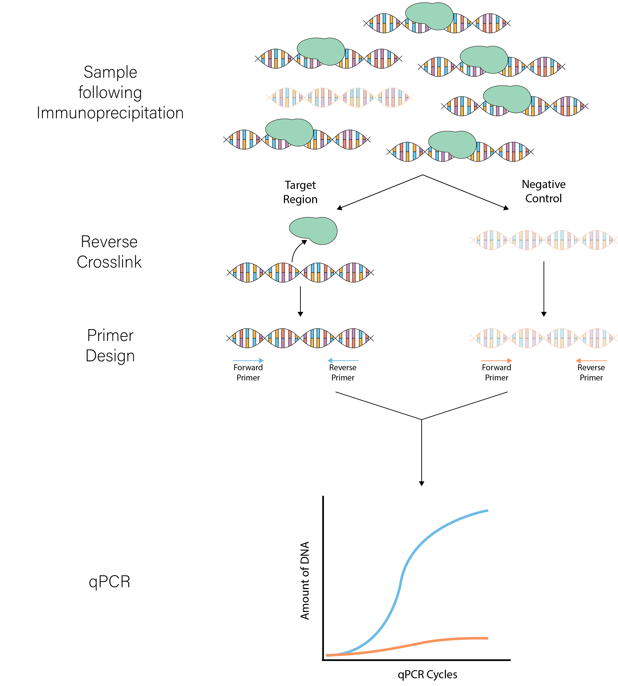

* If you don't have any known targets for your protein, run a **postive control ChIP**. Histone H3 or H3K4me3 usually work very well. Since there is loads of H3K4me3 present at most TSSs you could design primers against the promoter of a housekeeping gene. If you have a good signal present, you will at least know the protocol is working well.

	
<b><i>Testing the efficacy of the CUT&RUN protocol</i></b>

	 
	
<b>A control CUT&RUN with an antibody against a histone mark is recommended, to assess protocol efficacy.</b> After quantifying purified DNA, the fragments (50-150 bp) may not show up on the bioanalyzer electropherogram due to the low concentration of DNA present. With the control histone mark CUT&RUN, you should see mono-, di-, and tri-nucleosomes in the Bioanalyzer traces as shown below. 
	
  

  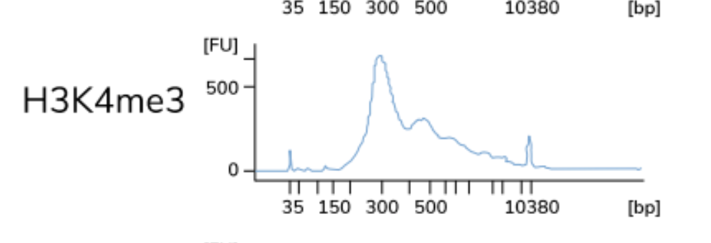
  

	

> **NOTE:** The authors of this study also included a positive control sample using an antibody against p300 to test the protocol, although the data is not included here. The p300 protein [has been shown](https://pubmed.ncbi.nlm.nih.gov/19212405/) to have binding sites in the cortex. 

### Negative Controls

A ChIP-Seq peak should be compared with the same region of the genome in a matched control sample because only a fraction of the DNA in our ChIP sample corresponds to actual signal amidst background noise. 

There are a number of **artifacts that tend to generate pileups of reads that could be interpreted as a false positive peaks**. These include:
* Open chromatin regions that are fragmented more easily than closed regions due to the accessibility of the DNA
* The presence of repetitive sequences
* An uneven distribution of sequence reads across the genome due to DNA composition
* ‘hyper-ChIPable’ regions: loci that are commonly enriched in ChIP datasets. Certain genomic regions are more susceptible to immunoprecipitation, therefore show increased ChIP signals for unrelated DNA-binding and chromatin-binding proteins.

There are two kinds of controls that can be used for ChIP-seq: **IgG control** and **input control**. 

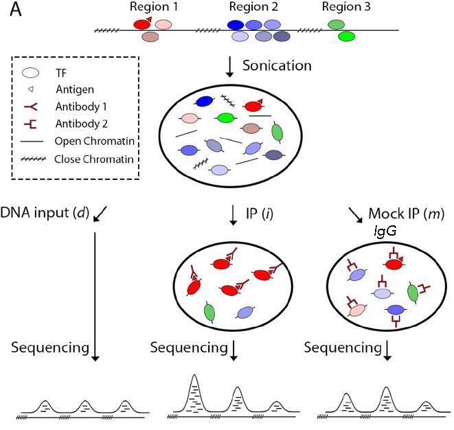

*Image source: [Xu J. et al., BioRxiv (2019)](https://www.biorxiv.org/content/10.1101/2019.12.17.880013v1.full).*

**IgG control** is DNA resulting from a immunoprecipitation with an [isotype-matched](https://www.novusbio.com/products/isotype-controls) control immunoglobulin. An isotype control is an antibody that maintains similar properties to the primary antibody but lacks specific target binding. Save 5-10% of your cell lysate, and add the appropriate non-specific IgG instead of protein-specific antibody, but at the same concentration. This will give an indication of the assay background and identify non-specific binding of the beads used for the immunoprecipitation. However, if too little DNA is recovered after immunoprecipitation, the sequencing library will be of low complexity and binding sites identified using this control could be biased. 

**Input control** is DNA purified from cells that are cross-linked, and fragmented, but without adding any antibody for enrichment. Save 5-10% of your cell lysate before addition of antibodies. Input samples can account for variations in the fragmentation step of the ChIP protocol as certain regions of the genome are more likely to shear than others based upon their structure and GC content. Input controls are **more widely used** to normalize signals from ChIP enrichment.

> #### Do I need to have one input sample for each IP sample in my dataset?
> The ENCODE guidelines [[Landt, et al, 2012](https://www.ncbi.nlm.nih.gov/pmc/articles/PMC3431496/)] states _"If cost constraints allow, a control library should be prepared from every chromatin preparation and sonication batch, although some circumstances can justify fewer control libraries. Importantly, a new control is always performed if the culture conditions, treatments, chromatin shearing protocol, or instrumentation is significantly modified."_
> 
> The short answer is, yes having an input sample matched with each IP is ideal. However, studies have shown input replicates to have strong reproducibility in some cases. Thus, if there are constraints with budget or obtaining enough sample, having one input per sample group can suffice. 

	
<b><i>Do we need controls for CUT&RUN?</i></b>

	 
	
Similar to ChIP-seq, only a fraction of the DNA in a CUT&RUN sample will correspond to actual signal amidst background noise. Rather than having an input DNA control, <b>the use of a nonspecific rabbit IgG antibody is recommended by the Henikoff lab</b>. It will randomly coat the chromatin at low efficiency without sequence bias. While a no-antibody input DNA sample will generate a more diverse DNA library, the lack of tethering increases the possibility that slight carryover of pA-MN will result in preferential fragmentation of hyperaccessible DNA.

	

	
<b><i>Do we need controls for ATAC-seq?</i></b>

	 
	
<b>In ATAC-seq, you do not have a control.</b> Intuitively, one might think we need to correct the bias caused by the Tn5 transposase. However, the original studies show that the intrinsic cutting preference/bias of the transposon is minimal and so controls are not neccessary.

	

### Spike-in DNA

There are multiple sources of **technical variability that can hamper the direct comparison of binding signal strength between different conditions** (in both, **ChIP-seq and CUT&RUN** data). For example, an increase in genomic occupancy of a chromatin factor could simply be the result of variability in the efficiency of immunoprecipitation between control and treated samples in a ChIP experiment.

The spike-in strategy is based on the **use of a fixed amount of exogenous chromatin** from another species that is added to sample in an effort **to control for technical variation**. Since we are adding a known amount (and the same amount) to each sample, we expect the number of mapped reads to the reference (in the example below, _Drosophila_) to also be similar.  

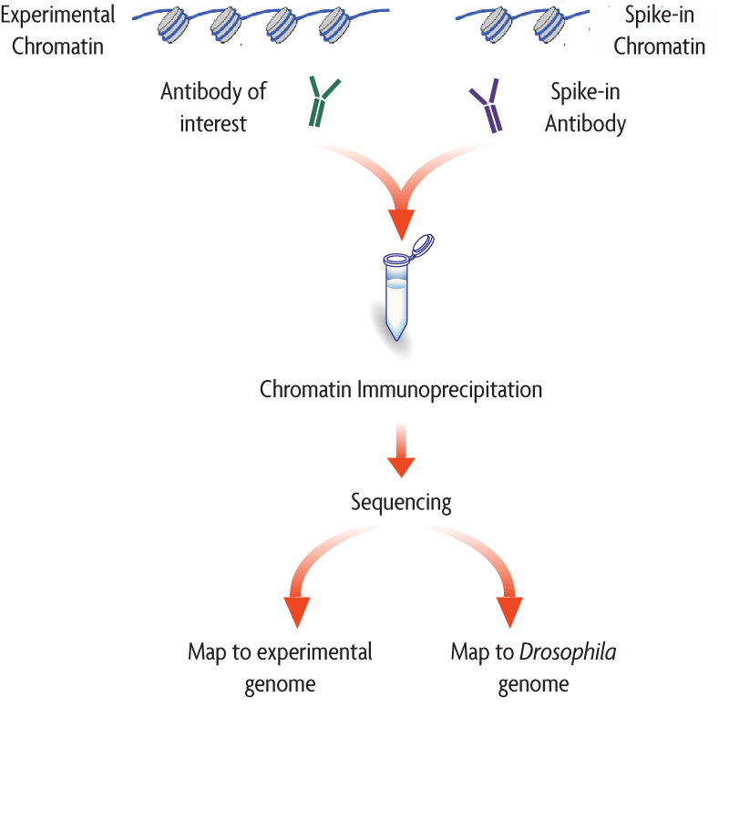

*Image source: Adapted from [ActiveMotif documentation]([https://dx.doi.org/10.15252%2Fembj.201592958](https://www.activemotif.com/catalog/1063/chip-seq-spike-in))*

* If the number of **mapped reads to the spike-in reference are roughly the same across samples**, then the observable differences in the reads of the experimental samples across conditions can be exclusively attributed to biological variation. 
    * There is no normalization required.
* If the number of **mapped reads to the spike-in reference are variable across samples**, this suggests that there is some amount of technical variation. 
    * A normalization factor can be computed.

There are various **approaches to computing the normalization factor**, we have outlined some of them below:

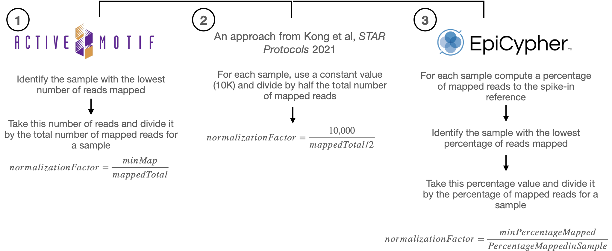

The **per-sample normalization factor** computed from either of the three approaches, equilibrates the spike-in signal among samples. That same factor from is then **used to normalize the experimental ChIP-seq samples** (which in theory exhibit the same amount of technical variation), thus enabling the fair comparison of the ChIP-seq signal across the samples. 

**When should I use spike-in normalized data?**

It is important that you qualitatively assess the data, because the normalization is only as good as the spike-in that was administered. The percent of reads mapping to the spike-in is typically 1% and no greater than 5%. A range is to be considered, because there is always a chance of human error due to the variability in protocols. After normalizing data with spike-in DNA, we typically recommend that you **evaluate and make and informed decision whether or not to include it in your analysis.**

> #### References for spike-in normalization
> * [Epicypher CUT&RUN protocol](https://www.epicypher.com/content/documents/protocols/cutana-cut&run-protocol.pdf) (see Appendix III)
> * [ActiveMotif Spike-in Normalization Strategy](https://www.activemotif.com/documents/1977.pdf)
> * [Kong NR et al STAR Protocols, August 2021](https://star-protocols.cell.com/protocols/944)

### Replicates

As with any high-throughput experiment, a single assay is often subject to a substantial amount of variability. Thus, it is highly recommended to setup your experimental design with a **minimum of 3 biological replicates**. Presumably, two replicates measuring the same underlying biology should have high consistency but that is not always the case. Having replicates allow you to evaluate concordance of peaks and identify a set of reproducible enriched regions with greater confidence. If you have multiple sample groups and are planning a differential enrichment analysis, increasing the number of replicates will give you more statistical power to find changes between groups.

> ***NOTE: Replicates are necessary for both CUT&RUN and ATAC-seq, for all of the reasons described above.***

*Image source: [Klaus B., EMBO J (2015) **34**: 2727-2730](https://dx.doi.org/10.15252%2Fembj.201592958)*

> #### Do we see batch effects in ChIP-seq data?
> Typically, batch effects are not as big of a concern with ChIP-seq data. However, it is best to run everything in parallel as much as possible. If you only have a single sample group, it should be more feasible to prepare all samples together (since there are fewer). For multiple sample groups, if you are not able to process all samples together, split replicates of the different sample groups across batches. This way you avoid any potential confounding.

### Sequencing considerations

|       | ChIP-seq| CUT&RUN | ATAC-seq |
|-----------|:----------:|:----------:|:----------:|
| **Read length**    | 50-150 bp | 50-75 bp | 50-75 bp |
| **Sequencing mode**    | Single-end reads are sufficient in most cases. Paired-end is good (and necessary) for allele-specific chromatin events, and investigations of transposable elements. _Sequence the input controls to equal or higher depth than your ChIP samples._ | Paired-end reads are recommended to retain fragment size information. It also is allows us to more accurately obtain the minimal protein protected region after MNase digestion.  | Paired-end is used to obtain fragment size information, useful for quality metrics and nucelosomal positioning. It also gives more information on the Tn5 cutting sites. |
| **Sequencing depth** | For standard transcription factors we recommend between **20-40 million total read depth** | For most targets (narrow or broad profiles), **3-8 million** paired-end reads are sufficient. | **50 million** for changes in chromatin accessibility; **200 million** for TF footprinting |
| **Sequencing depth (broad peaks)**   |  A **minimum of 40M total read depth; more is better** for detecting some histone marks | N/A | N/A |

> ***NOTE 1**: Balance cost with value of more informative reads. For example, if you have the money then spend it on replicates. This is more beneficial than longer reads or paired-end (in th ecase of ChIP-seq).*
> 
> ***NOTE 2**: The sequence depth guidelines are for mammalian cells. Organisms with smaller genomes will generally tend to have lower depth.*

## Public resources

There are various consortia that have formed to collectdata across studies and make it publicly available. Ultimately, resources like this enable researchers to piece together the epigenomic landscape contributing to cell identity, development, lineage specification, and disease. 

### The ENCODE project

The [ENCODE (Encyclopedia of DNA Elements) Project](https://www.encodeproject.org/) was planned as a follow-up to the Human Genome Project. It is a **public research consortium aimed to assign function to all elements in the human and mouse genome**. Coinciding with the completion of the Human Genome Project in 2003, the ENCODE Project began as a worldwide effort involving more than 30 research groups and more than 400 scientists. 

ENCODE has produced vast amounts of data that can be accessed through the project's freely accessible database, the ENCODE Portal. The ENCODE "Encyclopedia" organizes these data into two levels of annotations: 1) integrative-level annotations, including a registry of candidate cis-regulatory elements and 2) ground-level annotations derived directly from experimental data.

> *NOTE:* For those working on other model organisms, there is also the [modENCODE (MODel organism ENCyclopedia Of DNA Elements) project](http://www.modencode.org/), targeting the identification of functional elements in selected model organism genomes, specifically _Drosophila melanogaster_ and _Caenorhabditis elegans_.

### NIH Roadmap Epigenomics Mapping Consortium

The [NIH Roadmap Epigenomics Project](http://www.roadmapepigenomics.org/) has continued this journey, with a focus on human epigenomic data. This project was launched in 2008 with the goal of elucidating how epigenetic regulation contributes to human development and disease. **The Roadmap Epigenome** uses many of the same technologies used by ENCODE, but **almost excusively focused on epigenetic features such as DNA methylation and histone modifications**, while ENCODE emphasized identifying sites of DNA binding factor occupancy.

The data is presented as  **an atlas, where users can explore epigenome maps for stem cells and primary ex vivo tissues** selected to represent the normal counterparts of tissues and organ systems frequently involved in human disease. Data can be viewed in the browser or downloaded locally.

***
*This lesson has been developed by members of the teaching team at the [Harvard Chan Bioinformatics Core (HBC)](http://bioinformatics.sph.harvard.edu/). These are open access materials distributed under the terms of the [Creative Commons Attribution license](https://creativecommons.org/licenses/by/4.0/) (CC BY 4.0), which permits unrestricted use, distribution, and reproduction in any medium, provided the original author and source are credited.*

