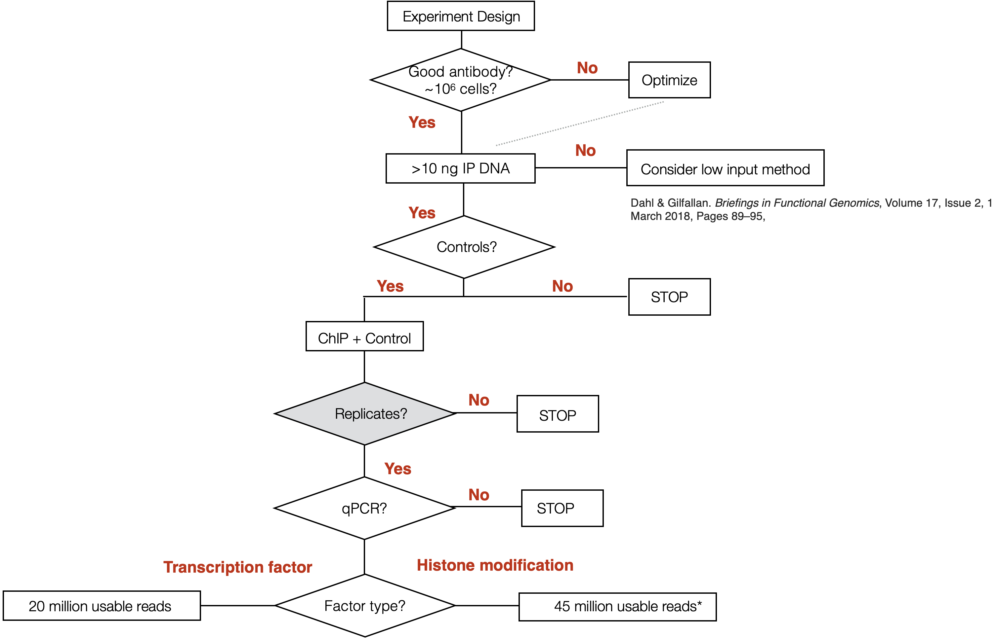

Approximate time: 45 minutes

## Learning Objectives

* Explain the protocol for creating an appropriate input
* Describe the importance of replicates for ChIP-seq experiments
* Provide guidelines for sequencing depth
* Understand the possible routes of analysis in the ChIP-seq workflow

## Considerations for ChIP-seq

In chromatin immunoprecipitation (ChIP) experiments, a transcription factor, cofactor, or other chromatin protein of interest is enriched by immunoprecipitation from cross-linked cells, along with its associated DNA. In ChIP-seq, the immunoprecipitated DNA fragments are then sequenced, followed by identification of enriched regions of DNA or peaks. These peak calls can then be used to make biological inferences by determining the associated genomic features and/or over-represented sequence motifs. 

ChIP-seq has now been widely used for many transcription factors, histone modifications, chromatin modifying complexes, and other chromatin-associated proteins in a wide variety of organisms. As such, **there is much diversity in the way ChIP-seq experiments are designed and the way analyses are executed.**

In this lesson, we describe a few simple guidelines for setting up a ChIP-seq experiment and outline the analysis workflow.

## Experimental design considerations

When starting out with your experiment, there are many things to think about. We have highlighted some of the important points in the previous lecture and within this lesson, but we encourage you to peruse the [ENCODE guidelines and practices for ChIP-seq](https://www.ncbi.nlm.nih.gov/pmc/articles/PMC3431496/). Although it was published in 2012, much of the information is still very much valid and are still used in practice today.

> #### ENCODE: Encyclopedia of DNA Elements
> The ENCODE Project was planned as a follow-up to the Human Genome Project. It aims to identify all functional elements in the human genome. Coinciding with the completion of the Human Genome Project in 2003, the ENCODE Project began as a worldwide effort involving more than 30 research groups and more than 400 scientists.
> 
> Over the years, the ENCODE Consortium has become involved with additional projects whose goals run in parallel. A popular one is the modENCODE (MODel organism ENCyclopedia Of DNA Elements) project, targeting the identification of functional elements in selected model organism genomes, specifically Drosophila melanogaster and Caenorhabditis elegans.

Below, is the **decision tree** that was presented earlier in the workshop (lecture). 

### Starting material
Ensure that you have a sufficient amount of starting material because the ChIP will only enrich for a small proportion. For a standard protocol, you want approximately 2 x 10^6 cells per immunoprecipitation. If it is difficult to obtain that many samples from your experiment, consider using low input methods. Ultimately, higher amounts of starting material yield more consistent and reproducible protein-DNA enrichments.

> NOTE on pooling to increase the amount of starting material. Is it okay? Under what circumstances?

### Quality control of your ChIP

Your ChIP experiment is only as good as your antibody! The more specific the antibody, the more robust and accurate your results will be. Antibody deficiencies are of two main types: poor reactivity against the intended target and/or cross-reactivity with other DNA-associated proteins. Numerous antibodies have been shown to work in ChIP; nevertheless, **it is best to test the antibody with the specific set of cells that you are working with**. Here, we boil it down to the following key points:

* Test your antibody with the use of a **Western blot**. These are performed on protein lysates from either whole-cell extracts, nuclear extracts, chromatin preparations, or immunoprecipitated material. 
* Check a few regions by **qPCR to confirm that the enrichment worked**. This is performed on the immunoprecipitated material, before sending it for sequencing. 
    * You can also check a region of DNA that you do not expect to be enriched and thus do not expect to be amplified by qPCR, to show that your ChIP is specific (negative control)
* If you don't have any known targets for your protein, run a **postive control IP**. Histone H3 or H3k4me3 usually work very well. Since there is loads of H3K4me3 present at most TSSs you could design primers against the promoter of a housekeeping gene. If you have a good signal present, you will at least know the protocol is working well.

### Input control
* YOu need an input!

### Replicates

### Sequencing depth

## Resources:

https://www.thermofisher.com/us/en/home/life-science/antibodies/antibodies-learning-center/antibodies-resource-library/antibody-application-notes/step-by-step-guide-successful-chip-assays.html

