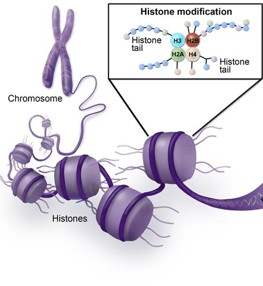
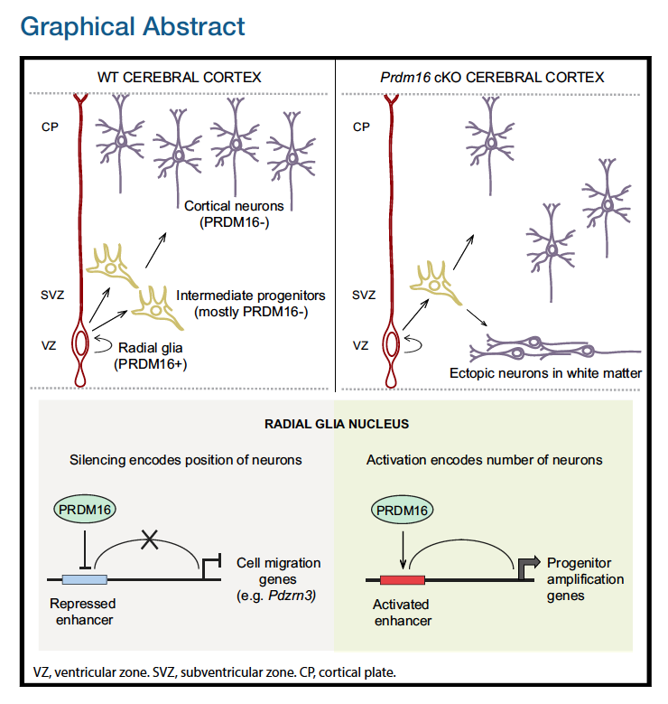
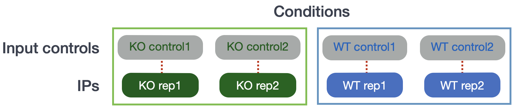

Contributors: Mary Piper, Radhika Khetani, Meeta Mistry, Jihe Liu, Will Gammerdinger

Approximate time: 30 minutes

## Learning Objectives

* Describe the dataset and biological context
* Explain the need for data management and project organization

## Introduction to the dataset

For this workshop we will be working with ChIP-seq data from a recent publication in Neuron by Baizabal et al. (2018) [[1]](https://doi.org/10.1016/j.neuron.2018.04.033). 

***Please note that even though we are utilizing a ChIP-seq dataset for this workshop, we will be highlighting how the code/parameters will differ if you are analyzing either ATAC-seq or CUT&RUN data.***

Baizabal et al. sought to understand how chromatin-modifying enzymes function in neural stem cells to establish the epigenetic landscape that determines cell type and stage-specific gene expression. Chromatin-modifying enzymes are transcriptional regulators that control gene expression through covalent modification of DNA or histones. 

<p align="center">

</p>

_Image adapted from: [American Society of Hematology](https://www.hematology.org/research/ash-agenda-for-hematology-research/epigenetic-mechanisms)_

### PRDM16

The transcriptional regulator **PRDM16 is a chromatin-modifying enzyme** that belongs to the larger PRDM (Positive Regulatory Domain) protein family, that is structurally defined by the **presence of a conserved N-terminal histone methyltransferase PR domain** ([Hohenauer and Moore, 2012](https://journals.biologists.com/dev/article/139/13/2267/45169/The-Prdm-family-expanding-roles-in-stem-cells-and)). 

* PRDM16 has been shown to function *in vitro* as a histone 3 lysine 9 (H3K9) and histone 3 lysine 4 (H3K4) mono-methyltransferase ([Pinheiro et al., 2012](https://www.sciencedirect.com/science/article/pii/S0092867412009385), [Zhou et al., 2016](https://www.sciencedirect.com/science/article/pii/S109727651600188X)). 
* PRDM16 also regulates gene expression by forming complexes with transcriptional co-factors and other histone-modifying proteins ([Chi and Cohen, 2016](https://www.sciencedirect.com/science/article/pii/S104327601500226X?casa_token=VOBAb4QhyXgAAAAA:c69XzQwZ86M4BcPt02cNKjn163X5pBZMTQHJX4D2HdMvgO3hrQE7N6L0YmFSWwucs2GhXPhBtw)). 
* PRDM16 was previously shown to control embryonic and post-natal neural stem cell maintenance and differentiation in the brain ([Chuikov et al., 2010](https://www.nature.com/articles/ncb2101), [Inoue et al., 2017](https://journals.biologists.com/dev/article/144/3/385/48274/Prdm16-is-crucial-for-progression-of-the), [Shimada et al., 2017](http://genesdev.cshlp.org/content/31/11/1134.short)). 


**How PRDM16 functions to regulate transcriptional programs in the developing cerebral cortex remains largely unknown.**

In this paper, the authors use various techniques to identify and validate the targets and activities of PRDM16, including ChIP-seq, bulk RNA-seq, FACS, in-situ hybridization and immunofluorescent microscopy on brain samples from embryonic mice and a generation of PRDM16 conditional knockout mice. 

<p align="center">

</p>


From the RNA-seq data, they found that the absence of PRDM16 in cortical neurons resulted in the misregulation of over a thousand genes during neurogenesis. To identify the subset of genes that are transcriptional targets of PRDM16 and to understand how these genes are directly regulated, they performed chromatin immunoprecipitation followed by sequencing (ChIP-seq).


**Hypothesis:** How does the histone methyltransferase PRDM16 work with other chromatin machinery to either silence or activate expression of sets of genes that impact the organization of the cerebral cortex?


### Raw data

For this study, we use the [ChIP-seq](https://www.ncbi.nlm.nih.gov/geo/query/acc.cgi?acc=GSE111657) data that is publicly available in the [Sequence Read Archive (SRA)](https://www.ncbi.nlm.nih.gov/sra?term=SRP134733).

> **NOTE:** If you are interested in how to obtain publicly available sequence data from the SRA, we have training materials on this [topic](https://hbctraining.github.io/Accessing_public_genomic_data/lessons/downloading_from_SRA.html).

### Metadata

In addition to the raw sequence data, we also need to collect **information about the data**, also known as **metadata**.  We sometimes rush to begin the analysis of the sequence data (FASTQ files), but how useful is it if we know nothing about the samples that this sequence data originated from? 

Some relevant metadata for our dataset is provided below:

* Whole brain lysates were obtained from **mice at E15.5** (when upper layer neurons are being generated)
* Approximately **20-40 million cortical cells** were isolated for each sample
* A [dual cross-linking protocol](https://www.abcam.com/protocols/dual-cross-linking-chip-protocol-1) was implemented using formaldehyde and EGS. This type of double cross-linking is very effective in identifying direct binding, as well as those found in DNA binding complexes not bound directly to DNA.  
* After the ChIP protocol, genomic DNA was purified, end repaired, ligated with barcoded adaptors, amplified for 11 PCR cycles
* Library **fragments in the range of 100-800 bp** were size-selected using agarose gel electrophoresis followed by DNA gel extraction
* Libraries were sequenced in an **Illumina HiSeq 2500** sequencer to a sequencing depth of **30-40 million reads per sample**.

> All of the above pertains to both WT and Prdm16 conditional knock-out mouse (Emx1Ires-Cre; Prdm16flox/flox). *For the rest of the workshop we will be referring to the conditional knockout samples as KO*.

Our dataset consists of two WT samples and two KO samples. For each of the IP samples, we have a corresponding input sample as illustrated in the schematic below.

<p align="center">

</p>

### Connect to O2

Let's get started with the hands-on component by typing in the following command to log in to O2:

```bash
ssh username@o2.hms.harvard.edu
```

You will receive a prompt for your password, and you should type in your associated password; **note that the cursor will *not move* as you type in your password**.

A warning might pop up the first time you try to connect to a remote machine, type "Yes" or "Y". 

Once logged in, you should see the O2 icon, some news, and the command prompt, e.g. `[rc_training10@login01 ~]$`.

> Note 1: `ssh` stands for secure shell. All of the information (like your password) going between your computer and the O2 login computer is encrypted when using `ssh`.
 
Next, you will need to **start an interactive session**.  A login node's only function is to enable users to log in to a cluster, it is not meant to be used for any actual work/computing. Since we will be doing some work, let's get on to a compute node:

```bash
$ srun --pty -p interactive -t 0-3:00 --mem 1G  /bin/bash
```

**Make sure that your command prompt is now preceded by a character string that contains the word "compute".**

## Implementing data management best practices

In a [previous lesson](https://hbctraining.github.io/Intro-to-rnaseq-hpc-salmon-flipped/lessons/04a_data_organization.html), we describe the data lifecycle and the **different aspects to consider when working on your own projects**. Here, we implement some of those strategies to get ourselves setup before we begin with any analysis. 

<p align="center">

</p>

_Image acquired from the [Harvard Biomedical Data Management Website](https://datamanagement.hms.harvard.edu/data-lifecycle)_


### Planning and organization
For each experiment you work on and analyze data for, it is considered best practice to get organized by creating a planned storage space (directory structure). We will start by creating a directory that we can use for the rest of the workshop. First, make sure that you are in your home directory.

```bash
$ cd
$ pwd
```

This should return `/home/rc_training`. Create the directory `chipseq_workshop` and move into it.

```bash
$ mkdir chipseq_workshop
$ cd chipseq_workshop
```

Now that we have a project directory, we can set up the following structure within it to keep files organized.

```bash
chipseq_workshop/
├── logs/
├── meta/
├── raw_data/
├── reference_data/
├── results/
└── scripts/
```

```bash
$ mkdir raw_data reference_data scripts logs meta results

$ tree     # this will show you the directory structure you just created
```

**This is a generic directory structure and can be tweaked based on personal preference and analysis workflow.**

- `logs`: to keep track of the commands run and the specific parameters used, but also to have a record of any standard output that is generated while running the command. 
- `meta`: for any information that describes the samples you are using, which we refer to as [metadata](https://datamanagement.hms.harvard.edu/metadata-overview). We will discuss this in more detail as it pertains to our example dataset, later in this lesson.
- `raw_data`: for any **unmodified** (raw) data obtained prior to computational analysis here, e.g. FASTQ files from the sequencing center. We strongly recommend leaving this directory unmodified through the analysis.
- `reference_data`: for known information related to the reference genome that will be used in the analysis, e.g. genome sequence (FASTA), gene annotation file (GTF) associated with the genome.
- `results`: for output from the different tools you implement in your workflow. Create sub-folders specific to each tool/step of the workflow within this folder. 
- `scripts`: for scripts that you write and use to run analyses/workflow.


Now that we have the directory structure created, let's **copy over the data**:

```bash
$ cp /n/groups/hbctraining/harwell-datasets/chipseq_workshop/data/*fastq.gz raw_data/

```

We're all set up for our analysis!

> #### File naming conventions
> 
> Another aspect of staying organized is making sure that all the filenames in an analysis are as consistent as possible, and are not things like `alignment1.bam`, but more like `20170823_kd_rep1_gmap-1.4.bam`. [This link](https://datamanagement.hms.harvard.edu/file-naming-conventions) and [this slideshow](http://www2.stat.duke.edu/~rcs46/lectures_2015/01-markdown-git/slides/naming-slides/naming-slides.pdf) have some good guidelines for file naming dos and don'ts.

### Documentation

In your lab notebook, you likely keep track of the different reagents and kits used for a specific protocol. Similarly, recording information about the tools used in the workflow is important for documenting your computational experiments. 

- **Make note of the software you use.** Do your research and find out what tools are best for the data you are working with. Don't just work with tools that you are able to easily install.
- **Keep track of software versions.** Keep up with the literature and make sure you are using the most up-to-date versions.
- **Record information on parameters used and summary statistics** at every step (e.g., how many adapters were removed, how many reads did not align)
    - A general rule of thumb is to test on a single sample or a subset of the data before running your entire dataset through. This will allow you to debug quicker and give you a chance to also get a feel for the tool and the different parameters.
    - Different tools have different ways of reporting log messages to the terminal. You might have to experiment a bit to figure out what output to capture. You can redirect standard output with the `>` symbol which is equivalent to `1> (standard out)`; other tools might require you to use `2>` to re-direct the `standard error` instead.
 
#### README files

After setting up the directory structure, it is useful to have a **[README file](https://datamanagement.hms.harvard.edu/readme-files) within your project directory**. This is a plain text file containing a short summary about the project and a description of the files/directories found within it. An example README is shown below. It can also be helpful to include a README within each sub-directory with any information pertaining to the analysis.

```
## README ##
## This directory contains data generated during the Introduction to ChIP-seq workshop
## Date: 

There are six subdirectories in this directory:

raw_data : contains raw data
meta:  contains...
logs:
results:
scripts:
reference_data:
```

*** 

**Exercise**

1. Take a moment to create a README for the `chipseq_workshop/` folder (hint: use `vim` to create the file). Give a short description of the project and brief descriptions of the types of files you will be storing within each of the sub-directories. 


***
*This lesson has been developed by members of the teaching team at the [Harvard Chan Bioinformatics Core (HBC)](http://bioinformatics.sph.harvard.edu/). These are open access materials distributed under the terms of the [Creative Commons Attribution license](https://creativecommons.org/licenses/by/4.0/) (CC BY 4.0), which permits unrestricted use, distribution, and reproduction in any medium, provided the original author and source are credited.*
