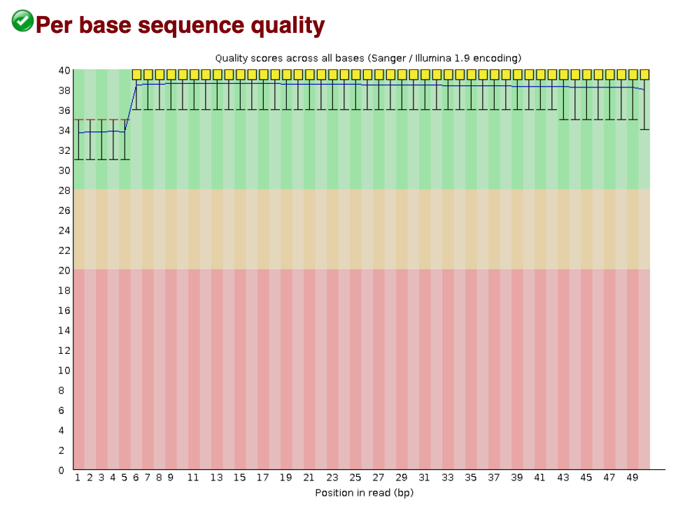
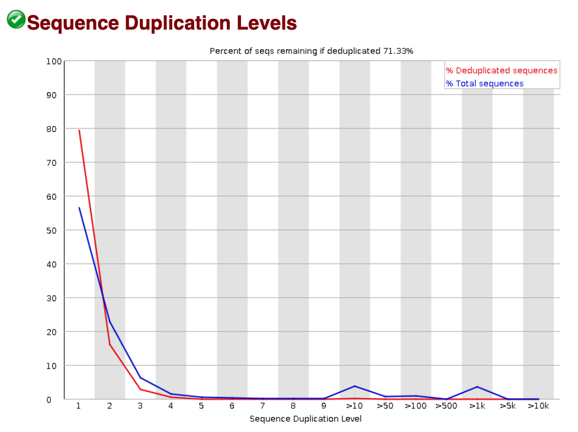
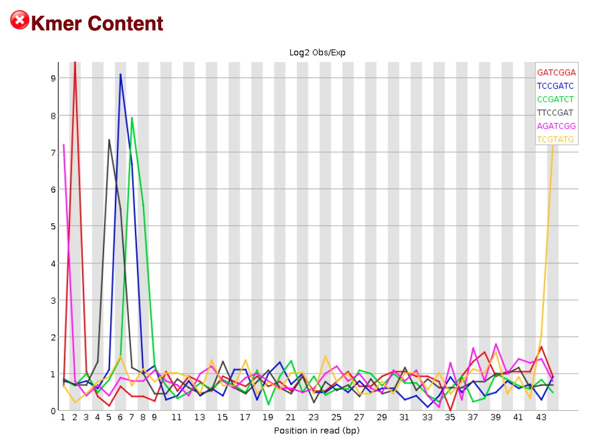

Contributors: Mary Piper, Radhika Khetani, Jihe Liu

Approximate time: 

**Link to issue describing the modifications to be made**: https://github.com/hbctraining/Intro-to-ChIPseq-flipped/issues/5

## Learning Objectives

* Understand the basics of a FASTQ file
* Evaluate the quality of the sequencing data using FastQC

## Quality control of sequence reads

<p align="center">
  
</p>

Now that we set up files and directory structure, we are ready for our ChIP-seq analysis. For any NGS analysis, the first step in the workflow is to evaluate the quality of the reads, prior to alignment them to the reference genome and downstream analyses. 

### Unmapped read data (FASTQ)

The [FASTQ](https://en.wikipedia.org/wiki/FASTQ_format) file format is the defacto file format for sequence reads generated from next-generation sequencing technologies. This file format evolved from FASTA in that it contains sequence data, but also contains quality information. Similar to FASTA, the FASTQ file begins with a header line. The difference is that the FASTQ header is denoted by a `@` character. For a single record (sequence read) there are four lines, each of which are described below:

|Line|Description|
|----|-----------|
|1|Always begins with '@' and then information about the read|
|2|The actual DNA sequence|
|3|Always begins with a '+' and sometimes the same info in line 1|
|4|Has a string of characters which represent the quality scores; must have same number of characters as line 2|

Let's use the following read as an example:

```
@HWI-ST330:304:H045HADXX:1:1101:1111:61397
CACTTGTAAGGGCAGGCCCCCTTCACCCTCCCGCTCCTGGGGGANNNNNNNNNNANNNCGAGGCCCTGGGGTAGAGGGNNNNNNNNNNNNNNGATCTTGG
+
@?@DDDDDDHHH?GH:?FCBGGB@C?DBEGIIIIAEF;FCGGI#########################################################
```

As mentioned previously, line 4 has characters encoding the quality of each nucleotide in the read. The legend below provides the mapping of quality scores (Phred-33) to the quality encoding characters. *Different quality encoding scales exist (differing by offset in the ASCII table), but note the most commonly used one is fastqsanger.*

 ```
 Quality encoding: !"#$%&'()*+,-./0123456789:;<=>?@ABCDEFGHI
                   |         |         |         |         |
    Quality score: 0........10........20........30........40                                
```
 
Using the quality encoding character legend, the first nucelotide in the read (C) is called with a quality score of 31, and our Ns are called with a score of 2. **As you can tell by now, this is a bad read.** 

Each quality score represents the probability that the corresponding nucleotide call is incorrect. This quality score is logarithmically based and is calculated as:

	Q = -10 x log10(P), where P is the probability that a base call is erroneous

These probabaility values are the results from the base calling algorithm and dependent on how much signal was captured for the base incorporation. The score values can be interpreted as follows:

|Phred Quality Score |Probability of incorrect base call |Base call accuracy|
|:-------------------|:---------------------------------:|-----------------:|
|10	|1 in 10 |	90%|
|20	|1 in 100|	99%|
|30	|1 in 1000|	99.9%|
|40	|1 in 10,000|	99.99%|
|50	|1 in 100,000|	99.999%|
|60	|1 in 1,000,000|	99.9999%|

Therefore, for the first nucleotide in the read (C), there is less than a 1 in 1000 chance that the base was called incorrectly. However, for the end of the read, there is greater than 50% probabaility that the base is called incorrectly.

## Assessing quality with FastQC

Now we understand what information is stored in a FASTQ file, the next step is to generate quality metrics for our data.

[FastQC](http://www.bioinformatics.babraham.ac.uk/projects/fastqc/) provides a simple way to do some quality control checks on raw sequence data coming from high throughput sequencing pipelines. It contains a modular set of analyses, allowing us to have a quick glimpse of whether the data is problematic before doing any further analysis.

The main features of FastQC are:

* Imports data in FASTQ files (or BAM files)
* Evaluates the reads automatically and identify potential issues of the data
* Generates a HTML-based quality report with graphs and tables

### Run FastQC  

Before we start using any software, we need to check if it is already loaded on the cluster. Otherwise, we have to load it into our environment (or `$PATH`). On the O2 cluster, we can check for and load tools using modules. 

When we check which modules are currently loaded, we should not see FastQC.

```bash
$ module list
```

> **NOTE:** If we check our $PATH variable, we will also see that the FastQC program is not in our $PATH (i.e. its not in a directory that unix will automatically check to run commands/programs).
>
> ```bash
> $ echo $PATH
> ```

To find the FastQC module to load, we need to search the available versions:

```bash
$ module spider
```

Then we can load the FastQC module:

```bash
$ module load fastqc/0.11.3
```

Once a module for a tool is loaded, it is directly available to you like any other basic UNIX command.

```bash
$ module list

$ echo $PATH
```

Now let's run FastQC on one of our samples: the chip data for a replicate of wild-type sample(wt_sample2_chip). We specify two arguments here: one is the directory where the results are stored, which is indicated after the `-o` flag; another one is the file name of our FASTQ input.

```bash
$ fastqc -o ~/chipseq_workshop/results/fastqc/ ~/chipseq_workshop/data/wt_sample2_chip.fastq.gz
```

> Note: FastQC could also accept multiple file names as input. You just need to separate different file names with space. FastQC also recognizes files with wildcard characters.

*It takes a few minutes to finish the run of this sample. How do we speed it up?*

We could run the program faster through the multi-threading functionality of FastQC. Before we use that function though, we need to increase the number of cores for our interactive session. Exit the interactive session (now you should be at a "login node"), then start a new interactive session with 4 cores. Now we could run FastQC with 4 threads (with the flag `-t`), thus increasing the speed.

```bash
$ exit  # exit the current interactive session

$ srun --pty -c 4 -p interactive -t 0-12:00 --mem 8G --reservation=HBC2 /bin/bash  # start a new one with 4 cpus (-c 6) and 8G RAM (--mem 8G)

$ module load fastqc/0.11.3  # reload the module for the new session

$ fastqc -o ~/chipseq_workshop/results/fastqc/ -t 4 ~/chipseq_workshop/data/wt_sample2_chip.fastq.gz  # note the extra parameter, where we specified for 4 threads
```

*Do you notice any difference in running time? Does multi-threading speed up the run?*

If you are new to FastQC, how to know that `-t` is the right argument to use? We could use `--help` to check what arguments are available for FastQC. Among them, `-t` (or `--threads`) specifies the number of files which can be processed simultaneously.

```bash
$ fastqc --help
```

### FastQC Results
   
Let's take a closer look at the files generated by FastQC:
   
`$ ls -lh ~/chipseq_workshop/results/fastqc/`

#### HTML reports
The html file contains the final report from FastQC. Let's transfer the html file `wt_sample2_chip_fastqc.html` over to your own laptop via *FileZilla*, and then take a look at the report.

##### Filezilla - Step 1

Open *FileZilla*, and click on the File tab. Choose 'Site Manager'.

<p align="center">

</p>

##### Filezilla - Step 2

Within the 'Site Manager' window, do the following: 

1. Click on 'New Site', and name it something intuitive (e.g. O2)
2. Host: transfer.rc.hms.harvard.edu 
3. Protocol: SFTP - SSH File Transfer Protocol
4. Logon Type: Normal
5. User: training_account
6. Password: password for training_account
7. Click 'Connect'

<p align="center">
	
</p>
	
The **[Per base sequence quality](https://www.bioinformatics.babraham.ac.uk/projects/fastqc/Help/3%20Analysis%20Modules/2%20Per%20Base%20Sequence%20Quality.html)** plot is the most important analysis module in FastQC for ChIP-seq; it provides the distribution of quality scores across all bases at each position in the reads. This information helps determine whether there are any problems during the sequencing of your data. Generally, we might observe a decrease in quality towards the ends of the reads, but we shouldn't see any quality drops at the beginning or in the middle of the reads.

<p align="center">
	
</p>

Based on the sequence quality plot, the majority of the reads have high quality. Particularly, the quality remains high towards the end of the read, suggesting that the sequencing process works well. We do not observe any unexpected quality drop in the middle of the sequence. If that happens, we will need to contact the sequencing facility for further investigation. For now, we are confident about the quality of the data, and could move forward with downstream analysis.

This is the main plot we explore for ChIP-seq, but if you would like to go through the remaining plots and metrics, FastQC has a well-documented [manual page](http://www.bioinformatics.babraham.ac.uk/projects/fastqc/) with [more details](http://www.bioinformatics.babraham.ac.uk/projects/fastqc/Help/) (under the Analysis Modules directory) about all the plots in the report. For ChIP-seq data, we recommend checking the following metrics:

- **[Sequence length distribution](https://www.bioinformatics.babraham.ac.uk/projects/fastqc/Help/3%20Analysis%20Modules/7%20Sequence%20Length%20Distribution.html):** Here, we observe a unique sequence length (50 bp) in our data, which is as expected. In some cases, if the sequence lengths vary in the fastqc report, that indicates either the sequencer generates varying lengths of sequences, or the adapter sequences are trimmed in the previous steps.

- **[Sequence duplication levels](https://www.bioinformatics.babraham.ac.uk/projects/fastqc/Help/3%20Analysis%20Modules/8%20Duplicate%20Sequences.html):** This plot indicates what proportion of your library corresponds to duplicates. Duplicates are typically removed (even if there is a chance that they are biological duplicates). Therefore, if there is a large amount of duplication, the number of reads available for mapping and peak calling will be reduced. We don't observe concerning duplication levels in our data.

<p align="center">
	
</p>

- **[Over-represented sequences](https://www.bioinformatics.babraham.ac.uk/projects/fastqc/Help/3%20Analysis%20Modules/9%20Overrepresented%20Sequences.html):**  Over-represented sequences could come from actual biological significance, or biases introduced during the sequencing. With ChIP-seq, you expect to see over-represented sequences in the immunoprecipitation sample, because that's exactly what you're doing - enriching for particular sequences based on binding affinity. However, lack of over-represented sequences in fastqc report doesn’t mean you have a bad experiment. If you observe over-represented sequences in the input sample, that usually suggests some bias in the protocol to specific regions. Here, there is no over-represented sequences in our `wt_sample2_chip` sample. 

- **[Kmer content](https://www.bioinformatics.babraham.ac.uk/projects/fastqc/Help/3%20Analysis%20Modules/11%20Kmer%20Content.html):** This metric examines whether there is positional bias for any small fragment of sequence. For ChIP-seq data, it is expected to observe enriched kmer for some positions (because of DNA binding patterns). Therefore, do not worry if you see "Failure" in this metric. 

<p align="center">
	
</p>

We recommend looking at [this post](http://bioinfo-core.org/index.php/9th_Discussion-28_October_2010) for more information on what bad plots look like and what they mean for your data. Also, FastQC is just an indicator of what's going on with your data. A good data does not necessarily need to pass every metrics. For example, it is fine that "Persequence GC content" and "Kmer Content" are flagged in our data.

> **We also have a [slidedeck](https://github.com/hbctraining/Intro-to-rnaseq-hpc-O2/raw/master/lectures/error_profiles_mm.pdf) of error profiles for Illumina sequencing, where we discuss specific FASTQC plots and possible sources of these types of errors.**

***
*This lesson has been developed by members of the teaching team at the [Harvard Chan Bioinformatics Core (HBC)](http://bioinformatics.sph.harvard.edu/). These are open access materials distributed under the terms of the [Creative Commons Attribution license](https://creativecommons.org/licenses/by/4.0/) (CC BY 4.0), which permits unrestricted use, distribution, and reproduction in any medium, provided the original author and source are credited.*

