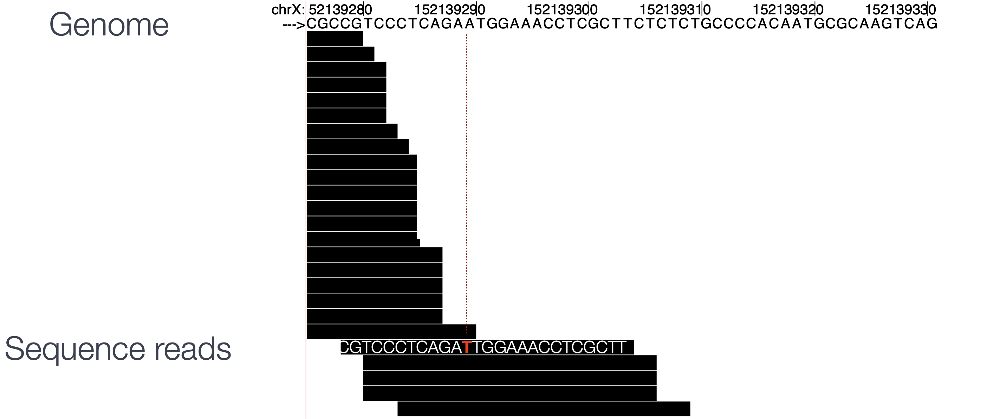

Contributors: Mary Piper, Radhika Khetani, Meeta Mistry, Jihe Liu

Approximate time:

**Link to issue describing the modifications to be made:** https://github.com/hbctraining/Intro-to-ChIPseq-flipped/issues/7

## Learning Objectives

* Understanding the basics of alignment theory
* Learn how to align reads to the genome using Bowtie2
* Understand SAM and BAM file format, and learn how to convert SAM file to BAM file
* Run alignment script and evaluate the alignment result

## Alignment to Genome

Now that we have assessed the quality of our sequence data, we are ready to align the reads to the reference genome. 

**CHANGE THIS WORKFLOW TO ONLY INCLUDE ALIGNMENT (grey out filtering)**
<p align="center">

</p>

In theory, this sounds like a very simple case of string matching. We take the sequence read and figure out where it originated from in the reference genome.
However, in practice, this is actually quite difficult! This is because the reference genome we are searching is large and complex. By contrast, the reads we are searching for are much smaller (50-150bp), and there are on the on the range of millions of them for a given sample. Additionally, we have to consider non-exact matching of the read to the reference due to sequencing errors, and also non-unique alignment due to the nature of short reads.

<p align="center">

</p>

There are many different tools that have been developed for alignment of next-generation sequencing data, and some that are more suitable to different technologies. A popular tool commonly used with ChIP-seq data, and one that we will be using in this workshop is Bowtie2.


## Bowtie2

[Bowtie2](http://bowtie-bio.sourceforge.net/bowtie2/manual.shtml) is a fast and accurate alignment tool.

* It supports gapped, local and paired-end alignment modes, and it works best for reads that are at least 50 bp (shorter read lengths should use Bowtie1)
* Bowtie2 performs a global end-to-end read alignment, which is best for quality-trimmed reads
* It also offers a local alignment mode, which will perform soft-clipping for the removal of poor quality bases or adapters from untrimmed reads. _We will use this option since we did not trim our reads._

> #### How do other aligners compare?
> We use Bowtie2 to align our reads in this workshop, but there are a number of other options. For **[bwa](http://bio-bwa.sourceforge.net/)**, the mapping rates are higher, with an equally similar increase in the number of duplicate mappings. Consequently, there is a significantly higher number of mapped reads and a much larger number of peaks being called (30% increase compared to Bowtie2). When we compare the peak calls generated from different aligners, the **bwa** peak calls are a superset of those called from the Bowtie2 aligments. It is yet to be determined whether or not these additional peaks are true positives. 

### Soft-clipping 

**Describe soft-clipping here briefly** (bullet points below have been taken from teh slide deck)

* Portions of the read that do not match well to the reference genome on either side of the reads are ignored for the alignment
* The procedure can carry a small penalty for each soft-clipped base, but amounts to a significantly smaller penalty than mismatching bases
* Soft-clipped bases are retained in the sequence and simply marked. Trimming methods hard-clip, which deletes the unwanted sequence.


<p align="center">

</p>


### Bowtie2: Building an index

To perform the Bowtie2 alignment, a genome index is required. The index is analagous to the index in a book. By indexing the genome, we have organized it in a manner that now allows for efficient search and retrieval of matches of the query (sequence read) to the genome.

Bowtie2 indexes the genome with an FM Index based on the **Burrows-Wheeler Transform** method to keep memory requirements low for the alignment process. Describe very briefly or link out to a helpful resource on BWT?

To create an index for your analysis, you can use the `bowtie2-build` command. There are various arguments you can provide, but in its simplest form all you needs as input is the path to the reference genome FASTA file, and a prefix to name your indices once its created.

```bash
#### DO NOT RUN THIS CODE ####

$ bowtie2-build <path_to_reference_genome.fa> <prefix_to_name_indexes>
```

**We will not be creating a genome index.**

The O2 cluster has a designated directory (`/n/groups/shared_databases/`) with shared databases for human and other commonly used model organisms that all users can readily access. These files contain, but are not limited to, genome indices for various tools, reference sequences, tool-specific data, and data from public databases, such as NCBI and PDB. Therefore, when using a tool that requires a reference file, it is worth taking a quick look at this directory and checking whether your desired reference is already deposited here.

```bash
$ ls -l /n/groups/shared_databases/
```
> *NOTE:* some disadvantages of using the shared databases? Not knowing exactly what reference version (i.e. release) or the exact parameters used to generate it.

For our dataset, we will need the `mm10` build of the reference genome. You can find those indices at `/n/groups/shared_databases/bowtie2_indexes/mm10`. **Rather than copying the files over, we will just point to the directory when necessary** so we will directly refer to it. 

### Bowtie2: Alignment

Now we are ready to perform the read alignment. Let's first create a `bowtie2` directory for our output:

```bash
# Create bowtie2 directory
mkdir ~/chipseq_workshop/results/bowtie2
```

We then need to load the module. We could find out more about bowtie2 on O2:

```bash
$ module spider bowtie2
```

Notice that before we load bowtie2, we also need to load the gcc compiler (as is the case for many other NGS analysis tools on O2). As a tip, we recommend always run `module spider` first to check any dependent modules.

```bash
$ module load gcc/6.2.0 bowtie2/2.2.9
```

The command to run the alignment is simply `bowtie2`. Some additional arguments that we will need for aligning reads to the genome using Bowtie2 are described below:

* `-p`: number of processors/cores
* `-q`: reads are in FASTQ format
* `--local`: local alignment feature to perform soft-clipping
* `-x`: /path/to/genome_indices_directory
* `-U`: /path/to/FASTQ_file
* `-S`: /path/to/output/SAM_file

Below is an example of the **full command to run bowtie2 on a single FASTQ file `wt_sample2_chip`**. Details on Bowtie2 and its functionality can be found in the [user manual](http://bowtie-bio.sourceforge.net/bowtie2/manual.shtml); we encourage you to peruse through to get familiar with all available options.

```bash
# DO NOT RUN
$ bowtie2 -p 2 -q --local \
-x /n/groups/shared_databases/bowtie2_indexes/mm10 \
-U ~/chipseq_workshop/data/wt_sample2_chip.fastq.gz \
-S ~/chipseq_workshop/results/bowtie2/wt_sample2_chip.sam
```

Bowtie2 does not generate log summary files. Rather this information gets printed to screen. If we want to capture that and save it in a file we can access later we can use `2>`. Talk about this vs `>`. Show the code below on how we use it.

## Alignment output: SAM/BAM file format

**This part can probably be trimmed in content**

The output from the Bowtie2 aligner is an unsorted SAM file, also known as **Sequence Alignment Map format**. The SAM file is a **tab-delimited text file** that contains information for each individual read and its alignment to the genome. While we will go into some features of the SAM format, the paper by [Heng Li et al](http://bioinformatics.oxfordjournals.org/content/25/16/2078.full) provides a lot more detail on the specification.

The file begins with a **header**, which is optional. The header is used to describe source of data, reference sequence, method of alignment, etc., this will change depending on the aligner being used. Each section begins with character ‘@’ followed by **a two-letter record type code**. These are followed by two-letter tags and values. Example of some common sections are provided below:

```
@HD  The header line
VN: format version
SO: Sorting order of alignments

@SQ  Reference sequence dictionary
SN: reference sequence name
LN: reference sequence length
SP: species

@PG  Program
PN: program name
VN: program version
```

Following the header is the **alignment section**. Each line corresponds to the alignment information for a single read. Each alignment line has **11 mandatory fields for essential mapping information** and a variable number of other fields for aligner-specific information. 


An example read mapping is displayed above. *Note that the example above spans two lines, but in the actual file it is a single line.* Let's go through the fields one at a time. 

- **`QNAME`:** Query name or read name - this is the same read name present in the header of the FASTQ file
- **`FLAG`:** numerical value providing information about read mapping and whether the read is part of a pair.
 
  > **NOTE:** The information stored inside the FLAG is additive based on the following information being TRUE or FALSE:
  > 
  > | Flag | Description |
  > | ------:|:----------------------:|
  > | 1 | read is mapped |
  > | 2 | read is mapped as part of a pair |
  > | 4 | read is unmapped |
  > | 8 | mate is unmapped |
  > | 16| read reverse strand|
  > | 32 | mate reverse strand |
  > | 64 | first in pair |
  > | 128 | second in pair |
  > | 256 | not primary alignment |
  > | 512 | read fails platform/vendor quality checks |
  > | 1024| read is PCR or optical duplicate |
  > 
  > * For a given alignment, each of these flags are either **on or off**, indicating the condition is **true or false**. 
  > * The `FLAG` is a combination of all of the individual flags (from the table above) that are true for the alignment 
  > * The beauty of the flag values is that **any combination of flags can only result in one sum**.
  > 
  > **There are tools that help you translate the bitwise flag, for example [this one from Picard](https://broadinstitute.github.io/picard/explain-flags.html)**

- **`RNAME`:** is the reference sequence name, giving the chromosome to which the read maps. The example read is from chromosome 1, which explains why we see 'chr1'. 
- **`POS`:** refers to the 1-based leftmost position of the alignment. 
- **`MAPQ`:** is giving us the alignment quality, the scale of which will depend on the aligner being used. 
- **`CIGAR`:** is a sequence of letters and numbers that represent the *edits or operations* required to match the read to the reference. The letters are operations that are used to indicate which bases align to the reference (i.e. match, mismatch, deletion, insertion), and the numbers indicate the associated base lengths for each 'operation'.

Now to the remaining fields in our SAM file:


The next three fields are more pertinent to paired-end data. 

- **`MRNM`:** is the mate reference name. 
- **`MPOS`:** is the mate position (1-based, leftmost). 
- **`ISIZE`:** is the inferred insert size.

Finally, you have the raw sequence data from the original FASTQ file stored for each read:

- **`SEQ`:** is the raw sequence
- **`QUAL`:** is the associated quality values for each position in the read.


### Changing file format from SAM to BAM

While the SAM alignment file from Bowtie2 is human readable, we need a BAM alignment file for downstream analysis. A BAM file is a binary equavalent version of SAM file, in other words, the same file in a compressed format. Therefore, BAM file is not human readable, and it is much smaller in size. BAM file is the typical format used in bioinformatics tools. We will use [Samtools](http://samtools.github.io) to convert the file format from SAM to BAM. Samtools is a program taht consists of many utilities for working with the Sequence Alignment/Map (SAM) format. Here, we will use the `samtools view` command to conver our SAM file into its binary compressed version (BAM) and save it to file.

> NOTE: Once we generate the BAM file, we don't need to retain the SAM file anymore - we can delete it to save space.

Let's start by loading the module `samtools`:

```bash
$ module load gcc/6.2.0 # you may not need to load this if you are working in the same session from Bowtie2
$ module load samtools/1.9
```

We outline below the parameters to use with the command `samtools view`, and what each does:

* `-h`: include header in output
* `-S`: input is in SAM format
* `-b`: output BAM format
* `-o`: /path/to/output/file

> **NOTE**: You can find detailed instructions for different samtools functions and additional parameter options in this [manual](http://www.htslib.org/doc/samtools-1.2.html). 

```bash
# DO NOT RUN
$ samtools view -h -S -b \
-o ~/chipseq_workshop/results/bowtie2/wt_sample2_chip.bam \
~/chipseq_workshop/results/bowtie2/wt_sample2_chip.sam
```

## Running alignment on a single sample

Genome alignment can take a while to finish,so we won't run it on an interactibve session. **Instead, we will create a SBATCH script, `alignment.sbatch` under the `~/chipseq_workshop/` directory, and submit this script as a job on the cluster.**

```bash
# Create a SBATCH script
vim alignment.sbatch
```

> NOTE: In the `vim`, press `i` to start the editing mode. Once done, type `:wq` to save and exit.

Let's specify the job submission options as below (don't forget the shebang line, `#!/bin/bash` at the begining):

```
#SBATCH -p short              # partition name
#SBATCH -c 2                  # number of cores
#SBATCH -t 0-2:00             # time limit
#SBATCH --mem 8G              # requested memory
#SBATCH --job-name alignment 	# job name
#SBATCH -o %j.out			          # file to which standard output will be written
#SBATCH -e %j.err 		          # file to which standard error will be written
```

In the body of the script, add the code required to:

* Load the necessary modules
* Run bowtie2 to obtain alignment SAM file, and a log file that captures the alignment summary
* Convert SAM file to BAM file using samtools. 

Please refer to the corresponding code we discussed earlier in this lesson, to fill up the whole script. Once you are done, submit the script as a job, using `sbatch alignment.sbatch` command.

<details>
  <summary>Solution</summary>
 
``` bash
#!/bin/bash
 
#SBATCH -p short              # partition name
#SBATCH -c 2                  # number of cores
#SBATCH -t 0-2:00             # time limit
#SBATCH --mem 8G              # requested memory
#SBATCH --job-name alignment 	# job name
#SBATCH -o %j.out			          # file to which standard output will be written
#SBATCH -e %j.err 		          # file to which standard error will be written

module load gcc/6.2.0 bowtie2/2.2.9 samtools/1.9
 
bowtie2 -p 2 -q --local \
-x /n/groups/shared_databases/bowtie2_indexes/mm10 \
-U ~/chipseq_workshop/data/wt_sample2_chip.fastq.gz \
-S ~/chipseq_workshop/results/bowtie2/wt_sample2_chip.sam 2> ~/chipseq_workshop/data/wt_sample2_chip_bowtie2.log
 
samtools view -h -S -b \
-o ~/chipseq_workshop/results/bowtie2/wt_sample2_chip.bam \
~/chipseq_workshop/results/bowtie2/wt_sample2_chip.sam

rm ~/chipseq_workshop/results/bowtie2/wt_sample2_chip.sam        
```

</details>

> NOTE:
> - The job takes about 50 minutes to finish. You could monitor the progress using the `sacct` command;
> - In the last line of the solution code, we remove the SAM file after generating the BAM file. We recommend you do so to save space.

***

**Exercise:**

1. After your job has completed, check the resulting `.out` and `.err` files. 
2. What information do you obtain from each file? 
3. Take a quick peek at a sample SAM file using `less`. Does the information you see line up with the fields we described above?
4. What is the alignment rate for the `wt_sample2_chip`? Do you think the alignment is good?

> _**NOTE:** After performing read alignment, it's useful to evaluate the mapping rate for each sample by taking look at the log files. Additionally, it is common to aggregate QC metrics and visualize them with plots using tools such as [MultiQC](http://multiqc.info). This is important to do prior to moving on to the next steps of the analysis._

***
*This lesson has been developed by members of the teaching team at the [Harvard Chan Bioinformatics Core (HBC)](http://bioinformatics.sph.harvard.edu/). These are open access materials distributed under the terms of the [Creative Commons Attribution license](https://creativecommons.org/licenses/by/4.0/) (CC BY 4.0), which permits unrestricted use, distribution, and reproduction in any medium, provided the original author and source are credited.*

