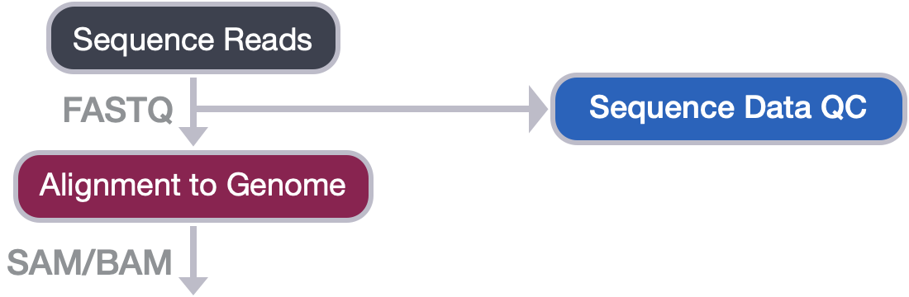
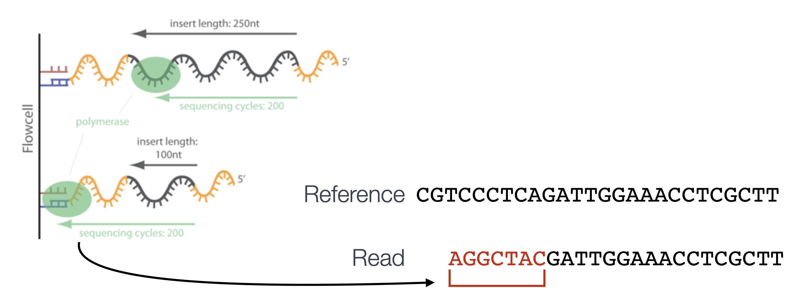

Contributors: Mary Piper, Radhika Khetani, Meeta Mistry, Jihe Liu, Will Gammerdinger

Approximate time: 45 min    
       

## Learning Objectives

* Describe the basics of alignment theory
* Complete an alignment of reads to the genome using Bowtie2
* Explain components of the SAM and BAM file formats
* Construct code to convert SAM files to BAM files
* Create a job submission script to run alignment on a sample
* Evaluate the results from an alignment of reads to the genome using Bowtie2

## Alignment to Genome

Now that we have assessed the quality of our sequence data, we are ready to align the reads to the reference genome. 


<p align="center">

</p>

In theory, this sounds like a very simple case of string matching. We take the sequence read and figure out where it originated from in the reference genome. However, in practice, this is **actually quite difficult!** This is because:

* The reference genome we are searching is large and complex (e.g. the human genome is ~3,200,000,000bp). 
* By contrast, the reads we are searching for are much smaller (50-150bp), and they are on the range of millions for a given sample.
* We have to consider non-exact matching of the read to the reference due to natural variation and sequencing errors.
* We have to consider non-unique alignment due to the short length of reads and high percentage of repetitive regions in the genome (e.g. repetitive regions = >50% of the human genome).

<p align="center">

</p>

There are many different tools that have been developed for alignment of next-generation sequencing data, and some that are more suitable to different technologies. A popular tool commonly used with ChIP-seq data, and the one that we will be using in this workshop is [Bowtie2](http://bowtie-bio.sourceforge.net/bowtie2/manual.shtml).

## To trim or not to trim?

Trimming is the process of removing unwanted sequence prior to sequence alignment. In general, trimming is an optional step. The 3' ends of the sequence may contain part of the Illumina sequencing adapter. This adapter contamination may prevent the reads from aligning to the reference genome correctly, thus adversely impacting the downstream analysis. You could evaluate potential adapter contamination either from the FastQC report (in "Overrepresented sequences" or "Adapter Contamination" sections), or from the size distribution of your sequencing libraries. If you suspect that your reads are contaminated with adapters, you should run an adapter removal tool. We list some additional considerations below whether trimming is needed:

  * If the read length is 25bp, there is no need to trim - adapter sequences will not be included in reads of inserts >25 bp.
  * If you perform trimming, then there is no need to use soft-clipping during the alignment.
  * After trimming, a minimum read length of 25bp should be imposed, as reads smaller than this are hard to align accurately.
  * Should you choose not to trim reads, you will need to use `--local` when runing Bowtie2 - this will perform "soft-clipping" to ignore parts of the reads that are of low quality.

## Bowtie2

Bowtie2 is a fast and accurate alignment tool that supports gapped, local and paired-end alignment modes and works best for reads that are **at least 50 bp** (shorter read lengths should use [Bowtie1](http://bowtie-bio.sourceforge.net/index.shtml)). 

By default, Bowtie2 will perform a global *end-to-end read alignment*, which aligns from the first to the last base of the read. This alignment is best for reads that have already been trimmed for quality and adapters (e.g. reads where nucleotide bases of poor quality or matching adapter sequences have been removed from the ends of the reads prior to alignment). However, Bowtie2 also has a _local alignment mode_, which, in contrast to end-to-end alignment, ignores portions at the ends of the reads that do match well to the reference genome. This is referred to as **soft-clipping** and allows for a more accurate alignment. The procedure can carry a small penalty for each soft-clipped base, but amounts to a significantly smaller penalty than mismatching bases. In contrast to trimming, which removes the unwanted sequence (hard-clipping), soft-clipping retains the soft-clipped base in the sequence and simply marks it. _We will use this option since we did not trim our reads._

<p align="center">

</p>  

> #### How do other aligners compare?
> We use Bowtie2 to align our reads in this workshop, but there are a number of other options. For **[bwa](http://bio-bwa.sourceforge.net/)**, the mapping rates are higher, with an equally similar increase in the number of duplicate mappings. Consequently, there is a significantly higher number of mapped reads and a much larger number of peaks being called (30% increase compared to Bowtie2). When we compare the peak calls generated from different aligners, the **bwa** peak calls are a superset of those called from the Bowtie2 aligments. It is yet to be determined whether or not these additional peaks are true positives. 

### Bowtie2: Building an index

To perform the Bowtie2 alignment, a genome index is required. The index is analagous to the index in a book. By indexing the genome, we have organized it in a manner that now allows for efficient search and retrieval of matches of the query (sequence read) to the genome.

Bowtie2 indexes the genome with an FM Index based on the **Burrows-Wheeler Transform** method to keep memory requirements low for the alignment process. If interested, a thorough description of the Burrows-Wheeler Transform and the FM Index can be found in this [resource paper](https://www.cs.jhu.edu/~langmea/resources/bwt_fm.pdf).

To create an index for your analysis, you can use the `bowtie2-build` command. There are various arguments you can provide, but in its simplest form all you need as input is the path to the reference genome FASTA file, and a prefix to name your indices once its created.

```bash
#### DO NOT RUN THIS CODE ####

$ bowtie2-build <path_to_reference_genome.fa> <prefix_to_name_indexes>
```

**We will not be creating a genome index.** Genome indices tend to be very large files, which would take up a lot of storage in our O2 space. Instead of generating our own index, the O2 cluster has a designated directory (`/n/groups/shared_databases/`) with shared databases for human and other commonly used model organisms that all users can readily access. These files contain, but are not limited to, genome indices for various tools, reference sequences, tool-specific data, and data from public databases, such as NCBI and PDB. Therefore, when using a tool that requires a reference file, it is worth taking a quick look at this directory and checking whether your desired reference is already deposited here.

```bash
$ ls -l /n/groups/shared_databases/
```
> *NOTE:* Disadvantages of using the shared databases include not knowing exactly what is the reference version (i.e. release) or the exact parameters used to generate it. **When using shared databases, it is important that it is clear how the reference was generated and its version.**

For our dataset, we will need the `mm10` build of the reference genome. You can find those indices at `/n/groups/shared_databases/bowtie2_indexes/mm10`. **Rather than copying the files over, we will just point to the directory when necessary** using its full path. 

### Bowtie2: Alignment

Now we are ready to perform the read alignment. Let's first create a `bowtie2` directory for our output:

```bash
# Create bowtie2 directory
$ mkdir ~/chipseq_workshop/results/bowtie2
```

We then need to load the module. We could find out more about Bowtie2 on O2:

```bash
# Check modules for Bowtie2
$ module spider bowtie2

# Check for any dependencies
$ module spider bowtie2/2.2.9
```

Notice that before we load Bowtie2, we also need to load the gcc compiler (as is the case for many other NGS analysis tools on O2). As a tip, we recommend always run `module spider` first to check any dependent modules.

```bash
# Load the necessary compiler and Bowtie2
$ module load gcc/6.2.0 bowtie2/2.2.9
```

The command to run the alignment is simply `bowtie2`. Some additional arguments that we will need for aligning reads to the genome using Bowtie2 are described below:

* `-p`: number of processors/cores
* `-q`: reads are in FASTQ format
* `--local`: local alignment feature to perform soft-clipping
* `-x`: /path/to/genome_indices_directory
* `-U`: /path/to/FASTQ_file
* `-S`: /path/to/output/SAM_file

For CUT&RUN and ATAC-seq, there are additional parameters that you want to explore, and we list them below:

<details>
	<summary><b><i>How do the parameters change for CUT&RUN?</i></b></summary>
	<br>
	For CUT&RUN, there are additional parameters that can be used. Here, we list options that have been reported by other groups. <b>It might not be neccessary to include any or all of these options.</b>  <i>We encourage you to explore the literature that resemble your research and method, and decide what is best for your data.</i><br>
	<ul><li><code>--end-to-end</code>: An opposite option of <code>--local</code>. Bowtie2 will search for alignments involving all of the read characters. This is also called an "untrimmed" or "unclipped" alignment, and is only used when trimming is done prior to alignment.</li>
	<li><code>--very-sensitive</code>: A preset option that results in slower running, but more sensitive and more accurate result.</li>
	<li><code>--no-mixed</code>: Suppress unpaired alignments for paired reads. Otherwise, without this option, when Bowtie2 cannot find a concordant or discordant alignment for a pair, it tries to find alignments for the individual mates.</li>
	<li><code>--no-discordant</code>: Suppress discordant alignments for paired reads. A discordant alignment is an alignment where both mates align uniquely, but that does not satisfy the paired-end constraints.</li>
	<li><code>-I 10 -X 700</code>: For specifying the size range of inserts. In this example, 10-700 bp in length is used to ignore any remaining adapter sequence at the 3’ ends of reads during mapping.</li>
	<li><code>--dovetail</code>: The term 'dovetailing' describes mates which extend past one another. It is unusual but is frequently encountered in CUT&RUN experiments. This option indicates that dovetailed alignments should be considered as concordant.</li></ul>	
 </details>

<details>
	<summary><b><i>How do the parameters change for ATAC-seq?</i></b></summary>
	<br>
	ATAC-seq usually uses the same parameters as ChIP-seq for alignment, but <b>the following options can be added if needed</b>:<br>		
<ul><li><code>-X <int></code>: Maximum DNA fragment length (default 500bp). If you anticipate that you may have DNA fragments longer than the default value, you should increase this parameter accordingly.</li>
<li><code>--very-sensitive</code>: better alignment results are frequently achieved with this.</li></ul>
 </details>

Below is an example of the **full command to run bowtie2 on a single FASTQ file `wt_sample2_chip`**. Details on Bowtie2 and its functionality can be found in the [user manual](http://bowtie-bio.sourceforge.net/bowtie2/manual.shtml); we encourage you to peruse through to get familiar with all available options.

```bash
# DO NOT RUN
$ bowtie2 -p 2 -q --local \
-x /n/groups/shared_databases/bowtie2_indexes/mm10 \
-U ~/chipseq_workshop/raw_data/wt_sample2_chip.fastq.gz \
-S ~/chipseq_workshop/results/bowtie2/wt_sample2_chip.sam
```

Bowtie2 does not generate log summary files. Rather this information gets printed to screen. If we want to capture that and save it in a file we can access later we can use the `2>` operator. To redirect the standard error from the `bowtie2` command we could do the following:

```
# DO NOT RUN
bowtie2 -p 2 -q --local \
-x /n/groups/shared_databases/bowtie2_indexes/mm10 \
-U ~/chipseq_workshop/raw_data/wt_sample2_chip.fastq.gz \
-S ~/chipseq_workshop/results/bowtie2/wt_sample2_chip.sam 2> ~/chipseq_workshop/logs/wt_sample2_chip_bowtie2.log
```

> _**NOTE: What is the `2>` operator doing?** Whenever we run a command, it generates two types of output: the output accomplished by the process, which is generally referred to as standard output, and the diagnostic output, which is generally referred to as standard error. By convention, both are output to the screen, but we can redirect either output to file using redirection operators. To redirect the standard output to file (if there is no option for specifying in the command), we can use the `>` operator and to redirect the standard error to file we can use the `2>` operator. Tools generally follow the convention of which type of information is contained in each output, but some tools will send the non-diagnostic output to standard error, and vice versa. We often redirect the standard error from the screen to a log file so that we have this information for any downstream troubleshooting._ 

## Alignment output: SAM/BAM file format

The output from the Bowtie2 aligner is an unsorted SAM file, also known as **Sequence Alignment/Map format**. The SAM file is a **tab-delimited text file** that contains information for each individual read and its alignment to the genome. While we will go into some features of the SAM format, the paper by [Heng Li et al](http://bioinformatics.oxfordjournals.org/content/25/16/2078.full) provides a lot more detail on the specification.

The file begins with a **header**, which is optional. The header is used to describe source of data, reference sequence, method of alignment, etc., this will change depending on the aligner being used. Each section begins with character ‘@’ followed by [**a two-letter record type code**](https://www.samformat.info/sam-format-header). These are followed by two-letter tags and values.

Following the header is the **alignment section**. Each line corresponds to the alignment information for a single read. Each alignment line has **11 mandatory fields for essential mapping information** and a variable number of other fields for aligner-specific information. 


An example read mapping is displayed above. *Note that the example above spans two lines, but in the actual file it is a single line.* Let's go through the fields one at a time. 

- **`QNAME`:** Query name or read name - this is the same read name present in the header of the FASTQ file
- **`FLAG`:** numerical value providing information about read mapping and whether the read is part of a pair. Specifics regarding the FLAG values are [available](https://www.samformat.info/sam-format-flag-single).
- **`RNAME`:** is the reference sequence name, giving the chromosome to which the read maps. The example read is from chromosome 1, which explains why we see 'chr1'. 
- **`POS`:** refers to the 1-based leftmost position of the alignment. 
- **`MAPQ`:** is giving us the alignment quality, the scale of which will depend on the aligner being used. 
- **`CIGAR`:** is a sequence of letters and numbers that represent the *edits or operations* required to match the read to the reference. The letters are operations that are used to indicate which bases align to the reference (i.e. match, mismatch, deletion, insertion), and the numbers indicate the associated base lengths for each 'operation'. For example, in the SAM image below, the `100M` represents all 100 bp match the genome (no insertions, deletions, or gaps).

Now to the remaining fields in our SAM file:


The next three fields are more pertinent to paired-end data. 

- **`MRNM`:** is the mate reference name. 
- **`MPOS`:** is the mate position (1-based, leftmost). 
- **`ISIZE`:** is the inferred insert size.

Finally, you have the raw sequence data from the original FASTQ file stored for each read:

- **`SEQ`:** is the raw sequence
- **`QUAL`:** is the associated quality values for each position in the read.


### Changing file format from SAM to BAM

While the SAM alignment file from Bowtie2 is human readable, we need a BAM alignment file for downstream analysis. A BAM file is a binary equivalent version of the SAM file, in other words, the same file in a compressed format. Therefore, BAM file is not human readable, and it is much smaller in size. BAM file is the typical format used in bioinformatics tools. We will use [Samtools](http://samtools.github.io) to convert the file format from SAM to BAM. Samtools is a program that consists of many utilities for working with the Sequence Alignment/Map (SAM) format. Here, we will use the `samtools view` command to convert our SAM file into its binary compressed version (BAM) and save it to file.

> NOTE: Once we generate the BAM file, we don't need to retain the SAM file anymore - we can delete it to save space.

Let's start by loading the module `samtools`:

```bash
$ module load gcc/6.2.0 # you may not need to load this if you are working in the same session from Bowtie2
$ module load samtools/1.13
```

We outline below the parameters to use with the command `samtools view`, and what each does:

* `-h`: include header in output
* `-S`: input is in SAM format
* `-b`: output BAM format
* `-o`: /path/to/output/file

> **NOTE**: You can find detailed instructions for different samtools functions and additional parameter options in this [manual](http://www.htslib.org/doc/samtools-1.2.html). 

```bash
# DO NOT RUN
$ samtools view -h -S -b \
-o ~/chipseq_workshop/results/bowtie2/wt_sample2_chip.bam \
~/chipseq_workshop/results/bowtie2/wt_sample2_chip.sam
```

## Running alignment on a single sample

Genome alignment can take a while to finish, so we won't run it in an interactive session. **Instead, we will create a SBATCH script, `alignment.sbatch` under the `~/chipseq_workshop/scripts` directory, and submit this script as a job on the cluster.**

```bash
# Create a SBATCH script
vim ~/chipseq_workshop/scripts/alignment.sbatch
```

> NOTE: In the `vim`, press `i` to start the editing mode. Once done, type `:wq` to save and exit.

Let's specify the job submission options as below (don't forget the shebang line, `#!/bin/bash` at the begining):

```
#SBATCH -p short              # partition name
#SBATCH -c 2                  # number of cores
#SBATCH -t 0-2:00             # time limit
#SBATCH --mem 8G              # requested memory
#SBATCH --job-name alignment 	# job name
#SBATCH -o %j.out			          # file to which standard output will be written
#SBATCH -e %j.err 		          # file to which standard error will be written
```

In the body of the script, add the code required to:

* Load the necessary modules
* Run bowtie2 to obtain a SAM file, and a log file that captures the alignment summary
* Convert the SAM file to a BAM file using samtools. 

Please refer to the corresponding code we discussed earlier in this lesson, to fill up the whole script. Once you are done, submit the script as a job, using `sbatch ~/chipseq_workshop/scripts/alignment.sbatch` command.

<details>
  <summary><b>Click here for solution</b></summary>
  
  <p><pre>
  
  ```
  #!/bin/bash
   
  #SBATCH -p short              # partition name
  #SBATCH -c 2                  # number of cores
  #SBATCH -t 0-2:00             # time limit
  #SBATCH --mem 8G              # requested memory
  #SBATCH --job-name alignment 	# job name
  #SBATCH -o %j.out			          # file to which standard output will be written
  #SBATCH -e %j.err 		          # file to which standard error will be written
  
  module load gcc/6.2.0 bowtie2/2.2.9 samtools/1.13
   
  bowtie2 -p 2 -q --local \
  -x /n/groups/shared_databases/bowtie2_indexes/mm10 \
  -U ~/chipseq_workshop/raw_data/wt_sample2_chip.fastq.gz \
  -S ~/chipseq_workshop/results/bowtie2/wt_sample2_chip.sam 2> ~/chipseq_workshop/logs/wt_sample2_chip_bowtie2.log
   
  samtools view -h -S -b \
  -o ~/chipseq_workshop/results/bowtie2/wt_sample2_chip.bam \
  ~/chipseq_workshop/results/bowtie2/wt_sample2_chip.sam
  
  rm ~/chipseq_workshop/results/bowtie2/wt_sample2_chip.sam    
  ```
  
  </pre></p>
  
</details>

> NOTE:
> - The job takes about 50 minutes to finish. You could monitor the progress using the `sacct` command;
> - In the last line of the solution code, we remove the SAM file after generating the BAM file. We recommend you do so to save space.

***

**Exercise:**

1. After your job has completed, check the resulting `.out` and `.err` files. What information do you obtain from each file? 
2. Take a quick peek at a sample BAM file using `samtools view`. Does the information you see line up with the fields we described above?
3. What is the alignment rate for the `wt_sample2_chip`? Do you think the alignment is good?

> _**NOTE:** After performing read alignment, it's useful to evaluate the mapping rate for each sample by taking look at the log files. Additionally, it is common to aggregate QC metrics and visualize them with plots using tools such as [MultiQC](http://multiqc.info). This is important to do prior to moving on to the next steps of the analysis._

***
*This lesson has been developed by members of the teaching team at the [Harvard Chan Bioinformatics Core (HBC)](http://bioinformatics.sph.harvard.edu/). These are open access materials distributed under the terms of the [Creative Commons Attribution license](https://creativecommons.org/licenses/by/4.0/) (CC BY 4.0), which permits unrestricted use, distribution, and reproduction in any medium, provided the original author and source are credited.*

