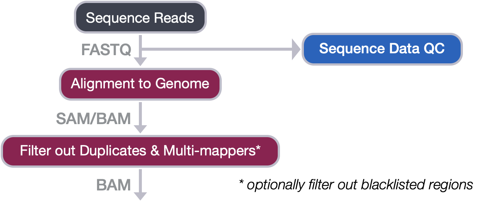
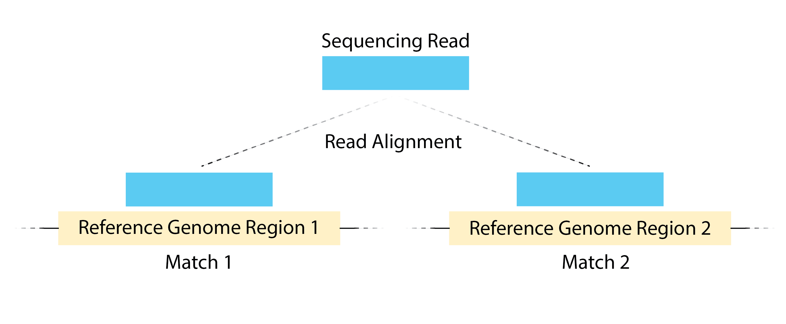
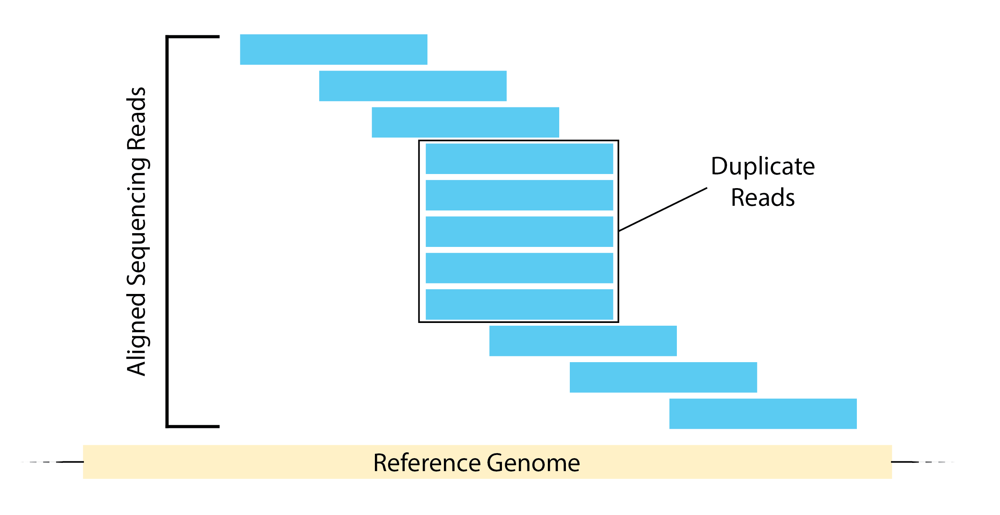

Contributors: Mary Piper, Radhika Khetani, Meeta Mistry, Jihe Liu, Will Gammerdinger

Approximate time: 45 minutes

## Learning Objectives

* Describe the purpose of filtering alignment reads
* Employ filtering on alignment files using sambamba and samtools

## Filtering reads

<p align="center">
 
</p>


A key issue when working with a ChIP-seq data is to **move forward with only the uniquely mapping reads**.  Allowing for multi-mapped reads increases the number of usable reads and the sensitivity of peak detection; however, the number of false positives may also increase [[1]](https://www.ncbi.nlm.nih.gov/pubmed/21779159/). To increase our confidence in peak calling and improve data reproducibility, we need to **filter out both multi-mapping reads and duplicate reads**.

* Multi-mapping reads are reads that are mapping to multiple loci on the reference genome.

<p align="center">
 
</p>

<details>
	<summary><b><i>Are multi-mappers treated differently for CUT&RUN and ATAC-seq data?</i></b></summary>
	<br>
	<p><b>Uniquely mapping reads is critical for ATAC-seq analysis.</b> A unique mapping rate over 80% is typical for a successful experiment. Multi-mappers are always removed.</p>
	<p><b>There are no mentions of a multi-mapper removal step in CUT&RUN analysis approaches</b>. Perhaps because Bowtie2 defaults to search for multiple alignments, yet only reports the best one (i.e. not using the `-k` option).</p>
 </details>


* Duplicate reads are reads that map at the exact same location, with the same coordinates and the same strand. These duplicates can arise from experimental artifacts, but can also contribute to genuine ChIP-signal.
    * **The bad kind of duplicates:** If initial starting material is low, this can lead to overamplification of this material before sequencing. Any biases in PCR will compound this problem and can lead to artificially enriched regions. 
    * **The good kind of duplicates:** You can expect some biological duplicates with ChIP-seq since you are only sequencing a small part of the genome. This number can increase if your depth of coverage is excessive or if your protein only binds to few sites. If there are a good proportion of biological dupicates, removal can lead to an underestimation of the ChIP signal. 

<p align="center">
 
</p>

> #### Some additional notes on duplicates
> Most peak calling algorithms also implement methods to deal with duplicate reads. While they are commonly removed prior to peak calling, another option is to leave them now and deal with them later. **Skip the duplicate filtering at this step if**:
> * You are planning on performing a differential binding analysis.
> * You are expecting binding in repetitive regions (also, use paired-end sequencing) 
> * You have included [UMIs](https://www.illumina.com/techniques/sequencing/ngs-library-prep/multiplexing/unique-molecular-identifiers.html) into your experimental setup.

<details>
	<summary><b><i>Are duplicates treated differently for CUT&RUN or ATAC-seq?</i></b></summary><br>
	<p><b>Duplicate removal is always performed for ATAC-seq data.</b></p><br>
	<p><b>Duplicate removal is an optional step in many CUT&RUN analysis approaches</b>. The default is usually to keep duplicates, because CUT&RUN increases the likelihood of biological duplicates. More specifically, nuclease cleavage of chromatin by its stereotypical nature is influenced by conformation of chromatin and/or nuclease bias, increasing the likelihood of identical reads that are originated from different cells. Therefore, we should remove duplicate with caution. Assess the library complexity first, and then check if there are unreasonbly high amount of duplications. If not, and your experiment does not over-amplify, you might not want to remove the duplicate. <br></p>
 </details>

### Filtering workflow

The older version of Bowtie2 had an argument that allowed us to easily perform filtering during the alignment process. but the latest Bowtie2 does not have this option. As a result, the filtering will be done with the use of a tool called [sambamba](https://lomereiter.github.io/sambamba/). Sambamba is an open source tool that provides methods for working with SAM/BAM files, similar to samtools, except with faster processing times and in some cases added functionality. 

This **lesson will consist of two steps**:

1. Sort BAM files by genomic coordinates (using `samtools`).
2. Filter the reads to keep only uniquely mapping reads (using `sambamba`). This will also remove any unmapped reads.

Before we begin, you will want to make sure you are **logged into O2.** To start an interactive session with 2 cores and 10G of memory (sorting can be memory-intensive) us the command below:

> **NOTE:** Check to see that you are not already on a compute node! Interactive session should always be run from the login node. If the text before your command prompt contains the word 'compute', _do not run the code below_.

```bash
$ srun --pty -p interactive -t 0-2:30 --mem 10G -c 2 --reservation=HBC2 /bin/bash
```

We will also load the required modules for this lesson:

```bash
module load gcc/6.2.0 samtools/1.13 sambamba/0.7.1
```


### 1. Sort BAM files by genomic coordinates

Before we can do the filtering, we need to sort our BAM alignment files by genomic coordinates (instead of by name). To perform the sorting, we could use [Samtools](http://www.htslib.org/), a tool we previously used when coverting our SAM file to a BAM file. 

The command we use this time is `samtools sort` with the parameter `-o`, indicating the path to the output file. The example code looks like below (please do not run):

``` bash
# DO NOT RUN
$ cd ~/chipseq_workshop/results/bowtie2/
$ samtools sort wt_sample2_chip.bam -o wt_sample2_chip_sorted.bam
```

> **NOTE**: To run the above code, you will need the BAM file generated from the [alignment lesson](04_alignment_using_bowtie2.md). If you do not have this file, you could copy over the BAM file to your directory:
>
> ```bash
> $ cp /n/groups/hbctraining/harwell-datasets/workshop_material/results/bowtie2/wt_sample2_chip.bam ~/chipseq_workshop/results/bowtie2/wt_sample2_chip.bam
> ``` 

The `samtools sort` code above takes about 7 min to finish. Instead of running it in the class, we have generated the output BAM file. Please copy over the BAM file to your directory:

```bash
$ cd ~/chipseq_workshop/results/bowtie2/
$ cp /n/groups/hbctraining/harwell-datasets/workshop_material/results/bowtie2/wt_sample2_chip_sorted.bam ~/chipseq_workshop/results/bowtie2/wt_sample2_chip_sorted.bam
```

We could take a glimpse of the sorted BAM file using `samtools view`:

```bash
$ samtools view wt_sample2_chip_sorted.bam | less
```

### 2. Filter the reads to keep only uniquely mapping reads

Next, we can filter the sorted BAM files to keep only uniquely mapping reads. We will use the `sambamba view` command with the following parameters:

* `-t`: number of threads(cores)
* `-h`: print SAM header before reads
* `-f`: format of output file (default is SAM)
* `-F`: set [custom filter](https://github.com/lomereiter/sambamba/wiki/%5Bsambamba-view%5D-Filter-expression-syntax) - we will be using the filter to remove duplicates, multimappers and unmapped reads.

```bash
$ sambamba view -h -t 2 -f bam \
-F "[XS] == null and not unmapped and not duplicate" \
wt_sample2_chip_sorted.bam > wt_sample2_chip_final.bam
```

We filter out unmapped reads by specifying in the filter `not unmapped`, and duplicates with `not duplicate`. Also, among the reads that are aligned, we filter out multimappers by specifying `[XS] == null`. 'XS' is a tag generated by Bowtie2 that gives an alignment score for the second-best alignment, and it is only present if the read is aligned and more than one alignment is found for the read.

<details>
	<summary><b><i>Click here for additional filtering considerations for CUT&amp;RUN data</i></b></summary>
	<br>
	<p> Once the CUT&amp;RUN sequence reads have been aligned to the genome, the resulting <b>BAM files can be filtered by fragment size</b>. Fragments can be divided into ≤ 120-bp and > 120-bp fractions. For transcription factors or proteins with an expected punctate binding profile, you can use the ≤ 120-bp fraction which is likely to contain binding sites. The range can be increased depending on the protein of interest, and alternatively BAM files without filtering can also be used.</p>
	Example code for filtering BAM files by fragment size:<br>
<pre>bash
sambamba view --format \
  bam --nthreads 6 \
  -F "((template_length > 0 and template_length < 120) or (template_length < 0 and template_length > -120))" $file | samtools view -b > bams_sizeSelect/${s}-sizeSelect.bam
</pre>	
 </details>


<details>
	<summary><b><i>Click here for additional filtering considerations for ATAC-seq data</i></b></summary>
	<br>There are two additional filtering steps that need to be performed for ATAC-seq data analysis:<br>	
<ul><li><b>Filtering mitochondrial reads</b>. The mitochondrial genome, which is more accessible due to the lack of chromatin packaging will result in extremely high read coverage. These <b>reads should be discarded</b>. Since there are no ATAC-seq peaks of interest in the mitochondrial genome, these reads are discarded. The Omni-ATAC method uses detergents to remove mitochondria from the samples prior to sequencing and is another option to deal with this issue.</li>
<li><b>Filtering BAM files based on fragment size.</b>
<ul><li>Typically, a successful ATAC-seq experiment should generate a fragment size distribution plot with decreasing and periodical peaks corresponding to the nucleosome-free regions (NFR) (< 100 bp) and mono-, di-, and tri-nucleosomes (~ 200, 400, 600 bp, respectively)</li>
<li>Fragments from the NFR are expected to be enriched around the transcription start site (TSS). Fragments from nucleosome-bound regions are expected to be depleted at TSS with a slight enrichment of flanking regions around TSS. <i>Use example sambamba code</i> from above (CUT&amp;RUN filtering) to filter out fragments by size. A BAM for NFR, mono-nuc, di-nuc, tr-nuc. <b>Typically the NFR BAM is used for peak calling.</b></li>
<li>Shift the reads in the BAM file. Reads should be shifted + 4 bp and − 5 bp for positive and negative strand respectively, to account for the 9-bp duplication created by DNA repair of the nick by Tn5 transposase</li></ul></ul><br>	
 </details>


> ### Filtering out Blacklisted Regions
> Although we do not perform this step, it is common practice to apply an additional level of filtering to our BAM files. That is, we remove alignments that occur with defined Blacklisted Regions. **We will filter out blacklist regions post-peak calling.**
> 
> Blacklisted regions represent artifact regions that tend to show artificially high signal (excessive unstructured anomalous reads mapping). These regions are often found at specific types of repeats such as centromeres, telomeres and satellite repeats and typically appear uniquely mappable so simple mappability filters applied above do not remove them. The ENCODE and modENCODE consortia have compiled blacklists for various species and genome versions including human, mouse, worm and fly. These blacklisted regions (coordinate files) can be filtered out from our alignment files before proceeding to peak calling.
> 
> If we wanted to filter blacklist regions at this point in our workflow, we would use the following code:
> 
> ``` 
> # DO NOT RUN
> $ bedtools intersect -v -abam wt_sample2_chip_final.bam -b mm10-blacklist.v2.bed > wt_sample2_chip_final_blacklist_filtered.bam
> ```
> 
> _bedtools is a suite of tools that we will discuss in more detail in a later lesson when blacklist filtering is applied._


***
*This lesson has been developed by members of the teaching team at the [Harvard Chan Bioinformatics Core (HBC)](http://bioinformatics.sph.harvard.edu/). These are open access materials distributed under the terms of the [Creative Commons Attribution license](https://creativecommons.org/licenses/by/4.0/) (CC BY 4.0), which permits unrestricted use, distribution, and reproduction in any medium, provided the original author and source are credited.*

