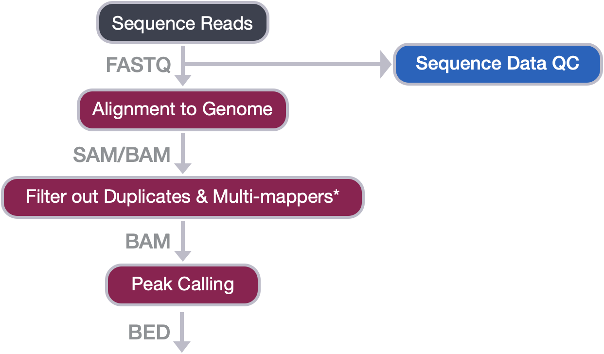
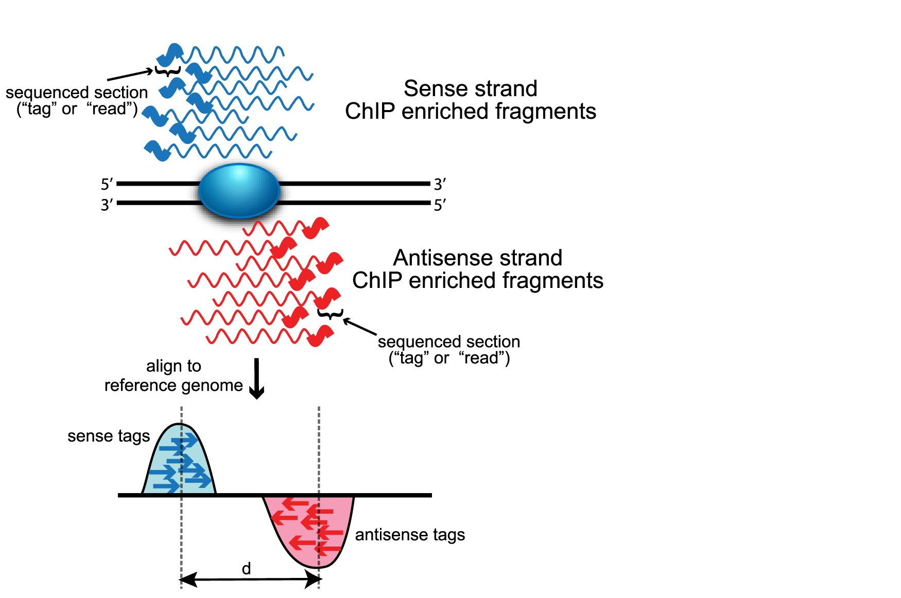
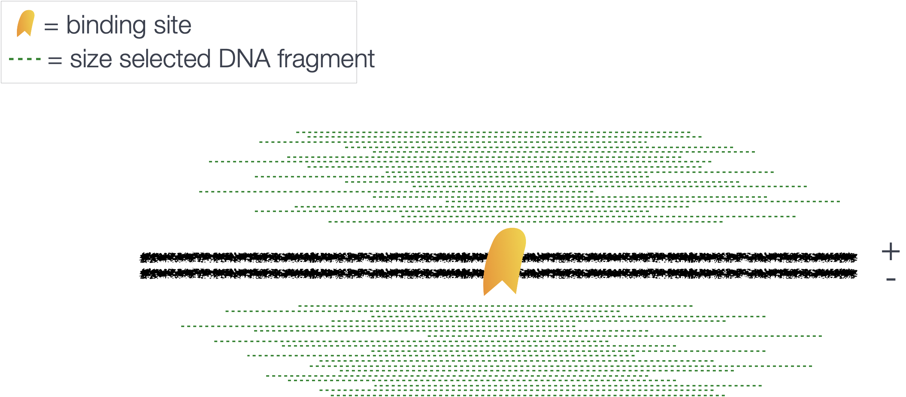
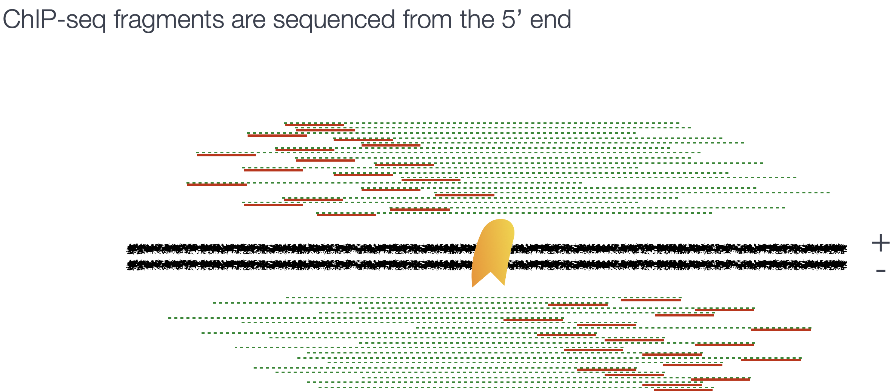
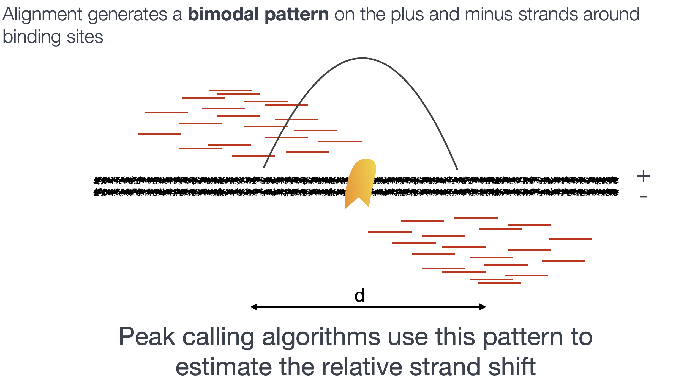

Contributors: Meeta Mistry, Jihe Liu, Radhika Khetani, Mary Piper, Will Gammerdinger

Approximate time: 60 minutes

## Learning Objectives

* Describe the different components of the MACS2 peak calling algorithm
* Describe the parameters involved in running MACS2
* List and describe the output files from MACS2

## Peak Calling

Peak calling, the next step in our workflow, is a computational method used to identify areas in the genome that have been enriched with aligned reads as a consequence of performing a ChIP-sequencing experiment. 

<p align="center">

</p>

For ChIP-seq experiments, what we observe from the alignment files is a **strand asymmetry with read densities on the +/- strand, centered around the binding site**. The 5' ends of the selected fragments will form groups on the positive- and negative-strand. The distributions of these groups are then assessed using statistical measures and compared against background (input or IgG samples) to determine if the site of enrichment is likely to be a real binding site.

<p align="center">

</p>

*Image source: [Wilbanks and Faccioti, PLoS One 2010](https://journals.plos.org/plosone/article?id=10.1371/journal.pone.0011471)*

There are various tools that are available for peak calling. Peak calling algorithms are often specialized in identifying one of **two types of enrichment**: broad peaks or narrow peaks. There are also many tools out there that are capable of handling both types of profiles, and have specific methods for each. As such, it is good to **have some idea about what type of binding profile you are expecting when choosing your peak caller and/or the specific methods** to run. For more detail on the different types of binding profiles, please refer to the discussion from [an earlier lesson](01_ChIPseq_design_and_workflow.md#types-of-binding-profiles).

> #### What if I am not sure what type of binding profile to expect?
> In this scenario, we advise peak calling for both narrow and broad profiles. This will require additional time for some exploration to determine what is best for your data.


## MACS2
A commonly used tool for identifying binding sites is named [Model-based Analysis of ChIP-seq (MACS)](https://github.com/taoliu/MACS). The [MACS algorithm](http://genomebiology.biomedcentral.com/articles/10.1186/gb-2008-9-9-r137) captures the influence of genome complexity to evaluate the significance of enriched ChIP regions. Although it was developed for the detection of transcription factor binding sites (narrow peaks), it is also suited for larger regions (broad peaks). 

We will be using **MACS2** in this workshop. The **underlying algorithm for peak calling remains the same as the original MACS**, but it comes with some enhancements in functionality. The MACS/MACS2 workflow is depicted below. In this lesson, we will describe the steps in more detail.

> **NOTE**: You will notice that the link above points to **MACS3, the newest version of this software**. For this workshop we are limited to what is available as a module on O2, but if you have access to the latest version - we do recommend using it. The base algorithm does not change between versions, rather small tweaks have been made towards speed/memory optimization and code cleanup. There are also additional features added. For more details, please [refer to the GitHub page](https://github.com/macs3-project/MACS). 

<p align="center">

</p>
	
### Removing redundancy

MACS provides different options for dealing with **duplicate tags** at the exact same location, that is tags with **the same coordination and the same strand**. The default is to keep a single read at each location. The `auto` option, which is very commonly used, tells MACS to calculate the maximum tags at the exact same location based on binomal distribution using 1e-5 as the pvalue cutoff. An alternative is to set the `all` option, which keeps every tag. If an `integer` is specified, then at most that many tags will be kept at the same location. This redundancy is consistently applied for both the ChIP and input samples.

> _We do not need to worry about this option, since **we filtered out the duplicates during the [post-alignment filtering step](05_filtering_BAM_files.md).**_

### The bimodal nature of ChIP-seq data 

Below, we have illustrated the protein of interest and the fragments of DNA (green) which have been obtained from the immunoprecipitation.

<p align="center">

</p>

As these fragments are typically sequenced from the 5' end, the reads we obtain will not give us the fragment pileup shown in the image above. Rather, we get a read pileup on either side of the protein (on the positive and negative strand).

<p align="center">

</p>

After aligining reads to the genome, the read density around a true binding site should show a **bimodal enrichment pattern** (or paired peaks).

<p align="center">

</p>

### Modeling the shift size

MACS takes advantage of this bimodal pattern to empirically model the shifting size, thus better locating the precise binding sites.

To identify the shift size:

1. MACS scans the whole sample **searching for all highly significant enriched regions**. *This is done only using the ChIP sample!* 
   * These regions are identified by MACS sliding across the genome using a 600bp window to find regions with **tags more than 50-fold enriched relative to a random tag genome distribution**. 
   
   > *Note 1:* Both the window size and the fold enrichment values described above are the default values. Although there are [parameters](06_peak_calling_macs.md#macs2-parameters) that allow you to modify these (i.e `bw` and `mfold`), tweaking it is not recommended.
   > 
   > *Note 2:* The default fold enrichment for MACS2 is greater than the value described in the workflow for MACSv1 above.
2. MACS randomly **samples 1,000 of these high-quality peaks** identified in #1. 
3. For these 1,000 peaks, MACS separates their positive and negative strand tags and aligns them by the midpoint between their centers. The **distance between the modes of the two peaks in the alignment is defined as 'd'** and represents the estimated fragment length. 
4. MACS **shifts all reads in the sample by d/2** toward the 3' ends to the most likely protein-DNA interaction sites


### Scaling libraries

For experiments in which sequence depth differs between input and treatment samples, MACS linearly scales the **total control tag count to be the same as the total ChIP tag count**. The default behaviour is for the larger sample to be scaled down.

### Effective genome length

To calculate λ<sub>bg</sub> (a parameter discussed [below](06_peak_calling_macs.md#peak-detection)), MACS requires the **effective genome size** or the size of the genome that is mappable. Mappability is related to the uniqueness of the k-mers at a particular position the genome. Low-complexity and repetitive regions have low uniqueness, which means low mappability. Therefore we need to provide the effective genome length to **correct for the loss of true signals in low-mappable regions**.

> #### How do I obtain the effective genome length?
> The MACS software has some pre-computed values for commonly used organisms (human, mouse, worm and fly). If you wanted you could compute a more accurate values based on your organism and build. The [deepTools docs](https://deeptools.readthedocs.io/en/develop/content/feature/effectiveGenomeSize.html) has additional pre-computed values for more recent builds but also has some good materials on how to go about computing it.

### Peak detection

After MACS shifts every tag by *d/2*, it then slides across the genome using a window size of *2d* to find candidate peaks. The tag distribution along the genome can be modeled by a Poisson distribution. The Poisson is a one parameter model, where the parameter **λ is the expected number of reads in that window**. It is computed using only the input control sample.

<p align="center">

</p>

MACS computes a λ<sub>local</sub> defined for each candidate peak. The λ<sub>local</sub> parameter is deduced by **computing a λ value for different window sizes** (as shown below). From these values, the maximum value is retained to represent λ<sub>local</sub>.

<p align="center">

</p>

**λ<sub>local</sub> = MAX(λ<sub>300bp</sub>, λ<sub>1kb</sub>, λ<sub>5kb</sub>, λ<sub>10kb</sub>, λ<sub>bg</sub>).** 

> λ<sub>bg</sub> represents the background λ estimated using the whole mappable genome (i.e. the largest window size)

In this way, lambda captures the influence of local biases, and is **robust against occasional low tag counts at small local regions**. Possible sources for these biases include local chromatin structure, DNA amplification and sequencing bias, and genome copy number variation.

Next, a Poisson distribution p-value is computed based on λ. A region is considered to have a significant tag enrichment if the p-value < 1e-5. Any overlapping enriched peaks are merged into a single peak.

### Estimation of false discovery rate

Each peak is considered an independent test. Therefore, when we encounter thousands of significant peaks detected in a sample, we have a multiple testing problem. In MACSv1.4, the FDR was determined empirically by exchanging the ChIP and control samples. However, in MACS2, p-values are now corrected for multiple comparison using the **Benjamini-Hochberg correction**.

## Running MACS2 

To run MACS2, we will first load the macs2 module along with any dependencies:

```bash
$ module load gcc/6.2.0  python/2.7.12 macs2/2.1.1.20160309
```

We will also need to create a directory for the output generated from MACS2:

```bash
# Create macs2 directory in results
$ mkdir -p ~/chipseq_workshop/results/macs2
```

Now change directories to the `results` folder:

```bash
$ cd ~/chipseq_workshop/results/
```

Since we only created a filtered BAM file for a single sample, **we will use the BAM files we have generated for you**. Rather than copying them over, we will have you point to them within your peak calling command.


### MACS2 parameters

There are seven [major functions](https://github.com/taoliu/MACS#usage-of-macs2) available in MACS2 serving as sub-commands. We will only cover `callpeak` in this lesson, but you can use `macs2 COMMAND -h` to find out more, if you are interested.

`callpeak` is the main function in MACS2 and can be invoked by typing `macs2 callpeak`. If you type this command without parameters, you will see a full description of commandline options. Here is a shorter list of the commonly used ones: 

**Input file options**

* `-t`: The ChIP data file (this is the only REQUIRED parameter for MACS)
* `-c`: The control or mock data file
* `-f`: format of input file; Default is "AUTO", which will allow MACS to decide the format automatically.
* `-g`: mappable genome size, which is defined as the genome size that can be sequenced (1.0e+9 or 1000000000, are both accepted formats). Some precompiled values are provided (i.e. 'hs' for human (2.7e9), 'mm' for mouse (1.87e9), 'ce' for C. elegans (9e7) and 'dm' for fruitfly (1.2e8))

> **NOTE:** While MACS can be used to call peaks without an input control, we advise against this. The control sample increases specificity of the peak calls, and without it you will find many false positive peaks identified. 

**Output arguments**

* `--outdir`: MACS2 will save all output files into speficied folder for this option
* `-n`: The prefix string for output files
* `-B/--bdg`: store the fragment pileup, control lambda, -log10pvalue and -log10qvalue scores in bedGraph files

**Shifting model arguments**

* `--nomodel`: Whether or not to build the shifting model. Set to True for ATAC-seq peak-calling.
* `--bw`: The bandwidth, which is used to scan the genome ONLY for model building. **Tweaking this is not recommended.**
* `--mfold`: upper and lower limit for model building (defaults to 5 and 50). **Tweaking this is not recommended.**

**Peak calling arguments**

* `-q`: q-value (minimum false discovery rate) cutoff for peak detection. By default this is set to 0.05 and the p-value is not considered.
* `-p`: p-value cutoff. This is mutually exclusive with `-q`. Use in place of q-value for a more lenient threshold (see note below). If p-value cutoff is set, qvalue will not be calculated and reported as -1 in the final .xls file
* `--nolambda`: do not consider the local bias/lambda at peak candidate regions
* `--broad`: broad peak calling

> **NOTE:** Relaxing the q-value does not behave as expected in this case, since it is partially tied to peak widths. Ideally, if you relaxed the thresholds, you would simply get more peaks. But with MACS2, relaxing thresholds also results in wider peaks.

Now that we have a feel for the different ways we can modify our command, let's set up the command for each of our wildtype replicates:

```bash
macs2 callpeak -t /n/groups/hbctraining/harwell-datasets/workshop_material/results/bowtie2/wt_sample1_chip_final.bam \
    -c /n/groups/hbctraining/harwell-datasets/workshop_material/results/bowtie2/wt_sample1_input_final.bam \
    -f BAM -g mm \
    -n wt_sample1 \
    --outdir macs2 2> macs2/wt_sample1_macs2.log

$ macs2 callpeak -t /n/groups/hbctraining/harwell-datasets/workshop_material/results/bowtie2/wt_sample2_chip_final.bam \
    -c /n/groups/hbctraining/harwell-datasets/workshop_material/results/bowtie2/wt_sample2_input_final.bam \
    -f BAM -g mm \
    -n wt_sample2 \
    --outdir macs2 2> macs2/wt_sample2_macs2.log
```

The tool is quite verbose, and normally you would see lines of text being printed to the terminal, describing each step that is being carried out. We have captured that information into a log file using `2>` to re-direct the stadard error to file. **You can use `less` to look at the log file and see what information is being reported.**
	
Move the log files to the `log` directory we had created during our project setup:

```bash
$ mv macs2/*.log ../logs/
```

As a general peak-caller, MACS2 can be applied to any DNA enrichment assays if the question to be asked is simply: _"Where we can find significant reads coverage than the random background?"_ Below, we comment on changes required for peak calling on CUT&RUN and ATAC-seq data.

<details>
	<summary><b><i>How do the parameters change for CUT&RUN?</i></b></summary>
	<br>
	<p> <b>There is very little required change for peak calling on CUT&RUN-seq data.</b> The only notable difference is the CUT&RUN sequencing data will typically be paired-end. To account for this, you can add the format parameter.
		
* `f BAMPE`: Paired-end analysis mode in MACS2. In this mode, MACS2 interprets the full extent of the sequenced DNA fragments correctly, and discards alignments that are not properly paired. 
		
_When PE datasets are analyzed in single-end mode, MACS2 eliminates the second read of each pair (the “R2” read) and then treats the remaining “R1” reads as if they were single-ended. It models the fragment lengths from the “single-end” R1 reads and then extends the read lengths to the average value from the mode. Using **this mode** with paired-end data **enables the use of actual fragment lengths**, for a more accurate end result_</p>
	
</details>

<details>
	<summary><b><i>How do the parameters change for ATAC-seq</i></b></summary>
	<br>To identify acccessible regions in the genome we need to <b>call peaks on the nucleosome-free BAM file obtained post-filtering</b>. Currently, MACS2 is the default peak caller of the ENCODE ATAC-seq pipeline. There are other ATAC-seq specific callers, however we have no experience and are unable to comment without benchmarking.
<p>
	
* `f BAMPE`: Paired-end analysis mode in MACS2.
* `--nomodel`: Bypass building the shifting model. The read pileup does not represent a bimodal pattern, as there is no specific protein-DNA interaction that we are assaying. Open regions will be unimodal in nature, not requiring any shifting of reads.
* `--keep-dup all`: Keep all reads since we have already filtered duplicates from our BAM files.
* `--nolambda`: MACS2 will use the background lambda as local lambda (since we have no input control samples for ATAC-seq)	
</details>

## MACS2 Output files

Change directories into `macs2`, and list the output files that we have generated.

```bash
$ cd macs2/
	
$ ls -lh
```

There should be 4 files output to the results directory for each sample (2 replicates), so a total of 8 files:

* `_peaks.narrowPeak`: BED6+4 format file which contains the peak locations together with peak summit, pvalue and qvalue
* `_peaks.xls`: a tabular file which contains information about called peaks. Additional information includes pileup and fold enrichment (the ratio between the ChIP-seq tag count and λlocal)
* `_summits.bed`: The location in the peak with the highest fragment pileup. These are the predicted precise binding location and recommended to use for motif finding.
* `_model.R`: an R script which you can use to produce a PDF image about the model based on your data and cross-correlation plot


Let's first obtain a summary of how many peaks were called in each sample. We can do this by counting the lines in the `.narrowPeak` files:

```bash
$ wc -l *.narrowPeak
```
	
*** 

**Exercise:**

1. Using the BAM files listed below, use MACS2 to call peaks on the KO samples.

```bash
# KO ChIP BAM files
/n/groups/hbctraining/harwell-datasets/workshop_material/results/bowtie2/ko_sample1_chip_final.bam
/n/groups/hbctraining/harwell-datasets/workshop_material/results/bowtie2/ko_sample2_chip_final.bam

# KO input BAM files
/n/groups/hbctraining/harwell-datasets/workshop_material/results/bowtie2/ko_sample1_input_final.bam
/n/groups/hbctraining/harwell-datasets/workshop_material/results/bowtie2/ko_sample2_input_final.bam
```

2. How many peaks do you get for each sample? How does this compare with the WT?

***

In the next lesson, we will delve deeper into the output files and gain an understanding of the different file formats.

### Other peak calling software
We have used this lesson to describe to you the inner workings of the MACS2 peak caller. This is a very popular tool in the field, however there are many other peak callers and depending on the data you are working with, it can be worth exploring more. Below, we provide the names of some other peak calling software, but this is by no means an exhaustive list.

* [SPP](https://www.encodeproject.org/software/spp/): an R package, that is implemented in the ENCODE processing pipeline. Best for narrow peak calling. 
* [epic2](https://github.com/biocore-ntnu/epic2): ideal for broad peak calling (a re-implementation of an older tool called SICER)
* [haystack bio](https://github.com/pinellolab/haystack_bio): Epigenetic Variability and Motif Analysis Pipeline
* [Genrich](https://github.com/jsh58/Genrich): designed to be able to run all of the post-alignment steps through peak-calling with one command. Features include:
	* Removal of mitochondrial reads and PCR duplicates
	* Analysis of multimapping reads
	* Analysis of replicates
	* A specific _ATAC-seq mode_


***
*This lesson has been developed by members of the teaching team at the [Harvard Chan Bioinformatics Core (HBC)](http://bioinformatics.sph.harvard.edu/). These are open access materials distributed under the terms of the [Creative Commons Attribution license](https://creativecommons.org/licenses/by/4.0/) (CC BY 4.0), which permits unrestricted use, distribution, and reproduction in any medium, provided the original author and source are credited.*
