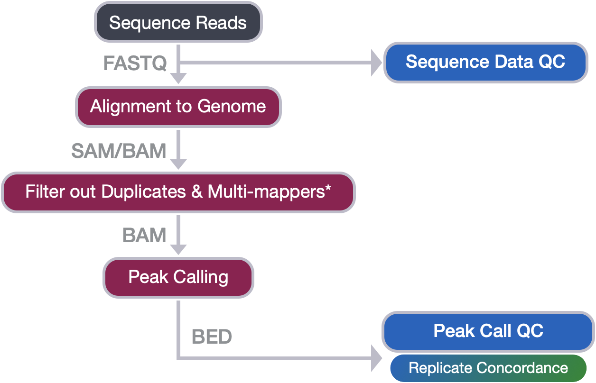
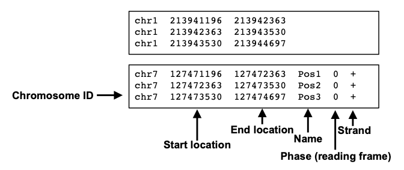
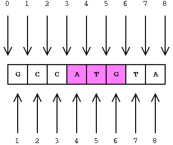
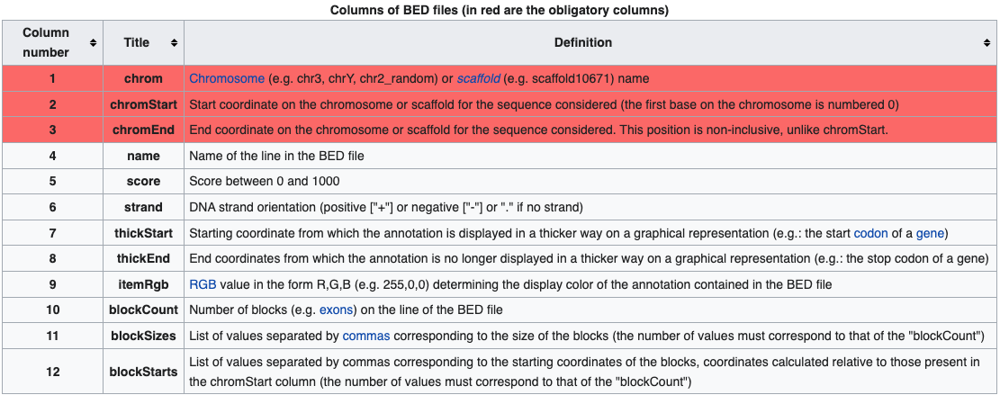
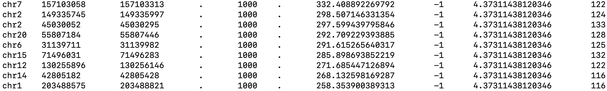

Contributors: Meeta Mistry, Radhika Khetani, Jihe Liu, Mary Piper, Will Gammerdinger

Approximate time: 30 minutes

## Learning Objectives

* Describe the elements of the BED file format and related file formats
* Utilize the bedtools suite of tools to filter peak calls 
* Utilize the bedtools suite to compare peaks betweeen replicates


## Handling peak calls 

Now that we have completed peak calling, we are ready to perform QC on our called peaks.

<p align="center">

</p>

In this lesson, we will introduce you to an important file format that you will encounter when working with peak calls called the **BED format** (**B**rowser **E**xtensible **D**ata). We will discuss the output files that we obtained from MACS2 peak calling, specifically describing the contents of the narrowPeak files and how it relates to BED. You will then get acquainted with **`bedtools`, a new suite of tools that is very helpful when working with BED files and other related file formats**, and use it to complete the following tasks for the WT and KO peak calls from this PRDM16 dataset:

1. Filter out peaks that overlap with the blacklisted regions
2. Assess the replicate concordance within sample groups, to see how many peaks are reproducible. 

## BED file formats

### BED

The BED file format is tab-delimited (columns separated by tabs) and contains information about the coordinates for particular genome features.

<p align="center">

</p>

**The coordinates in BED files are 0-based**. What does this mean? Among standard file formats, genomic coordinates can be represented in two different ways as shown in the image below. 

* **Zero-based** is shown at the top of the image. This is the preferred format for programmers.
* **One-based** is shown at the bottom. This is more intuitive and generally preferred by biologists. 

<p align="center">

</p>

Given the example above, **what coordinates would you use to define the sequence `ATG`?** 

If you were using the the 1-based (bottom) method you would indicate 4 to 6. Using the 0-based method you would define the range as 3 to 6. The benefits to having a **zero-based system** is the **ease of calculating distance or length** of sequences. We can easily determine the length of the `ATG` sequence using the zero-based coordinates by subtracting the start from the end, whereas for one-based coordinates we would need to add one after the subtraction. Therefore, many file formats used in computation, including **the BED file format**, use zero-based coordinates. 

BED files **require at least 3 fields** indicating the **genomic location of the feature**, including the chromosome and the start and end coordinates. However, there are 9 additional fields that are optional, as shown in the image below.

<p align="center">

</p>


### narrowPeak

A narrowPeak (.narrowPeak) file is used by the ENCODE project to provide called peaks of signal enrichment based on pooled, normalized (interpreted) data. The narrowPeak file is a BED 6+4 format, which means the first 6 columns of a standard BED file  with **4 additional fields**:

<p align="center">

</p>

Each row in the narrowPeak file represents a called peak. Below is an the example of a narrowPeak file, displaying the coordinate and statistical information for a handful of called peaks.

<p align="center">

</p>

## bedtools

The **bedtools suite is like a swiss-army knife of tools for a wide-range of genomics analysis tasks**. The general idea is that genome coordinate information can be used to perform relatively simple arithmetic, like combining, subsetting, intersecting etc., to obtain desired information. [bedtools](http://bedtools.readthedocs.org/en/latest/index.html) was devloped in [Aaron Quinlan's group](http://quinlanlab.org/) at University of Utah, and is widely used amongst the bioinformatics community. It is such an easy and versatile tool to perform these tasks described above. 

<p align="center">

</p>

As the name implies, this suite of tools works with **BED** files, but it also works with other file formats that have genome coordinate information. 

<p align="center">

</p>

> **NOTE:** When working with multiple files to perform arithmetic on genomic coordinates, it is essential that all files have coordinate information from the same version of the genome and the coordinate system (0-based or 1-based)!

`bedtools` is available as a module on O2. To set yourself up for the rest of the lesson, make sure you are **logged into O2 and on a compute node**.

```bash
$ srun --pty -p interactive -t 0-12:00 --mem 2G --reservation=HBC2 /bin/bash
```

Next, load the modules for `bedtools` and `samtools`:
	
```bash
$ module load gcc/6.2.0 bedtools/2.26.0 samtools/1.3.1
```


### bedtools intersect

The [`bedtools intersect`](https://bedtools.readthedocs.io/en/latest/content/tools/intersect.html) command within bedtools evaluates A (file 1) and finds regions that overlap in B (file 2). We will use this command to do both the filtering of peaks (from blacklisted regions) and assessing the overlap of peaks (between replicates).

<p align="center">

</p>


To find out more information on the parameters available when intersecting, use the help flag:

```bash
$ bedtools intersect -h
```

Alternatively, you can use the [web-based documentation](https://bedtools.readthedocs.io/en/latest/content/tools/intersect.html) which is much easier to read. The "options" summary shows the **large number of arguments available that allow us to do so much more than just a simple A versus B comparison**. It allows one to have fine control as to how the intersections are reported, and work with different types of files; amongst many other features.

## Filtering peaks overlapping with blacklist regions

We discussed blacklisted regions in the [filtering lesson](05_filtering_BAM_files.md), as it is commonplace to filter before peak calling. When it is performed on BAM files, the `bedtools intersect` is also used, the difference being the input file type (BAM instead of BED). The filtering works just as well if applied post-peak calling, which is what we will be doing in this lesson.

The blacklisted regions typically appear uniquely mappable so simple mappability filters do not remove them. These regions are often found at specific types of repeats such as centromeres, telomeres and satellite repeats.

<p align="center">

</p>

_Image source: [Park P., Nature Reviews Genetics (2009) 10: 669–680.](https://www.nature.com/articles/nrg2641)_

We have a BED file of blacklist regions for mouse `mm10` prepared at `/n/groups/hbctraining/harwell-datasets/workshop_material/reference/mm10-blacklist.v2.bed`. Copy this file over to your project into the `reference_data` folder.

```bash
$ cp /n/groups/hbctraining/harwell-datasets/workshop_material/reference/mm10-blacklist.v2.bed  ~/chipseq_workshop/reference_data
```

> **How were the 'blacklists compiled?** These blacklists were empirically derived from large compendia of data using a combination of automated heuristics and manual curation. Blacklists were generated for various species and genome versions including human, mouse, worm and fly. The lists can be [downloaded here](http://mitra.stanford.edu/kundaje/akundaje/release/blacklists/). For human, they used 80 open chromatin tracks (DNase and FAIRE datasets) and 12 ChIP-seq input/control tracks spanning ~60 cell lines in total. These blacklists are applicable to functional genomic data based on short-read sequencing (20-100bp reads). These are not directly applicable to RNA-seq or any other transcriptome data types.
> 
> More information about the blacklist region is described in this [paper](https://www.nature.com/articles/s41598-019-45839-z). This is a more recent resource and the authors compiled blacklists that can be [downloaded here](https://github.com/Boyle-Lab/Blacklist/tree/master/lists). _This is the source for the bed file used in this workshop._ 

Next, we will navigate to our results directory:

```bash
$ cd ~/chipseq_workshop/results/
```

To filter out blacklisted regions for `wt_sample1`, we use the following code. Note that **we use the flag `-v`, to report entries in A that have no overlaps with B.**

```bash
$ bedtools intersect \
-v \
-a macs2/wt_sample1_peaks.narrowPeak \
-b ../reference_data/mm10-blacklist.v2.bed \
> macs2/wt_sample1_peaks_filtered.bed
```

Similarly, we can filter out blacklisted regions for `wt_sample2`:

```bash
$ bedtools intersect \
-v \
-a macs2/wt_sample2_peaks.narrowPeak \
-b ../reference_data/mm10-blacklist.v2.bed \
> macs2/wt_sample2_peaks_filtered.bed
```

> **NOTE:** The narrowPeak file also follows the bed file format. That's why we could use it as an input, even though it does not end with the extension `.bed`.

***

**Exercise**

Use the `wc -l` command to check how many peaks were filtered due to an overlap with blacklisted regions. Report the number of peaks before and after the filtering for each WT sample.

***


## Finding overlapping peaks between replicates

The next use of `bedtools intersect` is to assess the **concordance between replicates**. We will do this for both the WT and KO sample groups. We will evaluate all peaks in the first replicate and see how many overlap in the second replicate. By default if two regions overlap by a minimum of one basepair, it is counted as an overlap. Since the default is a bit lenient, we have added some additional flags (described below) to increase the stringency for our final set of confident peaks per sample group. 

- `-wo`: Write the original A (file 1) and B (file 2) entries plus the number of base pairs of overlap between the two features.
- `-f`: Minimum overlap required as a fraction of A. The value ranges from 0 to 1. We will use 0.3, requiring the overlap region being at least 30% of A.
- `-r`: Require that the fraction overlap be reciprocal for A and B. Together with the `-f` flag above, we require the overlap region being at least 30% of B as well.

The code below generates the overlapping peaks: 

```bash
$ bedtools intersect \
-wo -f 0.3 -r \
-a macs2/wt_sample1_peaks_filtered.bed \
-b macs2/wt_sample2_peaks_filtered.bed \
> macs2/wt_peaks_final.bed
```

Finally, let's check how many confident peaks we are left with. Does this seem like a reasonable number of peaks to you? (You should get ~7,300 peaks)

```bash
wc -l ~/chipseq_workshop/results/macs2/wt_peaks_final.bed
```

> ### Other approaches for assessing peak reproducibility
> Historically, the ENCODE standard was using the overlaps that we described above but with a set of given criteria. This was developed based on experience with accumulated ENCODE ChIP-seq data, albeit with a much smaller sample size back then. In the paper [Landt et al, 2018](https://www.ncbi.nlm.nih.gov/pmc/articles/PMC3431496/) describe the approach as:
> 
> _"...either 80% of the top 40% of the peaks identified from one replicate using an acceptable scoring method should overlap the list of peaks from the other replicate, OR peak lists scored using all available reads from each replicate should share more than 75% of regions in common."_ 
> 
>  Since then, the field has moved towards more statistically motivated approaches like the [Irreproducibility Discovery Rate (IDR)](https://sites.google.com/site/anshulkundaje/projects/idr). The IDR framework was developed by Qunhua Li and Peter Bickel's group. It compares a pair of ranked lists of regions/peaks and assigns values that reflect its reproducibility. You can read more about IDR and how it works in this [linked lesson]().
> 
> IDR analysis is extensively used by the ENCODE and modENCODE projects and is part of their ChIP-seq guidelines and standards. However, more recently there has been dicussion about the two approaches converging on similar results and so it remains to be seen what the gold standard will be.


***

*This lesson has been developed by members of the teaching team at the [Harvard Chan Bioinformatics Core (HBC)](http://bioinformatics.sph.harvard.edu/). These are open access materials distributed under the terms of the [Creative Commons Attribution license](https://creativecommons.org/licenses/by/4.0/) (CC BY 4.0), which permits unrestricted use, distribution, and reproduction in any medium, provided the original author and source are credited.*


