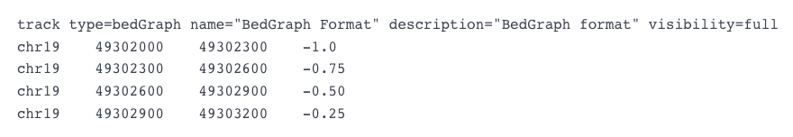
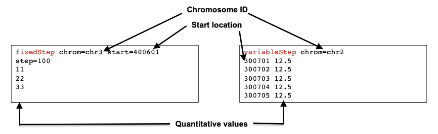

Approximate time:

**Link to issue describing the modifications to be made:** https://github.com/hbctraining/Intro-to-ChIPseq-flipped/issues/11

## Learning Objectives
* Understand the different file formats available for peak visualization
* Learn how to generate bigWig files using `deepTools`

## Setting up for QC on peak calls

Now that we have identified regions in the genome that are enriched through some interaction with PRDM16, we can **take those regions and visually assess the amount of signal observed**. This can be done by uploading the data to a genome viewer such as the Broad's [Integrative Genome Viewer (IGV)](https://software.broadinstitute.org/software/igv/) or the [UCSC Genome Browser](https://genome.ucsc.edu/cgi-bin/hgGateway), to explore the genome and specific loci for pileups. Alternatively, you can create profile plots and heatmaps to look at the signal aggregated over all binding sites. **In order to perform any of assessments described above, you will need a file in the appropriate format.** 

The goal of this lesson is to introduce you to **different file formats used for ChIP-seq data visualization and how to generate these files** using [`deepTools`](https://deeptools.readthedocs.io/en/develop/index.html).


## File formats for peak visualization

There are several different types of file formats that can hold data associated with high-throughput sequencing data, these file formats have a distinct structure and hold specific types of data. We have already encountered the sequence data format - FASTQ, the alignment file formats - SAM and BAM, the peak call format - BED, among others. In this section we want to introduce you to a few additional formats that can be used to visualizing peaks.

The commonality among these file formats is that they represent the peak location in a manner similar to the BED format (shown below). 

<p align="center">
  
</p>


### BedGraph format

In addition to accomodating peak calls (discrete data), the BedGraph format also allows display of continuous data as a track on a genome browser. This display type is useful for including and plotting some quantitative information, e.g. intensity. For the purposes of visualization, bedGraph and bigWig are pratically interchangeable, with the bigWig file being a lot smaller for a given dataset.

<p align="center">
  
</p>

### Wiggle and bigWig formats

The Wiggle format (wig) also allows the display of continuous data. This format is "line" oriented, and has declaration lines and data lines. It also requires a separate wiggle track definition line as a header. There are two options for how data in wiggle files are represented: variableStep and fixedStep. These formats were developed to allow the file to be written as compactly as possible.

<p align="center">
  
</p>

The bigWig format is an indexed *binary* form of the wiggle file format, and is useful for large amounts of dense and continuous data to be displayed in a genome browser as a graphical track. As mentioned above, the visual representation of this format is very similar to bedGraph.

## Creating bigWig files

For this workshop, we will focus on creating bigWig files, as we will be using them in the next lesson for qualitative assessment. The general procedure is to take our **alignment files (BAM) and convert them into bigWig files**, and we will do this using [`deepTools`](http://deeptools.readthedocs.org/en/latest/content/list_of_tools.html). 

<p align="center">

</p>

*Image acquired from the [deepTools documentation](http://deeptools.readthedocs.io/en/latest/content/tools/bamCoverage.html?highlight=bigwig)*

**`deepTools` is a suite of Python tools developed for the efficient analysis of high-throughput sequencing data**, such as ChIP-seq, RNA-seq, or MNase-seq. `deepTools` has a wide variety of commands that go beyond what we will cover in this workshop. We encourage you to look through the documentation and explore more on your own time. 

### Setting up 

The command for creating a bigWig file is fairly computationally heavy and so we will make use of the muti-threading functionality in `deepTools`. This means that we will also need to request more cores for our interactive session. *If you are already logged on to a compute node, you will need to exit and start a new session*. Note that we will ask for **6 cores, and also increase our memory to 8G**.

```bash
$ srun --pty -p interactive -t 0-12:00 --mem 8G -c 6 /bin/bash
```
Once on a compute node, begin by creating a directory for the output.

```bash
$ cd ~/chipseq_workshop/results/
$ mkdir -p visualization/bigWig
```

We then need to **create an index file for the BAM file**. Often, when working with BAM files you will find that many tools require an index (an associated `.bai` file). You can think of an index similar to that which is located at the back of a textbook - when you are interested in a particular subject, you look for the keyword in the index and identify the pages that contain the relevant information. Similarily, indexing the BAM file aims to achieve fast retrieval of alignments overlapping a specified region without going through the whole alignment file. Essentially, a `bai` file along with the `bam` ensures that downstream applications are able to use the information with the `bam` file much more speedily.

We will use [SAMtools](http://samtools.sourceforge.net/) again, specifically the **`samtools index`** command, to index the BAM file.

Let's load the `samtools` module:

```bash
$ module load gcc/6.2.0 samtools/1.9
```

Create an index for the `wt_sample2_chip_final.bam` file that we created in earlier lesson:

```bash
$ samtools index ~/chipseq_workshop/results/bowtie2/wt_sample2_chip_final.bam
```

> _Check your `bowtie2` folder to make sure see the new index file that was generated!_

Finally, let's make sure we have the required modules loaded to use `deepTools`:

```bash 
$ module load python/2.7.12 deeptools/3.0.2 
```

### `bamCoverage`

This command takes as **input a BAM file and generates a coverage track (bigWig or bedGraph) as output**. The coverage is calculated as the number of reads per bin, where bins are short consecutive sections of the genome (bins) that can be defined by the user. bigWig files have a much smaller data footprint compared to BAM = files, especially as the bin size increases, and you can also apply various types of normalization, if you choose to. 

> #### When should I normalize the data in my bigWig files?
> Normalizing is recommended if you want to compare different samples to each other, and those samples vary in terms of sequencing depth. We will not normalize the data we are working with because we are following the methods described in [Baizabal, 2018](https://doi.org/10.1016/j.neuron.2018.04.033).

We will use the `bamCoverage` command to **create a bigWig file for `wt_sample2_chip`**. We will specify `binSize` of 20, as an additional parameter. There are a few other parameters that you could explore (but we will not use). 

* `normalizeUsing`: Possible choices: RPKM, CPM, BPM, RPGC. By default no normalization is applied.
* `binSize`: size of bins in bases (default is 50)
* `--effectiveGenomeSize`: the portion of the genome that is mappable. It is useful to consider this when computing your scaling factor.
* `smoothLength`: defines a window, larger than the `binSize`, to average the number of reads over. This helps produce a more continuous plot.
* `centerReads`: reads are centered with respect to the fragment length as specified by `extendReads`. This option is useful to get a sharper signal around enriched regions.

We will be using the bare minimum of parameters as shown in the code below. We decrease the bin size to increase the resolution of the track (this also means larger file size). If you are interested, feel free to test out some of the other parameters to create different bigWig files. You can load them into a genome viewer like IGV and observe the differences.

```bash
$ bamCoverage -b ~/chipseq_workshop/results/bowtie2/wt_sample2_chip_final.bam \
-o ~/chipseq_workshop/results/visualization/bigWig/wt_sample2_chip.bw \
--binSize 20
```

_Note: This command can take up to 10 minutes to complete._

### `bamCompare`

As an alternate to calculating genome coverage with `bamCoverage`, we could use `bamCompare`. `bamCompare` will **create a bigWig file in which we compare the ChIP against the input**. The command is quite similar to `bamCoverage`, except that it requires two files as input (`b1` and `b2`). Below, we show you an example of how you would run `bamCompare`. The default `--operation` used to compare the two samples is the **log2 ratio**, however you also have the option to add, subtract and average. Any of the parameters described above for `bamCoverage` can also be used. 

```bash
## DO NOT RUN

$ bamCompare -b1 ~/chipseq_workshop/results/bowtie2/wt_sample2_chip_final.bam \
-b2 ~/chipseq_workshop/results/bowtie2/wt_sample2_input_final.bam \
-o ~/chipseq_workshop/results/visualization/bigWig/wt_sample2_chip.bw \
--binSize 20
```

You can find more details about the difference between `bamCompare` and `bamCoverage` [linked here](https://deeptools.readthedocs.io/en/develop/content/help_faq.html#when-should-i-use-bamcoverage-or-bamcompare).

***
*This lesson has been developed by members of the teaching team at the [Harvard Chan Bioinformatics Core (HBC)](http://bioinformatics.sph.harvard.edu/). These are open access materials distributed under the terms of the [Creative Commons Attribution license](https://creativecommons.org/licenses/by/4.0/) (CC BY 4.0), which permits unrestricted use, distribution, and reproduction in any medium, provided the original author and source are credited.*
