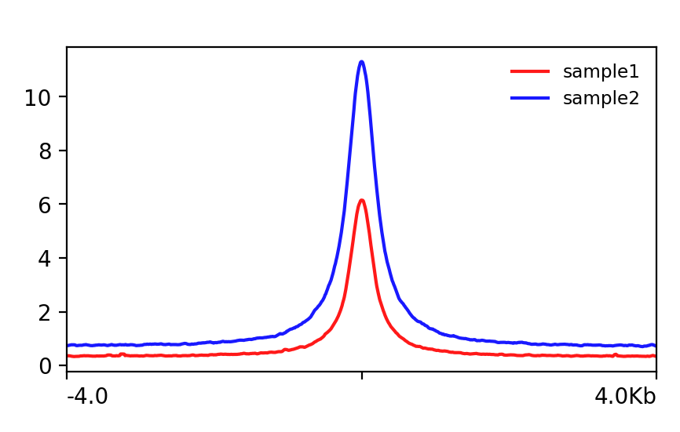
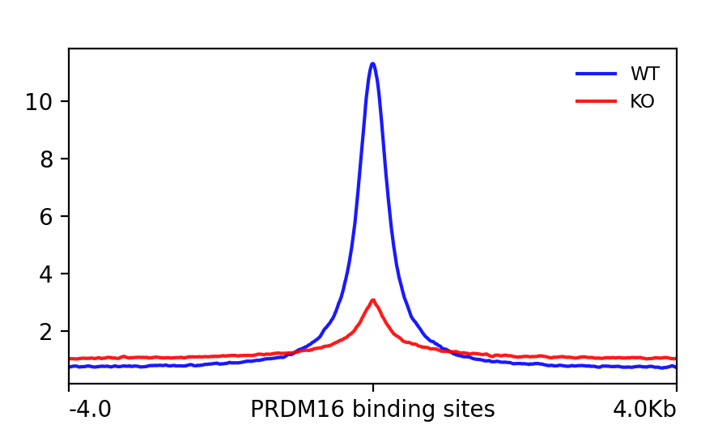
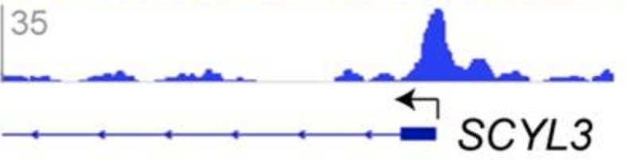
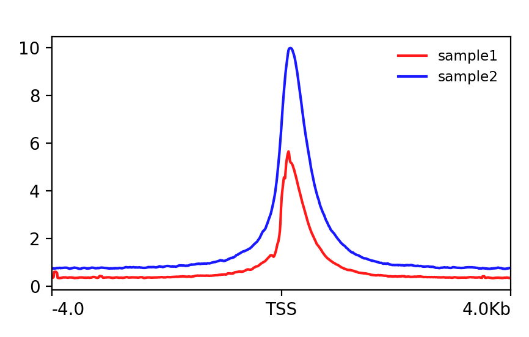
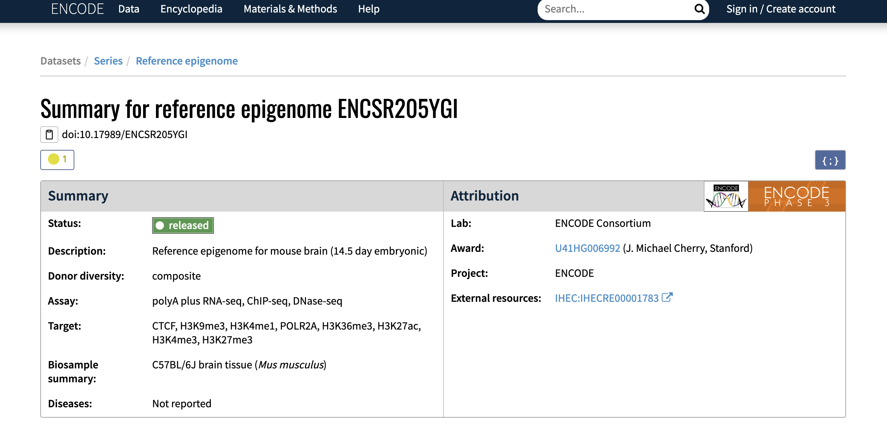
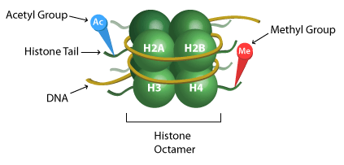
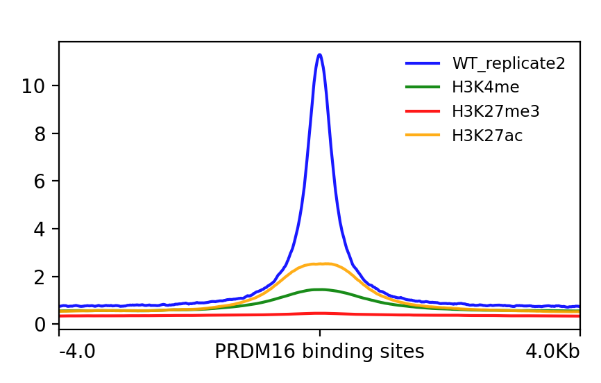

Approximate time:

## Learning Objectives

* Understand what a profile plot is and how to generate one
* Learn how to interpret a profile plot 
* Introduce different use cases for a profile to answer questions about your ChIP data

## Qualitative assessment of peak enrichment

The quality of ChIP-seq experiments can be especially difficult to evaluate when little is known about the factor and its binding motif, as is the case with PRDM16. The methods for peak call quality assessment can be seperated into those that are quantitative (which we will not be covering in this workshop) and those that are qualitative. Qualitative methods typically include a **traditional site-inspection-based evaluation** using a genome viewer, or the **exploration of  aggregated read density in selected regions** using profile plots and heatmaps. When applied and interpreted together, these approaches provide a valuable overall assessment of experimental success and data quality. In this lesson, we will cover the latter of the qualitative approaches mentioned above.

> **NOTE:** The ENCODE Consortium uses various metrics to assess [enrichment](https://www.encodeproject.org/data-standards/terms/#enrichment) and [complexity](https://www.encodeproject.org/data-standards/terms/#library) aspects of ChIP-seq quality. This quantitative approach is part of the end-to-end ChIP-seq workflow presented earlier in the workshop, however they will not be covered.

## Profile plots
The profile plot allows us to **evaluate read density over sets of genomic regions**. Typically, these regions are genes (start and end coordinates), but any other regions defined in the BED file will work. 

We will use the `plotProfile` command that is part of the [deepTools suite](https://deeptools.readthedocs.io/en/develop/content/tools/plotProfile.html), to create our profile plots. To use this, a matrix generated by `computeMatrix` is required. You will need to **create a matrix for every new plot you generate**, so this step of the workflow can often take some time. 

> *NOTE*: In this lesson, we teach you how to create a matrix for the first figure, and then we provide the pre-computed matrices for you to use to save time.

<p align="center">

</p>

_Image source: [deepTools documentation](https://deeptools.readthedocs.io/en/develop/content/tools/computeMatrix.html?highlight=computeMatrix)_

> *NOTE:* The matrix we generate can also be used as input to [`plotHeatmap`](https://deeptools.readthedocs.io/en/develop/content/tools/plotHeatmap.html?highlight=plotheatmap). Heatmaps are also a very popular data visualization option for peak call data. We will not be plotting heatmaps in this lesson, but encourage you to explore the command and the numerous parameters available for optimization.

### Setting up 

> _NOTE:_ If you have just completed the last lesson on creating bigWig files, you may already have yourself setup!

To start, you will need to be on a **compute node** and ensure you have an interactive session with **6 cores and 10G of memory**. The `computeMatrix` command can take some time, so we want to take advantage of the multi-threading. 

```bash
srun --pty -p interactive -t 0-5:00 -c 6 --mem 8G /bin/bash
```

Once you are on a compute node, load the modules:

```bash
$ module load gcc/6.2.0 python/2.7.12 deeptools/3.0.2 
```

Finally, we will move into our results directory and copy over the necessary bigWig files:

```bash
$ cd ~/chipseq_workshop/results/

$ cp /n/groups/hbctraining/harwell-datasets/workshop_material/results/visualization/bigWig/*chip.bw visualization/bigWig/
```

## Assessing read density between replicates

We have already shown that for our WT samples there are a good number of overlapping regions between replicates. Using `bedtools` we were able to extract a bed file of those consensus peaks. The next question is, **what kind of signal is observed for each replicate across these shared regions?**

The first step in generating the profile plot is to create the matrix. The `computeMatrix` command accepts multiple bigWig files and multiple region files (BED format) to create a count matrix. The command can also filter and sort regions according to their scores. For each window, `computeMatrix` will calculate scores based on the read density values in the bigWig files.

Below we describe the **parameters** we will be using:

* `reference-point`: The reference point for plotting. Here, we use the center of the consensus peaks (default is TSS).
* `-b`, `a`: Specify a window around the reference point (before and after). We have used +/- 4000 bp. 
* `-R`: The region file will be the BED file we generated for WT replicate overlap.
* `-S`: The list of bigWig files (WT replicates), that we have generated for you.
* `--skipZeros`: Do not include regions with only scores of zero
* `-o`: output file name
* `-p`: number of cores


Let's create a matrix for the WT replicates:

```bash
computeMatrix reference-point --referencePoint center \
-b 4000 -a 4000 \
-R ~/chipseq_workshop/results/macs2/wt_peaks_final.bed \
-S visualization/bigWig/wt_sample1_chip.bw visualization/bigWig/wt_sample2_chip.bw \
--skipZeros \
-o ~/chipseq_workshop/results/visualization/wt_matrix.gz \
-p 6
```
> _Runtime estimate: 8-10 minutes_

Once you have computed the matrix, you can create the **profile plot**. First, make a directory designated for the figures we will be creating, and then we will run `plotProfile`. _The `plotProfile` command will take a shorter amount of time to run._ 

> **NOTE:** `plotProfile` has many options to optimize your figure, including the ability to change the type of lines plotted, and to plot by group rather than sample. We encourage you to explore the [documentation](https://deeptools.readthedocs.io/en/develop/content/tools/plotProfile.html?highlight=plotProfile) to find out more detail.

```bash

# Create figures directory under visualization
mkdir ~/chipseq_workshop/results/visualization/figures

# Plot the profiles
plotProfile -m ~/chipseq_workshop/results/visualization/wt_matrix.gz \
-out ~/chipseq_workshop/results/visualization/figures/plot1_wt_replciates.png \
--regionsLabel "" \
--perGroup \
--colors red blue \
--samplesLabel "WT_replicate1" "WT_replicate2" \
--refPointLabel "PRDM16 binding sites"

```

> **NOTE:** The output of `plotProfile` will be a PNG image file, which you **will not be able to open on the cluster**. To view the file you will want to use [FileZilla](03_QC_FASTQC.md#what-is-filezilla) to move it over to your local computer. 

The figure should like the one displayed below. We observe that the **replicate 2 has a much higher signal** present in these regions. This is not uncommon in ChIP-seq data. What is encouraging to see is that there is a **decent amount of signal in both replicates**, so we have some confidence in the regions we identified.


<p align="center">

</p>


***

**Exercise: Assessing loss of signal in the KO samples**

The KO samples in the dataset represent two separate pools of E15.5 Prdm16 conditional knockout cortices. It would be good to **evaluate PRDM binding sites** in samples where the PRDM16 is rendered non-functional, and **see how read density compares to the WT**.

1. Modify the `computeMatrix` command we previously used so the input bigWigs are now `wt_sample2_chip.bw` and `ko_sample2_chip.bw`. You will also want to change the name of the ouput file to `wt_ko_matrix.gz`.
2. Compute the matrix.
3. Draw the profile plot. Be sure to modify the `--samplesLabel`.
4. Comment on the plot.

<details>
  <summary>Solution</summary>
  
 <p><pre>
  
  ```
  # Navigate to results directory
  computeMatrix reference-point --referencePoint center \
  -b 4000 -a 4000 \
  -R ~/chipseq_workshop/results/macs2/wt_peaks_final.bed \
  -S visualization/bigWig/wt_sample2_chip.bw visualization/bigWig/ko_sample2_chip.bw \
  --skipZeros \
  -o visualization/wt_ko_matrix.gz \
  -p 6

  plotProfile -m ~/chipseq_workshop/results/visualization/wt_ko_matrix.gz \
  -out ~/chipseq_workshop/results/visualization/figures/plot2_wt_ko.png \
  --regionsLabel "" \
  --perGroup \
  --colors blue red \
  --samplesLabel "WT" "KO" \
  --refPointLabel "PRDM16 binding sites"
  ```
  
We observed that the WT sample shows significantly higher enrichment at PRDM16-binding regions, compared to the KO sample. The result matches our expectation.
  
  <p align="center">
  
  </p>

</pre></p>
  
</details>

***

## Evaluating enrichment around the TSS

Because many cis-regulatory elements (i.e. promoters, enhancers, and silencers) are close to transcription start site (TSS) of their targets, **a common visualization** technique is to evaluate the **read density around the TSS**. This can be done by using a genome viewer on a gene-by-gene basis as shown below:

<p align="center">

</p>

Alternatively, we can look at the **read density aggregated across all genes in the genome** for a more global evaluation using a **profile plot**. To create this profile plot, we will need to compute yet another matrix. For this plot, we will need to change the following parameters:

* `-R`: Our regions file will change. Rather than using our PRDM16 binding sites, we will use a BED file which contains the start and end coordinate for every genes in the mm10 genome.
* `reference-point`: The reference point will be TSS. Specifying this means that the window will be centered around the start coordinate of each region.
* `-S`: The bigWig files input will be similar to the first plot we created, pointing to the two WT ChIP samples.

> **NOTE**: The mm10 genes BED file was obtained from the [UCSC table browser](https://genome.ucsc.edu/cgi-bin/hgTables).


**Since this matrix takes especially long to compute, we have created it for you**. Copy over the matrix into your `visualization` directory:

```bash
cp /n/groups/hbctraining/harwell-datasets/workshop_material/results/visualization/wt_matrix_allGenes_TSS.gz visualization/
```

_The code to compute the matrix is provided in the drop-down below if you are **interested in seeing the changes** that were made._ 

<details>
  <summary>Code</summary>
 <p><pre>
 **Please DO NOT RUN this code.**
  ```bash
  # DO NOT RUN!
  computeMatrix reference-point --referencePoint TSS \
  -b 4000 -a 4000 \
  -R /n/groups/hbctraining/harwell-datasets/chipseq_workshop/reference/mm10-allknownGenes.bed \
  -S visualization/bigWig/wt_sample1_chip.bw visualization/bigWig/wt_sample2_chip.bw \
  --skipZeros \
  -o visualization/wt_tss_matrix.gz \
  -p 6
  ```
</pre></p>
  
</details>

Use the matrix to create your own profile plot by running the code below. Once complete, copy your PNG file over to your local computer to open it up.

```bash
plotProfile -m ~/chipseq_workshop/results/visualization/wt_matrix_allGenes_TSS.gz \
-out ~/chipseq_workshop/results/visualization/figures/plot1_wt_TSS.png \
--regionsLabel "" \
--perGroup \
--colors red blue \
--samplesLabel "WT_replicate1" "WT_replicate2" \
--refPointLabel "TSS" \
--yMax 12
```
> *NOTE*: We added an additional parameter (`--yMax`) to set the y-axis similar to the previous plots. This way, we can make a more fair comparison between plots.

Yikes! This is not what we were expecting. **There appears to be very little enrichment in the +/- 4kb window around the TSS.** How do we interpret this? 

<p align="center">

</p>

If you are investigating a transcription factor known to bind at promoter regions of genes, it would be disappointing to see figure like this. But that is not the case for us - we are investigating the PRDM16 binding profile, and this plot indicates that **very few of the PRMD16 binding sites are around the TSS** (i.e. promoter regions). 

> **NOTE**: Later in the ChIP-seq workflow (not covered in this workshop), we use software to annotate our peaks using nearest gene approaches. This can give us more detailed information on where the PRDM16 binding sites are located.


## Exploring PRDM16-regulated enhancer binding in cortical neurons

**So where is PRDM16 binding in the genome?** While some some transcription factors bind to promoter regions, other transcription factors bind to regulatory sequences, such as **enhancer sequences**, and can either stimulate or repress transcription of the related gene. These regulatory sequences **can be thousands of base pairs upstream or downstream from the gene being transcribed**. 

One way of assessing this using profile plot is to obtain a BED file of regions that correspond to [enhancer regions in mouse genome](https://genome.ucsc.edu/cgi-bin/hgTrackUi?db=mm10&c=chrX&g=encode3RenEnhancerEpdNewPromoter). While this is a totally valid avenue to explore, we will be taking another route in this workshop.

### ENCODE data
Early in the workshop, we described the [ENCODE](https://www.encodeproject.org/) resource to you, and now we want to **show you how to make use of it to interrogate your data**. In 2012, [Stamatoyannopoulos et al.](https://genomebiology.biomedcentral.com/articles/10.1186/gb-2012-13-8-418) released a large dataset as part of the Mouse ENCODE project, which included numerous cell types, tissues, and developmental time points. 

<p align="center">

</p>

From this dataset, we were able to find data corresponding to various **histone marks using samples collected from E14.5 mouse brains**. When making any comparisons, we want to ensure we are using data generated from a similar set of cells. Gene regulation patterns are highly variable across development, and we want to make sure we are capturing patterns in the radial glia when upper layer neurons are being generated.

> _The mouse ENCODE data used in this workshop was taken from reference epigenome [ENCSR205YGI](https://www.encodeproject.org/reference-epigenomes/ENCSR205YGI/)._

### Histone modifications
A major component of chromatin that plays a key role in regulation is the modification of histones ([AJ Bannister, 2011](https://www.nature.com/articles/cr201122)). The best studied modifications are those that occur on the N-terminal ‘tail’ regions of the histones (which project from the nucleosome), but the list is ever-growing and the complexity of their action is only just beginning to be understood.

<p align="center">

</p>

_Image source: [Epigentek Overview of Histone Modifications](https://www.epigentek.com/catalog/advanced-epigenetic-overview-of-histone-modifications-n-5.html)_

For the most common histone modifications, we have a good idea of where they are generally found in the genome and how they function (i.e. activating or repressing). A helpful cheatsheet can [be found here](https://www.abcam.com/epigenetics/histone-modifications#histone-modifications-cheat-sheet). We can utilize this knowledge to test our hypotheses about PRDM16 function:

- H3K4me, is a chromatin mark associated with poised and active enhancers 
- H3K27me3, is a polycomb modification (developmental regulators) linked to transcriptional repression during neurogenesis (Hirabayashi and Gotoh, 2010) 
- H3K27ac is a modification associated with the higher activation of transcription and therefore defined as an active enhancer mark

### Profile plot
For each of the histone modifications listed above, we found the corresponding [ChIP experiments in ENCODE](https://www.encodeproject.org/reference-epigenomes/ENCSR205YGI/) and downloaded the bigWig files. Each experiment had two replicates. After plotting profiles, the replicate with stroger signal was identifed and retained for the visualizataion below. **For this plot, we have computed the matrix for you** using code similar to the first plot in this lesson (with a few additional bigWig files and keeping only the WT replicate 2).

Copy over the matrix to your visualization directory:

```bash
cp /n/groups/hbctraining/harwell-datasets/workshop_material/results/visualization/wt_encode_matrix.gz visualization/
```

Once you have the matrix copied over, you can run the code below to create the proile plot:

```bash

plotProfile -m ~/chipseq_workshop/results/visualization/wt_encode_matrix.gz \
-out ~/chipseq_workshop/results/visualization/figures/plot2_wt_encode.png \
--regionsLabel "" \
--perGroup \
--colors blue green red orange \
--samplesLabel "WT_replicate2" "H3K4me" "H3K27me3" "H3K27ac" \
--refPointLabel "PRDM16 binding sites"
```

In this profile plot, we observe moderate levels of H3K4me and H3K27ac in PRDM16-binding regions. Given what we know about these histone marks, this suggests that  **PRDM16 is associated with active enhancers in the embryonic cortex**. The developmental connection of H3K27me3 would be nice to have with this dataset, however we do not see much enrichment of the mark in PRDM16 binding sites. This makes sense as the H3K27me3 modification is mostly found in	promoters in gene-rich regions, and we already ruled out promoter regions with our TSS plot. 

<p align="center">

</p>

## Closing Remarks


***
*This lesson has been developed by members of the teaching team at the [Harvard Chan Bioinformatics Core (HBC)](http://bioinformatics.sph.harvard.edu/). These are open access materials distributed under the terms of the [Creative Commons Attribution license](https://creativecommons.org/licenses/by/4.0/) (CC BY 4.0), which permits unrestricted use, distribution, and reproduction in any medium, provided the original author and source are credited.*
