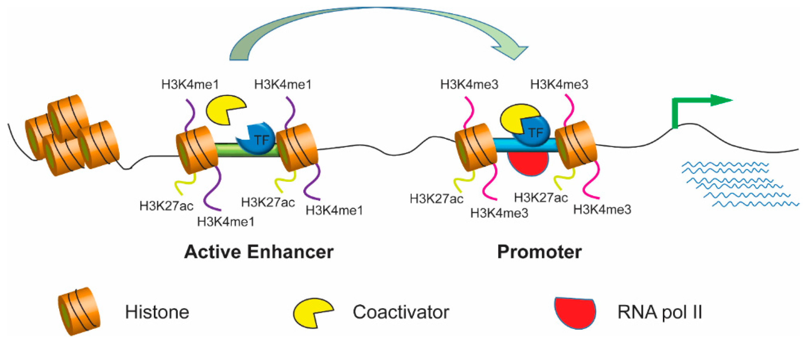

Contributors: Meeta Mistry, Jihe Liu, Mary Piper, Radhika Khetani, Will Gammerdinger

Approximate time: 45 minutes

## Learning Objectives

* Understand what a profile plot is and how to generate one
* Learn how to interpret a profile plot 
* Introduce different use cases for a profile plot to answer questions about your ChIP data

## Qualitative assessment of peak enrichment

The quality of ChIP-seq experiments can be especially difficult to evaluate when little is known about the factor and its binding motif, as is the case with PRDM16. The methods for peak call quality assessment can be seperated into those that are quantitative (which we will not be covering in this workshop) and those that are qualitative. Qualitative methods typically include:
* a **traditional site-inspection-based evaluation** using a genome viewer, or 
* the **exploration of  aggregated read density in selected regions** using profile plots and heatmaps. 
 
When applied and interpreted together, these approaches provide a valuable overall assessment of experimental success and data quality, in addition to some biological insight. In this lesson, we will cover the latter of the qualitative approaches mentioned above.

<p align="center">

</p>


> **NOTE:** The ENCODE Consortium uses various metrics to assess [enrichment](https://www.encodeproject.org/data-standards/terms/#enrichment) and [complexity](https://www.encodeproject.org/data-standards/terms/#library) aspects of ChIP-seq quality. This quantitative approach is part of the end-to-end ChIP-seq workflow presented earlier in the workshop. This will be covered in ChIP-seq Part II workshop materials.

## Profile plots
The profile plot allows us to **evaluate read density over sets of genomic regions**. Typically, these regions are genes (start and end coordinates), but any other regions defined in the BED file will work. 

We will use the `plotProfile` command that is part of the [deepTools suite](https://deeptools.readthedocs.io/en/develop/content/tools/plotProfile.html), to create our profile plots. To use this, a matrix generated by `computeMatrix` is required. You will need to **create a matrix for every new plot you generate**, so this step of the workflow can often take some time. 

> *NOTE*: In this lesson, we teach you how to create a matrix for the first figure, and then we provide the pre-computed matrices for you to use to save time.

<p align="center">

</p>

_Image source: [deepTools documentation](https://deeptools.readthedocs.io/en/develop/content/tools/computeMatrix.html?highlight=computeMatrix)_

> *NOTE:* The matrix we generate can also be used as input to [`plotHeatmap`](https://deeptools.readthedocs.io/en/develop/content/tools/plotHeatmap.html?highlight=plotheatmap). Heatmaps are also a very popular data visualization option for peak call data. We will not be plotting heatmaps in this lesson, but encourage you to explore the command and the numerous parameters available for optimization.

### Setting up 

To start, you will need to be on a **compute node** and ensure you have an interactive session with **6 cores and 10G of memory**. The `computeMatrix` command can take some time, so we want to take advantage of the multi-threading. 

> _NOTE:_ If you have the O2 session open from the last lesson on creating bigWig files, you already have yourself setup with the appropriate amount of resources.

```bash
srun --pty -p interactive -t 0-5:00 -c 6 --mem 8G /bin/bash
```

Once you are on a compute node, load the modules:

```bash
$ module load gcc/6.2.0 python/2.7.12 deeptools/3.0.2 
```

Finally, we will move into our results directory and copy over the necessary bigWig files:

```bash
$ cd ~/chipseq_workshop/results/

$ cp /n/groups/hbctraining/harwell-datasets/workshop_material/results/visualization/bigWig/*chip.bw visualization/bigWig/
```

## Evaluating signal in PRDM16 binding sites

We have already shown that for our WT samples there are a good number of overlapping regions between replicates. Using `bedtools` we were able to extract a bed file of the shared regions, to define our most confident set of PRDM16 binding sites in the developing cortex. The next question is, **how much signal is observed for each WT replicate within these shared regions?**

### 1. Create the matrix
The first step in generating the profile plot is to create the matrix. The `computeMatrix` command accepts multiple bigWig files and multiple region files (BED format) to create a count matrix. The command can also filter and sort regions according to their scores. For each window, `computeMatrix` will calculate scores based on the read density values in the bigWig files.

Below we describe the **parameters** we will be using:

* `reference-point`: The reference point for plotting. Here, we use the center of the consensus peaks (default is TSS).
* `-b`, `a`: Specify a window around the reference point (before and after). For narrow peaks, we can use a smaller window as we expect a more punctate binding profile. Broader peaks might require you to explore and play around with the window size. We have used +/- 4000 bp. 
* `-R`: The region file will be the BED file we generated for WT replicate overlap.
* `-S`: The list of bigWig files (WT replicates), that we have generated for you.
* `--skipZeros`: Do not include regions with only scores of zero
* `-o`: output file name
* `-p`: number of cores


Let's create a matrix for the WT replicates:

```bash
computeMatrix reference-point --referencePoint center \
-b 4000 -a 4000 \
-R ~/chipseq_workshop/results/macs2/wt_peaks_final.bed \
-S visualization/bigWig/wt_sample1_chip.bw visualization/bigWig/wt_sample2_chip.bw \
--skipZeros \
-o ~/chipseq_workshop/results/visualization/wt_matrix.gz \
-p 6
```
> _Runtime estimate: 8-10 minutes_

### 2. Drawing the profile plot
Once you have computed the matrix, you can create the **profile plot**. First, make a directory designated for the figures we will be creating, and then we will run `plotProfile`. _The `plotProfile` command will take a shorter amount of time to run._ 

> **NOTE:** `plotProfile` has many options to optimize your figure, including the ability to change the type of lines plotted, and to plot by group rather than sample. We encourage you to explore the [documentation](https://deeptools.readthedocs.io/en/develop/content/tools/plotProfile.html?highlight=plotProfile) to find out more detail.

```bash

# Create figures directory under visualization
mkdir ~/chipseq_workshop/results/visualization/figures

# Plot the profiles
plotProfile -m ~/chipseq_workshop/results/visualization/wt_matrix.gz \
-out ~/chipseq_workshop/results/visualization/figures/plot1_wt_replicates.png \
--regionsLabel "" \
--perGroup \
--colors red blue \
--samplesLabel "WT_replicate1" "WT_replicate2" \
--refPointLabel "PRDM16 binding sites"

```

> **NOTE:** The output of `plotProfile` will be a PNG image file, which you **will not be able to open on the cluster**. To view the file you will want to use [FileZilla](03_QC_FASTQC.md#what-is-filezilla) to move it over to your local computer. 

The figure should look like the one displayed below. We observe that the **replicate 2 has a much higher signal** present in these regions. This is not uncommon in ChIP-seq data. There will likely be one replicate that exhibits stronger signal. What is encouraging to see is that there is a **decent amount of signal in both replicates**, so we have some confidence in the regions we identified.


<p align="center">

</p>


***

**Exercise: Assessing loss of signal in the KO samples**

The KO samples in the dataset represent two separate pools of E15.5 Prdm16 conditional knockout cortices. **Let's compare the read densities between the WT and KO samples for the coordinates where the WT samples have identified peaks** (i.e. the confident set of PRDM16 binding sites).

1. Modify the `computeMatrix` command we previously used so the input bigWigs are now `wt_sample2_chip.bw` and `ko_sample2_chip.bw`. You will also want to change the name of the ouput file to `wt_ko_matrix.gz`.
2. Compute the matrix.
3. Draw the profile plot. Be sure to modify the `--samplesLabel`.
4. Comment on the plot.

<details>
  <summary><b>Click here for solution</b></summary>
  
 <p><pre>
  
  ```
  # Navigate to results directory
  computeMatrix reference-point --referencePoint center \
  -b 4000 -a 4000 \
  -R ~/chipseq_workshop/results/macs2/wt_peaks_final.bed \
  -S visualization/bigWig/wt_sample2_chip.bw visualization/bigWig/ko_sample2_chip.bw \
  --skipZeros \
  -o visualization/wt_ko_matrix.gz \
  -p 6

  plotProfile -m ~/chipseq_workshop/results/visualization/wt_ko_matrix.gz \
  -out ~/chipseq_workshop/results/visualization/figures/plot2_wt_ko.png \
  --regionsLabel "" \
  --perGroup \
  --colors blue red \
  --samplesLabel "WT" "KO" \
  --refPointLabel "PRDM16 binding sites"
  ```
  
We observed that the WT sample shows significantly higher enrichment at PRDM16-binding regions, compared to the KO sample. The result matches our expectation.
  
  <p align="center">
  
  </p>

</pre></p>
  
</details>

***

## Understanding how PRDM16 regulates transcriptional activity

Because many cis-regulatory elements (i.e. promoters, enhancers, and silencers) are close to transcription start site (TSS) of their targets, **a common visualization** technique is to evaluate the **read density around the TSS**. This can be done by using a genome viewer on a gene-by-gene basis as shown below:

<p align="center">

</p>

Alternatively, we can get a more **global perspective** by looking at the read density aggregated across all genes in the genome, using a **profile plot**. 

For this next figure, **the regions** we are aggregating over is the promoter region for every gene in the mouse genome. The "promoter region" is **defined by the user (in our command) as 4000 bases upstream from the start of the gene, to 4000 bases downstream of the start of the gene**. 

To create this profile plot, we will need to compute yet another matrix using the following parameters:

* `-R`: **Our regions file will change**. Rather than using our PRDM16 binding sites, we will use a BED file which contains the start and end coordinate for every gene in the mm10 genome.
* `reference-point`: The **reference point will be TSS**. Specifying this means that the window (+/- 4000 bp) will be centered around the start coordinate of each region.
* `-S`: The bigWig files input will be similar to the first plot we created, pointing to the two WT ChIP samples.

> **NOTE**: The mm10 genes BED file was obtained from the [UCSC table browser](https://genome.ucsc.edu/cgi-bin/hgTables).


**The matrix takes very long to compute** with so many regions as input, and so **we have created it for you**. Copy over the matrix into your `visualization` directory:

```bash
cp /n/groups/hbctraining/harwell-datasets/workshop_material/results/visualization/wt_matrix_allGenes_TSS.gz visualization/
```

_The code to compute the matrix is provided in the drop-down below if you are **interested in seeing the changes** that were made._ 

<details>
  <summary><b>Click here to see the code</b></summary>
 <p><pre>
 **Please DO NOT RUN this code.**
  ```bash
  # DO NOT RUN!
  computeMatrix reference-point --referencePoint TSS \
  -b 4000 -a 4000 \
  -R /n/groups/hbctraining/harwell-datasets/chipseq_workshop/reference/mm10-allknownGenes.bed \
  -S visualization/bigWig/wt_sample1_chip.bw visualization/bigWig/wt_sample2_chip.bw \
  --skipZeros \
  -o visualization/wt_tss_matrix.gz \
  -p 6
  ```
</pre></p>
  
</details>

Use the matrix to **create your own profile plot** by running the code below. Once complete, copy your PNG file over to your local computer to open it up.

```bash
plotProfile -m ~/chipseq_workshop/results/visualization/wt_matrix_allGenes_TSS.gz \
-out ~/chipseq_workshop/results/visualization/figures/plot1_wt_TSS.png \
--regionsLabel "" \
--perGroup \
--colors red blue \
--samplesLabel "WT_replicate1" "WT_replicate2" \
--refPointLabel "TSS" \
--yMax 12
```
> *NOTE*: We added an additional parameter (`--yMax`) to set the y-axis similar to the previous plots. This way, we can make a more fair comparison between plots.

Yikes! This is not what we were expecting. **There appears to be very little enrichment in the +/- 4kb window around the TSS.** How do we interpret this? 

<p align="center">

</p>

If you are investigating a transcription factor known to bind at promoter regions of genes, it would be disappointing to see a figure like this. But that is not the case for us - we are plotting this data to gain insight on PRDM16 binding. This plot indicates that **very few of the PRMD16 binding sites are around the TSS** (i.e. promoter regions). 

> **NOTE**: Later in the ChIP-seq workflow (in ChIP-seq Part II), we use software to annotate our peaks using nearest gene approaches. This can give us more detailed information on where the PRDM16 binding sites are located in the genome.


### Histone modifications and enhancers

Okay, so we have ruled out promoter region binding for PRDM16. Now, what? 

While some some transcription factors bind to promoter regions, other transcription factors bind to regulatory sequences, such as **enhancer sequences**, and can either stimulate or repress transcription of the related gene. These regulatory sequences **can be thousands of base pairs upstream or downstream from the gene being transcribed**. 

<p align="center">

</p>

_Image source: [Xia & Wei, Cells, 2019](https://www.mdpi.com/2073-4409/8/10/1281)_

Binding of transcription factors to the **active enhancer** regions also enables modification of chromatin, as shown in the schematic above. The active enhancers are accessible regions of the genome, however, the vicinity of enhancer regions containing nucleosomes has unique histone monomethylation and acetylation signatures. Active enhancer chromatins **are marked by H3 lysine 4 monomethylation (H3K4me1) and H3 lysine 27 acetylation (H3K27ac)**.

> **NOTE**: For the most common histone modifications, we have a good idea of where they are generally found in the genome and how they function (i.e. activating or repressing). A helpful cheatsheet can [be found here](https://www.abcam.com/epigenetics/histone-modifications#histone-modifications-cheat-sheet).

Another relevant modification that might be worth exploring is **H3 lysine 27 trimethylation (H3K27me3)**. While this mark is not related to active enhancers, it is a polycomb modification (developmental regulators) **linked to transcriptional repression during neurogenesis** ([Hirabayashi and Gotoh, 2010](https://pubmed.ncbi.nlm.nih.gov/20485363/)). This is relevant to our study, as we are working with cortical stem cells. If PRDM16 is not binding to active enhancers, it is worth exploring other avenues of how it may function.

To test these hypotheses, **a logical next step would be to run another set of experiments**. We would prepare whole brain lysates obtained from mice at E15.5, and this time immunoprecipitate with **antibodies for each of the histone modifications described above**. However, sometimes your budget does not allow for follow-up experiments. Or sometimes it does, but the optimization is not as easy and the experiment doesn't work.

A logical next step, can also be to compare your data against publicly available data to validate your hypotheses.

### ENCODE
When using public data, it is best to find data generated from a similar set of cells. Gene regulation patterns are highly variable across development, and we want to make sure we are capturing patterns in the radial glia when upper layer neurons are being generated. In 2012, [Stamatoyannopoulos et al.](https://genomebiology.biomedcentral.com/articles/10.1186/gb-2012-13-8-418) released a large dataset as part of the Mouse ENCODE project, which included numerous cell types, tissues, and developmental time points. 

<p align="center">

</p>

From this dataset, we were able to find ChIP experiments (reference epigenome [ENCSR205YGI](https://www.encodeproject.org/reference-epigenomes/ENCSR205YGI/)) using **samples collected from E14.5 mouse brains**. For each of the histone modifications listed above we downloaded the bigWig files from ENCODE. Each experiment had two biological replicates. We plotted profiles for both replicates, to identify the sample with stronger signal and included it in the visualization below. 


We have computed the matrix for you. Copy it over to your visualization directory:

```bash
cp /n/groups/hbctraining/harwell-datasets/workshop_material/results/visualization/wt_encode_matrix.gz visualization/
```

Run the code below to create the profile plot:

```bash

plotProfile -m ~/chipseq_workshop/results/visualization/wt_encode_matrix.gz \
-out ~/chipseq_workshop/results/visualization/figures/plot2_wt_encode.png \
--regionsLabel "" \
--perGroup \
--colors blue green red orange \
--samplesLabel "WT_replicate2" "H3K4me" "H3K27me3" "H3K27ac" \
--refPointLabel "PRDM16 binding sites"
```
**What do we observe from this plot?**

<p align="center">

</p>

There appears to be no H3K27 trimethylation associated with PRDM16 binding sites. This makes sense as the H3K27me3 modification is mostly found in	promoters in gene-rich regions, and we already ruled out promoter regions with our TSS plot. 

Given what we know about the other two histone modifications, this plot suggests that **PRDM16 is associated with active enhancers** in the embryonic cortex. We observe moderate levels of H3K4 monomethylation and slightly higher levels H3K27 acetylation in PRDM16-binding regions. The **moderate levels suggest that PRDM16 might also be associated with regulatory sequences that repress transcription** of genes. This hypothesis would require further investigation with relevant data.

In summary, this qualitative assessment allowed us to explore our the quality of the signal in our data and help us begin to piece together the story of PRDM16 and its function in cortical stem cells. 

***
*This lesson has been developed by members of the teaching team at the [Harvard Chan Bioinformatics Core (HBC)](http://bioinformatics.sph.harvard.edu/). These are open access materials distributed under the terms of the [Creative Commons Attribution license](https://creativecommons.org/licenses/by/4.0/) (CC BY 4.0), which permits unrestricted use, distribution, and reproduction in any medium, provided the original author and source are credited.*
