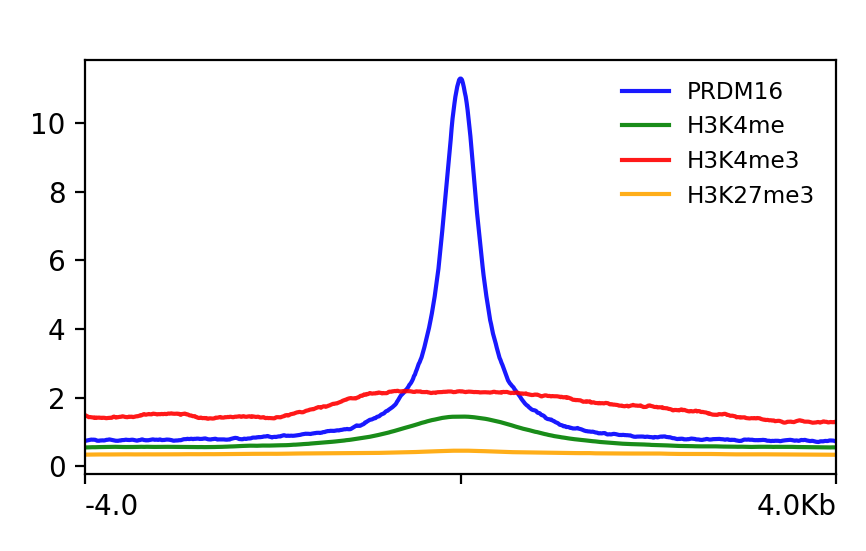

Approximate time: 80 minutes

**Link to issue describing the modifications to be made:** https://github.com/hbctraining/Intro-to-ChIPseq-flipped/issues/12

## Learning Objectives

* Visualizing enrichment patterns at particular locations in the genome

## Profile plots

After creating the bigWig files, we are ready to perform data visualization. We first need to prepare an intermediate file that will be used with the `plotHeatmap` and `plotProfile` commands.

<p align="center">

</p>

The `computeMatrix` command accepts multiple bigWig files and multiple region files (BED format) to create a count matrix -- the intermediate file. The command can also filter and sort regions according to their scores. The region file will be the BED file we generated for the final peaks, and the bigWig files will be those generated from the last lesson. Additionally, we specify a window of +/- 4000 bp around the reference point of genes (`-b` and `-a`). The [reference point](https://deeptools.readthedocs.io/en/develop/content/tools/computeMatrix.html#Optional%20arguments_repeat1) for the plotting could be either the region start (TSS), the region end (TES) or the center of the region. Here, we use the center of the region (the default is TSS). For each window, `computeMatrix` will calculate scores based on the read density values in the bigWig files.

Let's create a matrix for the wt sample:

```bash

computeMatrix reference-point --referencePoint center \
-b 4000 -a 4000 \
-R ~/chipseq_workshop/results/macs2/wt_peaks_final.bed \
-S ~/chipseq_workshop/results/visualization/bigWig/wt_sample1_chip.bw ~/chipseq_workshop/results/visualization/bigWig/wt_sample2_chip.bw \
--skipZeros \
-o ~/chipseq_workshop/results/visualization/wt_matrix.gz \
-p 6

```

> **NOTE:** Typically, the genome regions are genes, and can be obtained from the [UCSC table browser](http://rohsdb.cmb.usc.edu/GBshape/cgi-bin/hgTables). Alternatively, you could look at other regions of interest that are not genomic feature related (i.e. binding regions from another protein of interest).

With the computed matrix, we could now create a **profile plot**, which is essentially a density plot that evaluates read density across all reference points. For the wt samples, we can see that **sample2 has higher amount of signal at the reference point compared to sample1**. 

```bash

# Create figures directory under visualization
mkdir ~/chipseq_workshop/results/visualization/figures

# Plot the profiles
plotProfile -m ~/chipseq_workshop/results/visualization/wt_matrix.gz \
-out ~/chipseq_workshop/results/visualization/figures/plot1_wt.png \
--regionsLabel "" \
--perGroup \
--colors red blue \
--samplesLabel "PRDM16_sample1" "PRDM16_sample2" \
--refPointLabel "PRDM16 binding sites"

```

<p align="center">

</p>


> **NOTE:** Both `plotProfile` and `plotHeatmap` have many options, including the ability to change the type of lines plotted, and to plot by group rather than sample. We encourage you to explore the documentation to find out more detail.

**Exercise**

We explored profiles at the center of region. How about the TSS region? Compute the matrix with TSS as the reference point, and then plot the corresponding profile. What does the profile look like? Could you think of why it looks like that?

## Plotting with histone methylation pattern
How does PRDM16 regulates gene expression? One possibility is through histone methylation. We could analyze the overlap of PRDM16-binding regions with different histone methylation marks (H3K4me, H3K4me3, H3K27me3). The data for the histone methylation level could be obtained from the Encyclopedia of DNA Elements ([ENCODE](https://www.encodeproject.org/)). We deposited the data in our training directory, which you could directly use.

```bash
#!/bin/sh

#SBATCH -p priority
#SBATCH -c 2
#SBATCH -t 0-1:00
#SBATCH --mem 16G

computeMatrix reference-point --referencePoint center \
-b 4000 -a 4000 \
-R ~/chipseq_workshop/results/macs2/wt_peaks_final.bed \
-S ~/chipseq_workshop/results/visualization/bigWig/wt_sample2_chip.bw /n/groups/hbctraining/harwell-datasets/encode-chipseq/H3k04me1UE14_mm10.bw /n/groups/hbctraining/harwell-datasets/encode-chipseq/H3k04me3UE14_mm10.bw /n/groups/hbctraining/harwell-datasets/encode-chipseq/H3k27me3UE14_mm10.bw \
--skipZeros \
-o ~/chipseq_workshop/results/visualization/wt_encode_matrix.gz \
-p 6

plotProfile -m ~/chipseq_workshop/results/visualization/wt_encode_matrix.gz \
-out ~/chipseq_workshop/results/visualization/figures/plot2_wt_encode.png \
--regionsLabel "" \
--perGroup \
--colors blue green red orange \
--samplesLabel "PRDM16" "H3K4me" "H3K4me3" "H3K27me3" \
--refPointLabel "PRDM16 binding sites"
```

We observed some moderate levels of H3K4me3 and H3K4me in PRDM16-binding regions. The result makes sense, because both H3K4me3 and H3K4me are associated with transcriptional activation. There was also little overlap with H3K27me3, which is a epigenetic modification associated with transcriptional repression during neurogenesis. 

<p align="center">

</p>

**Exercise**

The study also included PRDM16-knockout experiment (we refer to as `ko`). How does the `ko` sample looks like compared to the `wt` sample? We placed the bigWig file for one of the `ko`sample at the location `/n/groups/hbctraining/harwell-datasets/workshop_material/results/visualization/bigWig/ko_sample2_chip.bw`. Use this, and the bigWig file you generated earlier for `wt`, to plot the peaks. Do you see a difference between `wt` and `ko` samples? Does that match your expectation?


***
*This lesson has been developed by members of the teaching team at the [Harvard Chan Bioinformatics Core (HBC)](http://bioinformatics.sph.harvard.edu/). These are open access materials distributed under the terms of the [Creative Commons Attribution license](https://creativecommons.org/licenses/by/4.0/) (CC BY 4.0), which permits unrestricted use, distribution, and reproduction in any medium, provided the original author and source are credited.*
