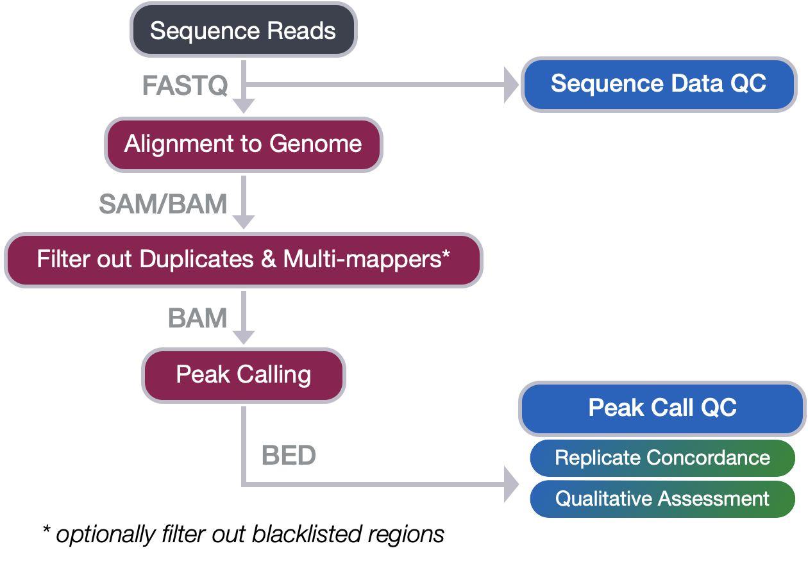
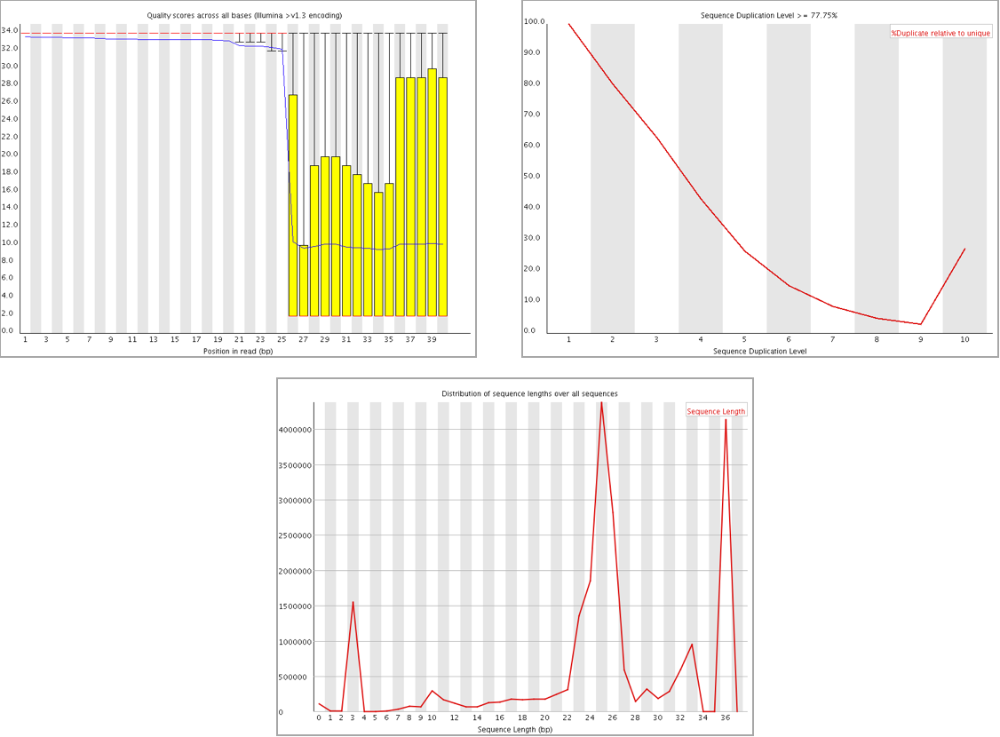
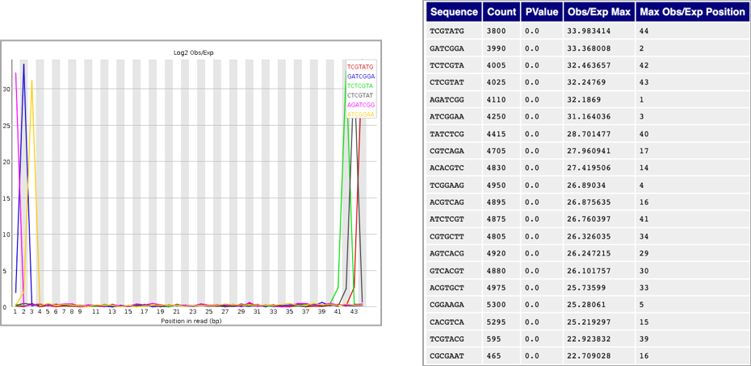
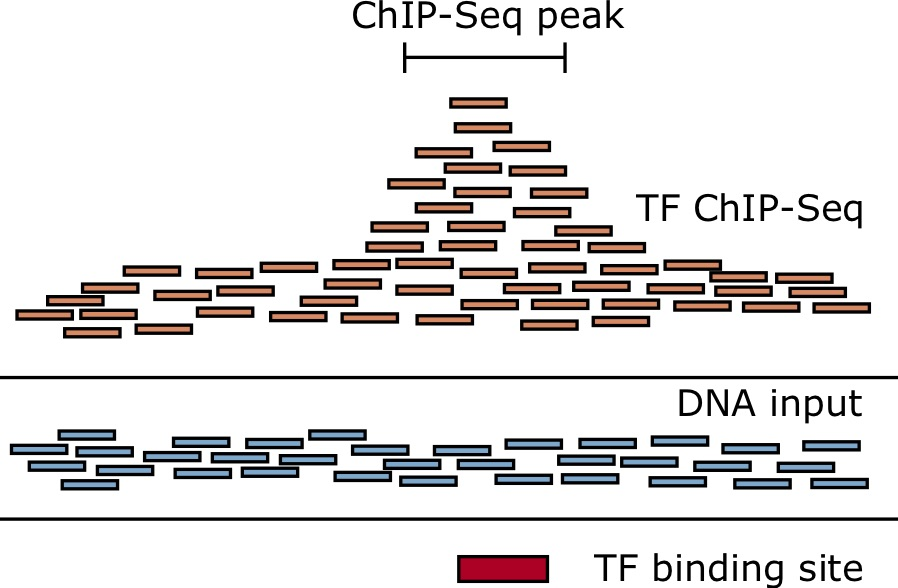
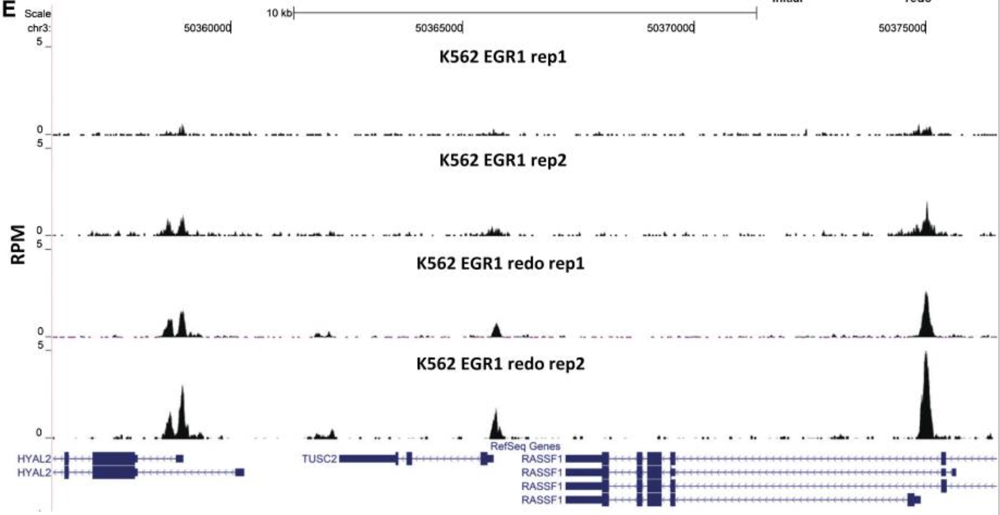

Approximate time: 45 minutes

## Learning Objectives
* Recall the quality checks required at each step of the ChIP-seq workflow
* Identify ways to troubleshoot issues in the workflow

## From Sequence reads to Peak calls
In this workshop we covered the steps in the first half of the ChIP-seq workflow where we go from raw sequence reads through to peak calls. We have discussed each of the steps in detail, outlining the tools involved and the file formats encountered. In this lesson, we revisit the quality checks associated with each step and summarize the main points to take away.

## Quality control of sequence reads

The quality checks at this stage in the workflow include:
* Checking the **quality of the base calls** to ensure that there were no issues during sequencing. 
    * Sudden drops in quality could indicate a techincal problem with the sequencer, as shown below.
* Evaluating **duplication levels** for sequences, to check that libraries have not been over amplified. 
    * In a normal, diverse library you should see most sequences occurring only once or twice. In the example below, the unique sequences make up only a small proportion of the library, with low level duplication accounting for most of the sequences. Post-filtering, you will be left with very little usable data.
* Exploring the **sequence length distribution**, as variable lengths can indicate adapter contamination.  
    * Adapter contamination arises from fragments of the sequencing library that are shorter than the read length itself. It is also possible for adapters to be ligated with no insert (a consequence of low DNA or the amount of adapters too high), resulting in only adapter to be sequenced.
    

### Examples of bad quality data

### Good quality data masquerading as bad quality 

Quality checks include looking for modules of the FastQC report which may report as bad quality (for any other NGS data), but indicate good quality ChIP-seq data:
* Expect to see **over-represented sequences** in the immunoprecipitation sample, because that’s exactly what you’re doing - enriching for particular sequences based on binding affinity.
* High levels of **k-mer content** on either end of the reads suggests is some enrichment of K-mers amongst the fragments. Similar to the point above, we are expecting some similarity in the sequences represented amongst our reads.

## Alignment quality

The quality checks at this stage in the workflow include:

* Checking the **total percent of reads aligning to the genome**. A mapping rate of 70% or higher is great, and lower than 50% is concerning especially if total read depth is low.
   * Low mapping rates can be a result of low quality reads, contaminating sequences, inappropriate alignment parameters chosen, or a poor quality reference genome. 

> **If my mapping rate is low, do I discard my sample?** Do not discard your sample, rather you will want to:
> 1. Flag the sample as low quality. Keep an eye out for QC metrics later in the workflow for that same sample.
> 2. Troubleshoot the sample. Take the unmapped reads and BLAST the sequences; if the reads are not mapping to the genome, where are they mapping? It's possible you might identify a high level of contamination from another organism.
 
* Determining the **percent uniquely mapping reads**, ideally this would be > 60% of the total read depth of your sample. The higher the percentage the more usable data you have to work with.
   *  High duplication can be a result of over-amplification. 
   *  High number of multi-mapping reads can be due to mappability.

_Image source: [Land et, al, 2012](https://www.ncbi.nlm.nih.gov/pmc/articles/PMC3431496/)_

* Identify **percent of reads mapping in blacklist regions**. This shouldn't be higher than 10% of your high quality mapped (and filtered) read count.

> **NOTE:** For paired-end reads you will also want to checking percent that are properly paired. By default, Bowtie 2 searches for both concordant and discordant alignments, though searching for discordant alignments can be disabled with the `--no-discordant option`.

## Peak quality checks
The quality checks at this stage in the workflow include:

* Total number of peaks called
* Peak concordance between replicates
* Qualitative assessment of peak enrichment 

### Total number of peaks 
This number will vary depending on your protein of interest and the number of expected binding sites. It can range from thousands of regions to hundred thousands. **If you are only finding a handful of regions identified as significantly enriched, there is a high likelihood that your experiment failed.**

_Image source: [Hendrix, DA, "Applied Bioinformatics" - Online textbook from Oregon State Univeristy](https://open.oregonstate.education/appliedbioinformatics/chapter/chapter-9/)_

**Possible reasons you are not seeing many peaks**:

*  **Poor antibody**. Running QC on your IP before sending samples for sequencing as [described in an earlier lesson](01_ChIPseq_design_and_workflow.md), is critical.
   * Use a well characterized antibody, tested for specificity.
   * Given the challenges in obtaining antibodies for suitable ChIP, an alternative is to tag the factor with an exogenous epitope and immunoprecipitate with a well-characterized monoclonal reagent specific for the tag.  
*  **Oversonication**. Sonicating for too long or too harshly can lead to denatured protein, or protein that is dissociated from DNA or whose antibody epitope has been destroyed. This step requires considerable optimization.
* **Cross-linking needs to be optimized**. 
   * Excessive cross-linking may mask the epitope that is recognizable by your antibody, leading to a reduction in protein that can be pulled down.
   * For proteins that do not directly interact with DNA or are large, the typical protocol may not work. A dual cross-link protocol is a good solution for this scenario.
* **Sequence depth**. Depending on the binding profile, if you did not sequence deep enough it will be hard for the peak caller to distinguish signal from noise.
   *  Check the number of usable reads that were used for peak calling. Ensure it meets and/or exceeds the guidelines.
   *  Sites can be detected with greater confidence in larger data sets because of the increased statistical power afforded by more reads  

### Replicate concordance
Unlike RNA-seq, increasing replicates in your ChIP-seq will not increase the number of binding sites identified. Rather, it gives you **confidence that the sites you identified are true signal.**

> _Representative browser snapshot of the four EGR1 ChIP-seq experiments, showing the much stronger peaks obtained with the second set of replicates_

_Image source: [Land et, al, 2012](https://www.ncbi.nlm.nih.gov/pmc/articles/PMC3431496/)_

* Check for overlapping regions between replicates. 
   * Start with a simple 1bp overlap (default in bedtools), and increase stringency if necessary.
   * There is inevitably always one sample with fewer peaks called
   * Low reproducibility will mean discarding one replicate. If you only had two samples to start, you might need to repeat the experiment.
* Compare signal in overlapping regions, using read density.

### Qualitative assessment of enriched regions
At this point, if you have a reasonable number of peaks and you observe a good amount of concordance between replicates - the next step is evaluating the enriched regions. You can do this with a simple site-based inspection (i.e use a genome viewer to look for enrichment profiles fo specific target genes), or use profile plots for a genome-wide assessment.

* Evaluate enrichment within specific genomic regions/features, and within known artifact regions
* Compare and contrast the profiles with what you anticipate for the binding profile
* Compare and contrast the profiles with publicly available datasets

***
*This lesson has been developed by members of the teaching team at the [Harvard Chan Bioinformatics Core (HBC)](http://bioinformatics.sph.harvard.edu/). These are open access materials distributed under the terms of the [Creative Commons Attribution license](https://creativecommons.org/licenses/by/4.0/) (CC BY 4.0), which permits unrestricted use, distribution, and reproduction in any medium, provided the original author and source are credited.*
